# Model-agnostic covariate PCA and terrain residual stratification scaffold

This is a separate diagnostic report for the dense validation work. It is designed to sit beside the main dense-validation manuscript rather than replace it.

## 1. Purpose

The main question is whether the three dense validation sites occupy comparable or distinct parts of the model-agnostic covariate space, and whether model failures occur in the same parts of that space across sites. This matters because a model can have acceptable pooled skill while still failing systematically in particular terrain, soil, exposure, or seasonal-climate contexts.

The analysis is framed around four working hypotheses.

1. **Absolute covariate-space transfer:** if a site sits far from the OzNet training distribution, both model6 and model8 should be treated as extrapolating or semi-extrapolating there.
2. **Covariate-space failure consistency:** if high-error points cluster in the same PCA region across sites, that suggests a transferable structural weakness.
3. **Scale-dependence of PCA:** global-scaled PCA should reveal between-site environmental differences, while site-standardised PCA should reveal within-site wet/dry terrain contrasts after removing site means.
4. **Model-type contrast:** the process model and statistical model may fail in different parts of the terrain/climate covariate space, which is directly relevant to local calibration design.

## 2. Data used

- Validation predictions: `/Volumes/Dmitry_work/borevitz_projects/DMM_validation/outputs/unified_dense_validation/stage1_independent_validation/combined_model_agnostic_predictions.csv`
- OzNet training covariate table: `/Volumes/Dmitry_work/borevitz_projects/Data/oznet_model6_training_2006_2010.csv`
- Validation sites: Esdale, Tarrawarra, and Llara.
- Models compared: model6 statistical RF/HGB and model8 process bucket.

All PCA inputs are model-agnostic covariates already present in the validation prediction table, not covariates from the raw point-measurement CSVs.

## 3. Feature spaces

Three related spaces are scaffolded.

1. **Static terrain-soil space:** elevation, slope, northness, eastness, TWI, HLI, accumulation, clay, sand, AWC, and bulk density. This is the cleanest terrain stratification space.
2. **Dynamic model-agnostic covariate space:** static terrain-soil plus SMIPS totalbucket, SMIPS lookback/anomaly terms, day-of-year terms, and SILO antecedent rainfall/water-balance/VPD terms.
3. **Process-context covariate space:** bucket storage where available plus the static process-model readout/capacity variables available in the unified table. This is included as exploratory because the complete process forcing/static matrix is not yet fully represented in the unified table for every site.

## 4. PCA methodology

### 4.1 Global-scaled PCA

For each feature space, features are median-imputed and standardised once across pooled validation supports. PCA is then fitted to the pooled support matrix. This preserves absolute between-site differences. Large separation of site centroids means the sites occupy different parts of covariate space.

Interpretation: this is the right view for asking whether Esdale, Tarrawarra, and Llara are genuinely different environments to the model.

### 4.2 Site-standardised PCA

For each site, every feature is z-scored within that site before fitting PCA across all supports. This removes the site-average environmental offset and keeps within-site structure. Local covariate extremes therefore become comparable across sites even when the absolute covariate distributions differ.

Interpretation: this is the right view for asking whether models fail in analogous within-property terrain positions.

## 5. Distance from training covariate space

Where the OzNet training covariate table is available, validation rows are compared with the training distribution in standardised feature space. Two distances are reported.

1. **Nearest-neighbour distance percentile:** distance from each validation row to its nearest OzNet training row, expressed as a percentile of OzNet leave-one-neighbour distances.
2. **Training-PCA Mahalanobis distance percentile:** validation rows are projected into PCA fitted on OzNet training rows. Distance from the OzNet centre is scaled by training PC variance and expressed as a percentile of training-row distances.

Rows above the 95th percentile are flagged as practically out-of-distribution for that feature space. This does not prove the prediction is wrong; it says the prediction is being made in a part of covariate space with weak training support.

## 6. Residual stratification methodology

For each site and support point/grid cell, observed and predicted soil moisture are summarised into support-level metrics. The PCA residual decomposition deliberately focuses on only two response variables:

1. **Bias**: prediction minus observation, used to diagnose signed wet/dry structure.
2. **RMSE**: error magnitude, used to diagnose unreliable regions regardless of sign.

NSE, Pearson r, and ubRMSE remain important validation metrics in the main manuscript, but they are not used here as PC-decomposition targets.

The diagnostic outputs are:

- high-RMSE locations in PCA space for each model;
- signed-bias locations in PCA space for each model;
- model6-minus-model8 RMSE difference in PCA space;
- correlations between PC axes and support-level RMSE and bias;
- a loading-weighted decomposition that identifies which covariates dominate the PC axes most associated with RMSE and bias;
- overlap between the worst 20% of supports for model6 and model8.

If both models fail on the same supports, this suggests a shared missing process, measurement/support mismatch, or terrain state not captured by the available inputs. If only one model fails, that gives clues about process-model versus statistical-model vulnerabilities.

## 7. Headline numeric outputs from this run

### PCA variance explained

| feature_set               | scaling           | PC1    | PC2    |
| ------------------------- | ----------------- | ------ | ------ |
| model_agnostic_covariates | global            | 40.226 | 28.094 |
| model_agnostic_covariates | site_standardised | 18.323 | 13.390 |
| static_terrain_soil       | global            | 38.462 | 17.463 |
| static_terrain_soil       | site_standardised | 23.121 | 21.187 |

### Site centroid distances in validation PCA space

| feature_set               | scaling           | site_a | site_b     | pc1_pc2_distance | pc1_pc2_pc3_distance |
| ------------------------- | ----------------- | ------ | ---------- | ---------------- | -------------------- |
| model_agnostic_covariates | global            | Esdale | Llara      | 9.595            | 9.595                |
| model_agnostic_covariates | global            | Esdale | Tarrawarra | 6.399            | 6.401                |
| model_agnostic_covariates | global            | Llara  | Tarrawarra | 9.994            | 9.994                |
| model_agnostic_covariates | site_standardised | Esdale | Llara      | 0.000            | 0.000                |
| model_agnostic_covariates | site_standardised | Esdale | Tarrawarra | 0.000            | 0.000                |
| model_agnostic_covariates | site_standardised | Llara  | Tarrawarra | 0.000            | 0.000                |
| static_terrain_soil       | global            | Esdale | Llara      | 5.419            | 5.446                |
| static_terrain_soil       | global            | Esdale | Tarrawarra | 3.922            | 4.043                |
| static_terrain_soil       | global            | Llara  | Tarrawarra | 2.116            | 2.604                |
| static_terrain_soil       | site_standardised | Esdale | Llara      | 0.000            | 0.000                |
| static_terrain_soil       | site_standardised | Esdale | Tarrawarra | 0.000            | 0.000                |
| static_terrain_soil       | site_standardised | Llara  | Tarrawarra | 0.000            | 0.000                |

### Model failure overlap by site

| site       | n_supports | worst_set_size | shared_worst_supports | jaccard_top20pct_worst_rmse | rmse_correlation_model6_model8 | bias_correlation_model6_model8 | model8_better_fraction |
| ---------- | ---------- | -------------- | --------------------- | --------------------------- | ------------------------------ | ------------------------------ | ---------------------- |
| Esdale     | 77.000     | 16.000         | 8.000                 | 0.333                       | 0.476                          | 0.858                          | 0.494                  |
| Llara      | 32.000     | 7.000          | 5.000                 | 0.556                       | 0.801                          | 0.949                          | 0.531                  |
| Tarrawarra | 169.000    | 34.000         | 26.000                | 0.619                       | 0.897                          | 0.873                          | 1.000                  |

### Distance from OzNet training space

| feature_set               | site       | n_validation_rows | n_common_features | median_nn_percentile | p90_nn_percentile | fraction_nn_gt95 | median_mahalanobis_percentile | fraction_mahalanobis_gt95 |
| ------------------------- | ---------- | ----------------- | ----------------- | -------------------- | ----------------- | ---------------- | ----------------------------- | ------------------------- |
| static_terrain_soil       | Esdale     | 560.000           | 11.000            | 86.111               | 100.000           | 0.263            | 83.333                        | 0.180                     |
| static_terrain_soil       | Llara      | 29247.000         | 11.000            | 88.889               | 100.000           | 0.154            | 80.556                        | 0.154                     |
| static_terrain_soil       | Tarrawarra | 2154.000          | 11.000            | 86.111               | 88.889            | 0.000            | 36.111                        | 0.000                     |
| model_agnostic_covariates | Esdale     | 560.000           | 25.000            | 100.000              | 100.000           | 1.000            | 62.590                        | 0.070                     |
| model_agnostic_covariates | Llara      | 29247.000         | 25.000            | 100.000              | 100.000           | 1.000            | 98.311                        | 0.840                     |
| model_agnostic_covariates | Tarrawarra | 2154.000          | 25.000            | 100.000              | 100.000           | 1.000            | 98.662                        | 0.863                     |

### Seasonal distance from OzNet training space

| feature_set               | site       | season | n_validation_rows | median_nn_percentile | fraction_nn_gt95 | median_mahalanobis_percentile | fraction_mahalanobis_gt95 |
| ------------------------- | ---------- | ------ | ----------------- | -------------------- | ---------------- | ----------------------------- | ------------------------- |
| static_terrain_soil       | Esdale     | autumn | 308.000           | 86.111               | 0.260            | 83.333                        | 0.182                     |
| static_terrain_soil       | Esdale     | winter | 252.000           | 86.111               | 0.266            | 83.333                        | 0.179                     |
| static_terrain_soil       | Llara      | autumn | 8617.000          | 88.889               | 0.149            | 80.556                        | 0.149                     |
| static_terrain_soil       | Llara      | spring | 6208.000          | 88.889               | 0.154            | 80.556                        | 0.154                     |
| static_terrain_soil       | Llara      | summer | 7658.000          | 88.889               | 0.157            | 80.556                        | 0.157                     |
| static_terrain_soil       | Llara      | winter | 6764.000          | 88.889               | 0.156            | 80.556                        | 0.156                     |
| static_terrain_soil       | Tarrawarra | autumn | 663.000           | 86.111               | 0.000            | 36.111                        | 0.000                     |
| static_terrain_soil       | Tarrawarra | spring | 994.000           | 86.111               | 0.000            | 36.111                        | 0.000                     |
| static_terrain_soil       | Tarrawarra | summer | 333.000           | 86.111               | 0.000            | 36.111                        | 0.000                     |
| static_terrain_soil       | Tarrawarra | winter | 164.000           | 86.111               | 0.000            | 36.111                        | 0.000                     |
| model_agnostic_covariates | Esdale     | autumn | 308.000           | 100.000              | 1.000            | 69.958                        | 0.107                     |
| model_agnostic_covariates | Esdale     | winter | 252.000           | 100.000              | 1.000            | 51.475                        | 0.024                     |
| model_agnostic_covariates | Llara      | autumn | 8617.000          | 100.000              | 1.000            | 98.543                        | 0.907                     |
| model_agnostic_covariates | Llara      | spring | 6208.000          | 100.000              | 1.000            | 98.437                        | 0.850                     |
| model_agnostic_covariates | Llara      | summer | 7658.000          | 100.000              | 1.000            | 98.131                        | 0.827                     |
| model_agnostic_covariates | Llara      | winter | 6764.000          | 100.000              | 1.000            | 97.986                        | 0.761                     |
| model_agnostic_covariates | Tarrawarra | autumn | 663.000           | 100.000              | 1.000            | 99.478                        | 1.000                     |
| model_agnostic_covariates | Tarrawarra | spring | 994.000           | 100.000              | 1.000            | 96.649                        | 0.702                     |
| model_agnostic_covariates | Tarrawarra | summer | 333.000           | 100.000              | 1.000            | 99.117                        | 1.000                     |
| model_agnostic_covariates | Tarrawarra | winter | 164.000           | 100.000              | 1.000            | 98.268                        | 1.000                     |

### Correlation between training distance and absolute error

| feature_set               | base_model     | n         | distance_abs_error_correlation | median_abs_error_in_distribution | median_abs_error_above_95pct |
| ------------------------- | -------------- | --------- | ------------------------------ | -------------------------------- | ---------------------------- |
| static_terrain_soil       | model6_rf      | 31961.000 | -0.062                         | 9.167                            | 8.174                        |
| static_terrain_soil       | model8_process | 31961.000 | -0.027                         | 7.901                            | 6.689                        |
| model_agnostic_covariates | model6_rf      | 31961.000 | 0.014                          |                                  | 8.981                        |
| model_agnostic_covariates | model8_process | 31961.000 | 0.007                          |                                  | 7.576                        |

### Strongest PC associations with bias and RMSE

| feature_set               | scaling           | site       | pc_axis | metric                       | pc_metric_correlation | n_supports |
| ------------------------- | ----------------- | ---------- | ------- | ---------------------------- | --------------------- | ---------- |
| model_agnostic_covariates | site_standardised | Esdale     | PC3     | abs_bias_model6_minus_model8 | 0.560                 | 77.000     |
| model_agnostic_covariates | site_standardised | Esdale     | PC3     | bias_model8_process          | -0.546                | 77.000     |
| static_terrain_soil       | site_standardised | Llara      | PC2     | bias_model6_rf               | 0.542                 | 32.000     |
| model_agnostic_covariates | global            | Esdale     | PC3     | bias_model6_rf               | -0.529                | 77.000     |
| static_terrain_soil       | site_standardised | Esdale     | PC2     | bias_model6_rf               | -0.521                | 77.000     |
| static_terrain_soil       | global            | Esdale     | PC2     | bias_model6_rf               | -0.514                | 77.000     |
| model_agnostic_covariates | site_standardised | Esdale     | PC3     | bias_model6_rf               | -0.507                | 77.000     |
| static_terrain_soil       | site_standardised | Esdale     | PC1     | bias_model8_process          | 0.507                 | 77.000     |
| static_terrain_soil       | site_standardised | Esdale     | PC2     | abs_bias_model6_minus_model8 | 0.500                 | 77.000     |
| model_agnostic_covariates | site_standardised | Esdale     | PC3     | rmse_model6_minus_model8     | 0.493                 | 77.000     |
| static_terrain_soil       | global            | Esdale     | PC3     | bias_model6_rf               | -0.488                | 77.000     |
| model_agnostic_covariates | site_standardised | Tarrawarra | PC2     | abs_bias_model6_minus_model8 | -0.478                | 169.000    |
| static_terrain_soil       | global            | Esdale     | PC2     | abs_bias_model6_minus_model8 | 0.475                 | 77.000     |
| model_agnostic_covariates | site_standardised | Tarrawarra | PC2     | rmse_model6_minus_model8     | -0.471                | 169.000    |
| static_terrain_soil       | site_standardised | Tarrawarra | PC2     | bias_model8_process          | -0.465                | 169.000    |
| model_agnostic_covariates | site_standardised | Llara      | PC3     | bias_model6_rf               | 0.464                 | 32.000     |
| model_agnostic_covariates | global            | Esdale     | PC3     | abs_bias_model6_minus_model8 | 0.456                 | 77.000     |
| static_terrain_soil       | site_standardised | Esdale     | PC2     | rmse_model6_minus_model8     | 0.447                 | 77.000     |
| static_terrain_soil       | site_standardised | Esdale     | PC2     | bias_model8_process          | -0.440                | 77.000     |
| model_agnostic_covariates | site_standardised | Esdale     | PC3     | rmse_model8_process          | -0.439                | 77.000     |
| static_terrain_soil       | site_standardised | Llara      | PC2     | bias_model8_process          | 0.438                 | 32.000     |
| static_terrain_soil       | global            | Esdale     | PC2     | rmse_model6_minus_model8     | 0.433                 | 77.000     |
| model_agnostic_covariates | global            | Llara      | PC3     | bias_model6_rf               | 0.426                 | 32.000     |
| model_agnostic_covariates | global            | Esdale     | PC3     | rmse_model6_minus_model8     | 0.426                 | 77.000     |
| static_terrain_soil       | global            | Tarrawarra | PC3     | bias_model8_process          | -0.418                | 169.000    |
| static_terrain_soil       | site_standardised | Tarrawarra | PC1     | rmse_model6_minus_model8     | -0.415                | 169.000    |
| static_terrain_soil       | global            | Esdale     | PC2     | bias_model8_process          | -0.409                | 77.000     |
| static_terrain_soil       | site_standardised | Esdale     | PC1     | rmse_model8_process          | 0.409                 | 77.000     |
| static_terrain_soil       | site_standardised | Llara      | PC2     | rmse_model8_process          | -0.401                | 32.000     |
| static_terrain_soil       | global            | Tarrawarra | PC3     | rmse_model8_process          | 0.396                 | 169.000    |

### Site-standardised PC feature decomposition

This table back-projects the PC/error correlations through the PCA loadings. It is a diagnostic ranking, not a causal attribution model.

| feature_set               | metric_family | feature       | mean_abs_contribution | max_abs_contribution | mean_signed_contribution | n_tests |
| ------------------------- | ------------- | ------------- | --------------------- | -------------------- | ------------------------ | ------- |
| model_agnostic_covariates | RMSE          | hli           | 0.057                 | 0.230                | 0.003                    | 27.000  |
| model_agnostic_covariates | RMSE          | soil_clay     | 0.056                 | 0.192                | -0.015                   | 27.000  |
| model_agnostic_covariates | RMSE          | soil_sand     | 0.055                 | 0.187                | 0.014                    | 27.000  |
| model_agnostic_covariates | RMSE          | northness     | 0.046                 | 0.190                | 0.006                    | 27.000  |
| model_agnostic_covariates | RMSE          | eastness      | 0.046                 | 0.184                | -0.006                   | 27.000  |
| model_agnostic_covariates | RMSE          | rain_30       | 0.038                 | 0.128                | -0.008                   | 27.000  |
| model_agnostic_covariates | RMSE          | rain_365_anom | 0.035                 | 0.121                | -0.009                   | 27.000  |
| model_agnostic_covariates | RMSE          | twi           | 0.032                 | 0.117                | -0.006                   | 27.000  |
| model_agnostic_covariates | bias          | hli           | 0.076                 | 0.261                | 0.002                    | 27.000  |
| model_agnostic_covariates | bias          | soil_clay     | 0.069                 | 0.195                | 0.008                    | 27.000  |
| model_agnostic_covariates | bias          | soil_sand     | 0.069                 | 0.190                | -0.008                   | 27.000  |
| model_agnostic_covariates | bias          | northness     | 0.062                 | 0.216                | -0.000                   | 27.000  |
| model_agnostic_covariates | bias          | eastness      | 0.054                 | 0.187                | 0.006                    | 27.000  |
| model_agnostic_covariates | bias          | rain_30       | 0.044                 | 0.130                | 0.006                    | 27.000  |
| model_agnostic_covariates | bias          | slope         | 0.043                 | 0.193                | -0.002                   | 27.000  |
| model_agnostic_covariates | bias          | twi           | 0.042                 | 0.133                | 0.003                    | 27.000  |
| static_terrain_soil       | RMSE          | hli           | 0.065                 | 0.274                | 0.004                    | 27.000  |
| static_terrain_soil       | RMSE          | eastness      | 0.065                 | 0.176                | -0.009                   | 27.000  |
| static_terrain_soil       | RMSE          | twi           | 0.061                 | 0.214                | 0.023                    | 27.000  |
| static_terrain_soil       | RMSE          | northness     | 0.059                 | 0.227                | 0.013                    | 27.000  |
| static_terrain_soil       | RMSE          | soil_clay     | 0.058                 | 0.224                | -0.030                   | 27.000  |
| static_terrain_soil       | RMSE          | slope         | 0.056                 | 0.141                | -0.006                   | 27.000  |
| static_terrain_soil       | RMSE          | soil_sand     | 0.056                 | 0.220                | 0.028                    | 27.000  |
| static_terrain_soil       | RMSE          | accumulation  | 0.053                 | 0.211                | 0.025                    | 27.000  |
| static_terrain_soil       | bias          | hli           | 0.092                 | 0.332                | -0.002                   | 27.000  |
| static_terrain_soil       | bias          | eastness      | 0.086                 | 0.213                | 0.006                    | 27.000  |
| static_terrain_soil       | bias          | northness     | 0.083                 | 0.275                | -0.009                   | 27.000  |
| static_terrain_soil       | bias          | twi           | 0.075                 | 0.229                | -0.017                   | 27.000  |
| static_terrain_soil       | bias          | slope         | 0.075                 | 0.171                | 0.005                    | 27.000  |
| static_terrain_soil       | bias          | soil_clay     | 0.069                 | 0.273                | 0.019                    | 27.000  |
| static_terrain_soil       | bias          | soil_sand     | 0.067                 | 0.269                | -0.018                   | 27.000  |
| static_terrain_soil       | bias          | soil_bdw      | 0.065                 | 0.141                | 0.012                    | 27.000  |

### Direct site-standardised covariate/error correlations

This is a simpler companion diagnostic: support-level covariates are standardised within each site, then directly correlated with bias and RMSE metrics.

| metric_family | feature    | mean_abs_correlation | max_abs_correlation | n_tests |
| ------------- | ---------- | -------------------- | ------------------- | ------- |
| RMSE          | northness  | 0.258                | 0.376               | 9.000   |
| RMSE          | hli        | 0.257                | 0.412               | 9.000   |
| RMSE          | soil_sand  | 0.244                | 0.535               | 9.000   |
| RMSE          | soil_clay  | 0.228                | 0.512               | 9.000   |
| RMSE          | rain_7     | 0.224                | 0.372               | 9.000   |
| RMSE          | eastness   | 0.209                | 0.372               | 9.000   |
| RMSE          | smips_365d | 0.206                | 0.390               | 9.000   |
| RMSE          | doy_sin    | 0.182                | 0.521               | 9.000   |
| RMSE          | slope      | 0.177                | 0.327               | 9.000   |
| RMSE          | smips_anom | 0.170                | 0.272               | 9.000   |
| bias          | hli        | 0.375                | 0.523               | 9.000   |
| bias          | northness  | 0.326                | 0.418               | 9.000   |
| bias          | soil_sand  | 0.307                | 0.649               | 9.000   |
| bias          | soil_clay  | 0.292                | 0.573               | 9.000   |
| bias          | slope      | 0.285                | 0.437               | 9.000   |
| bias          | eastness   | 0.229                | 0.381               | 9.000   |
| bias          | soil_bdw   | 0.216                | 0.319               | 9.000   |
| bias          | rain_7     | 0.207                | 0.283               | 9.000   |
| bias          | elevation  | 0.195                | 0.357               | 9.000   |
| bias          | soil_awc   | 0.145                | 0.224               | 9.000   |

### Dominant PCA loadings

| feature_set               | scaling           | feature   | PC1_loading | PC2_loading | PC1_PC2_abs_loading |
| ------------------------- | ----------------- | --------- | ----------- | ----------- | ------------------- |
| model_agnostic_covariates | global            | soil_bdw  | 0.156       | -0.309      | 0.346               |
| model_agnostic_covariates | global            | elevation | 0.205       | -0.272      | 0.341               |
| model_agnostic_covariates | global            | rain_365  | -0.226      | 0.254       | 0.340               |
| model_agnostic_covariates | global            | doy_cos   | 0.247       | 0.218       | 0.329               |
| model_agnostic_covariates | global            | soil_clay | 0.040       | 0.326       | 0.329               |
| model_agnostic_covariates | global            | vpd_30    | 0.220       | 0.241       | 0.326               |
| model_agnostic_covariates | site_standardised | vpd_30    | -0.397      | 0.170       | 0.432               |
| model_agnostic_covariates | site_standardised | rain_365  | 0.407       | -0.122      | 0.425               |
| model_agnostic_covariates | site_standardised | ppet_365  | 0.385       | -0.173      | 0.422               |
| model_agnostic_covariates | site_standardised | ppet_30   | 0.419       | -0.032      | 0.421               |
| model_agnostic_covariates | site_standardised | soil_clay | 0.041       | 0.407       | 0.409               |
| model_agnostic_covariates | site_standardised | soil_sand | -0.028      | -0.398      | 0.399               |
| static_terrain_soil       | global            | northness | 0.184       | 0.511       | 0.543               |
| static_terrain_soil       | global            | hli       | 0.131       | 0.510       | 0.527               |
| static_terrain_soil       | global            | eastness  | 0.105       | 0.472       | 0.484               |
| static_terrain_soil       | global            | soil_clay | 0.422       | -0.161      | 0.451               |
| static_terrain_soil       | global            | soil_sand | -0.404      | 0.143       | 0.428               |
| static_terrain_soil       | global            | soil_bdw  | -0.409      | -0.108      | 0.423               |
| static_terrain_soil       | site_standardised | hli       | 0.059       | 0.612       | 0.615               |
| static_terrain_soil       | site_standardised | soil_clay | 0.539       | -0.051      | 0.542               |
| static_terrain_soil       | site_standardised | soil_sand | -0.530      | 0.056       | 0.533               |
| static_terrain_soil       | site_standardised | northness | 0.016       | 0.508       | 0.508               |
| static_terrain_soil       | site_standardised | eastness  | 0.288       | 0.393       | 0.487               |
| static_terrain_soil       | site_standardised | elevation | -0.342      | -0.129      | 0.365               |

## 8. Figures

### Static terrain-soil PCA

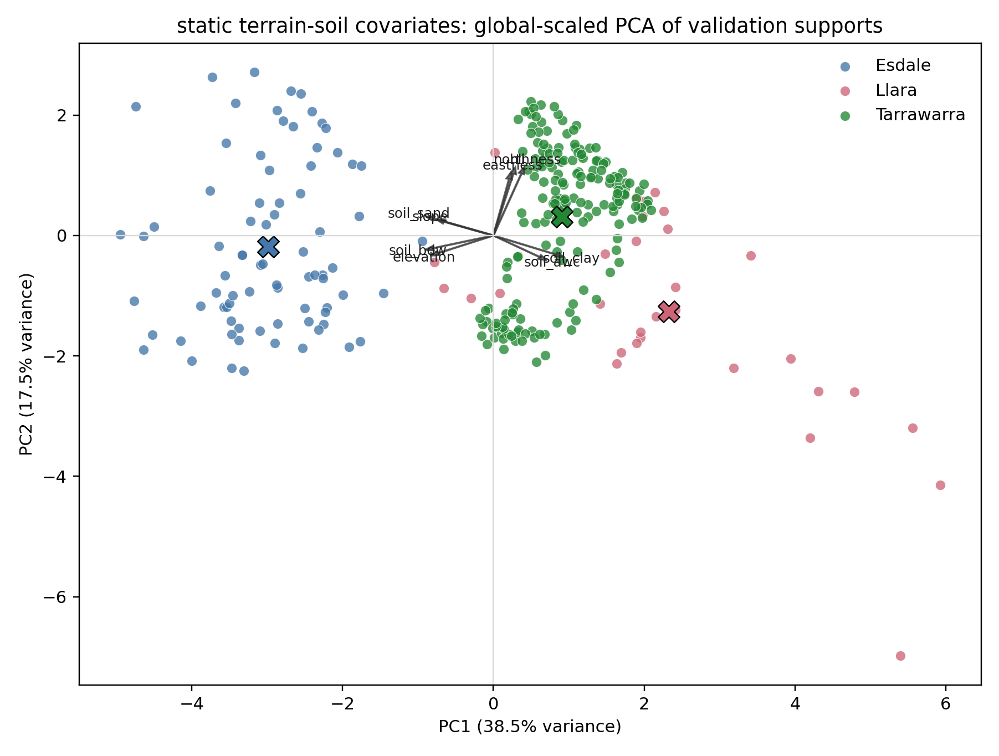

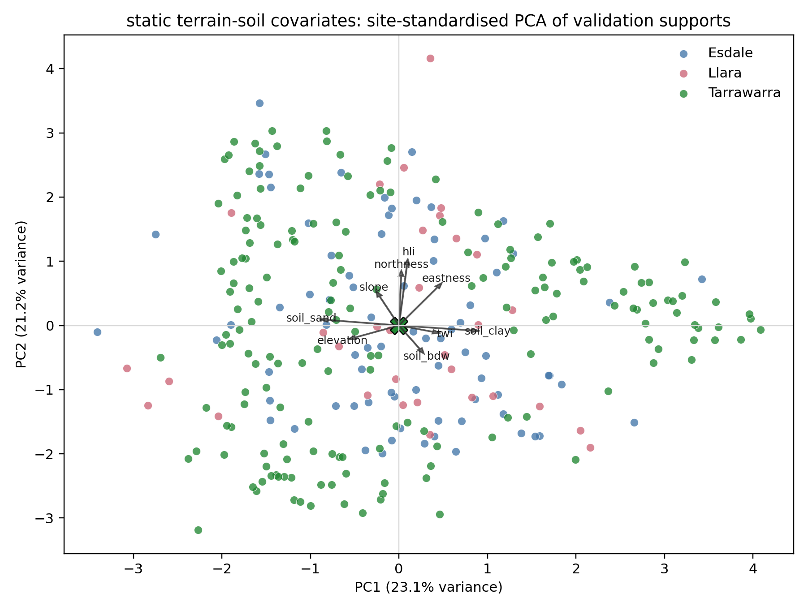

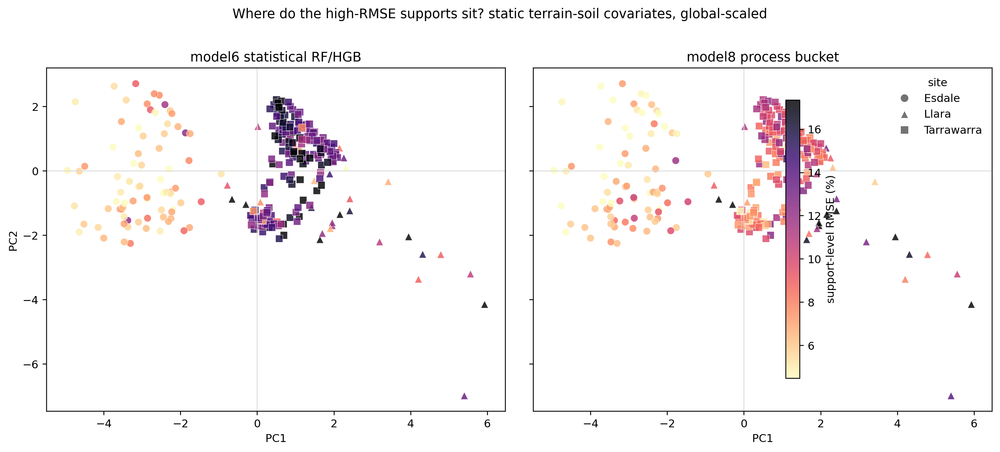

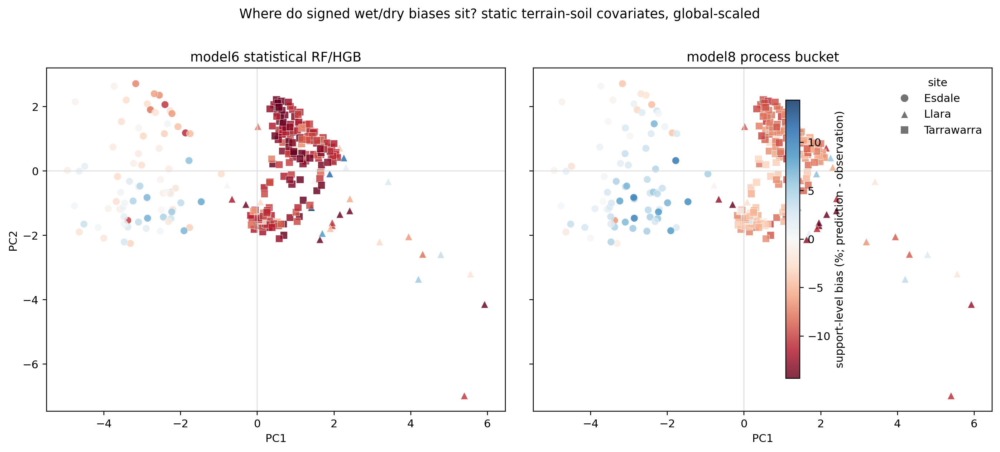

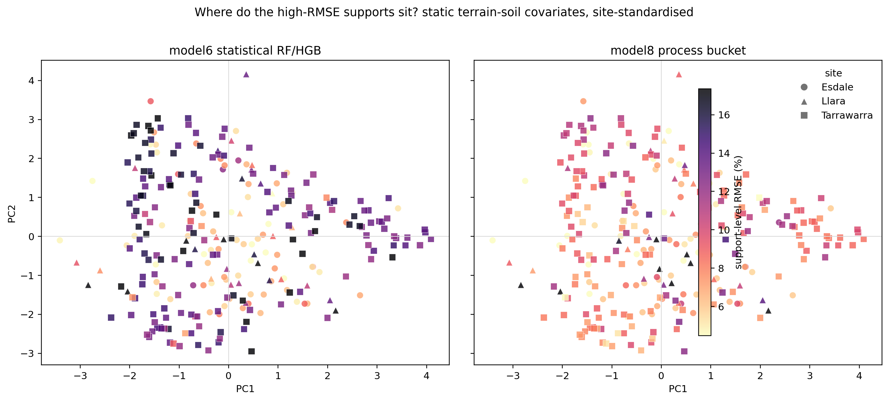

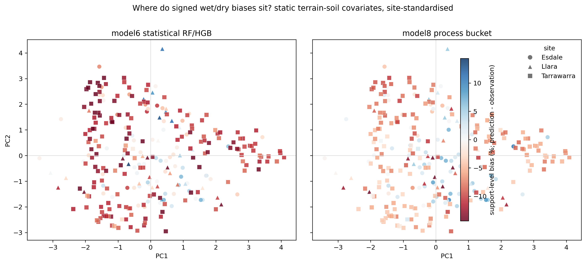

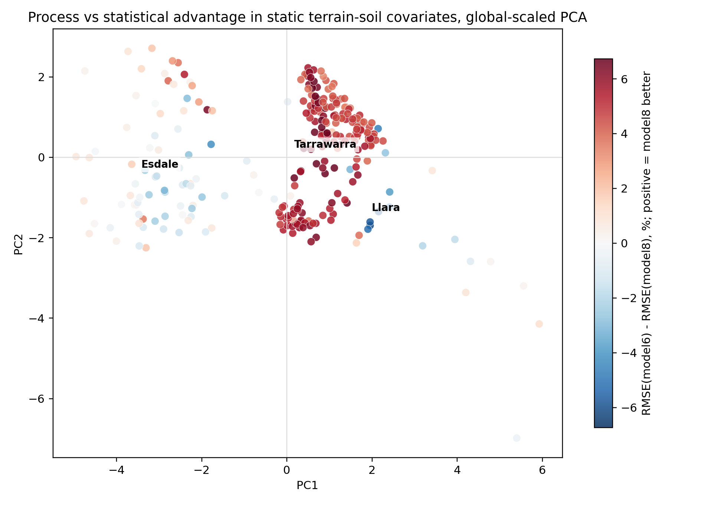

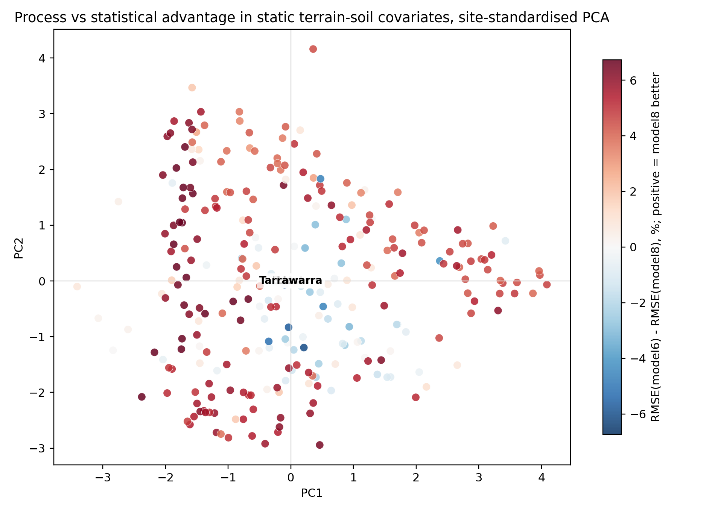

### Dynamic model-agnostic covariate PCA and training distance

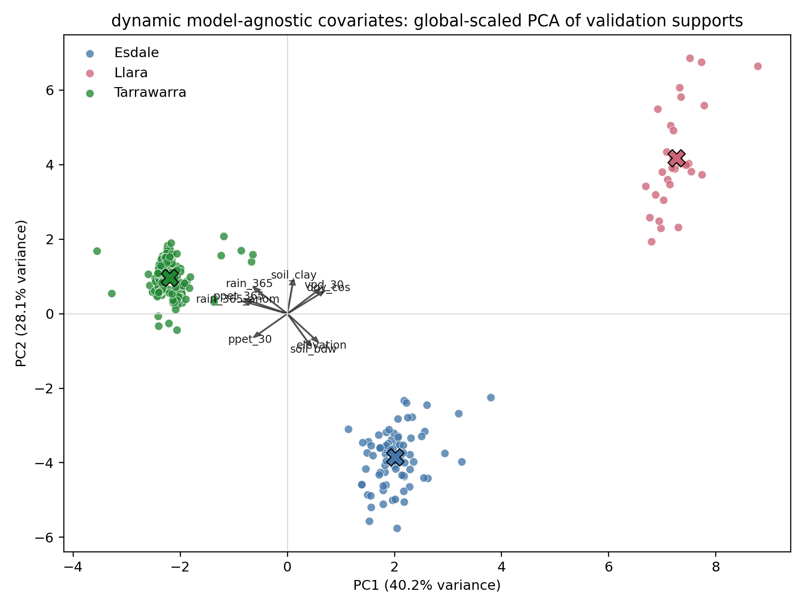

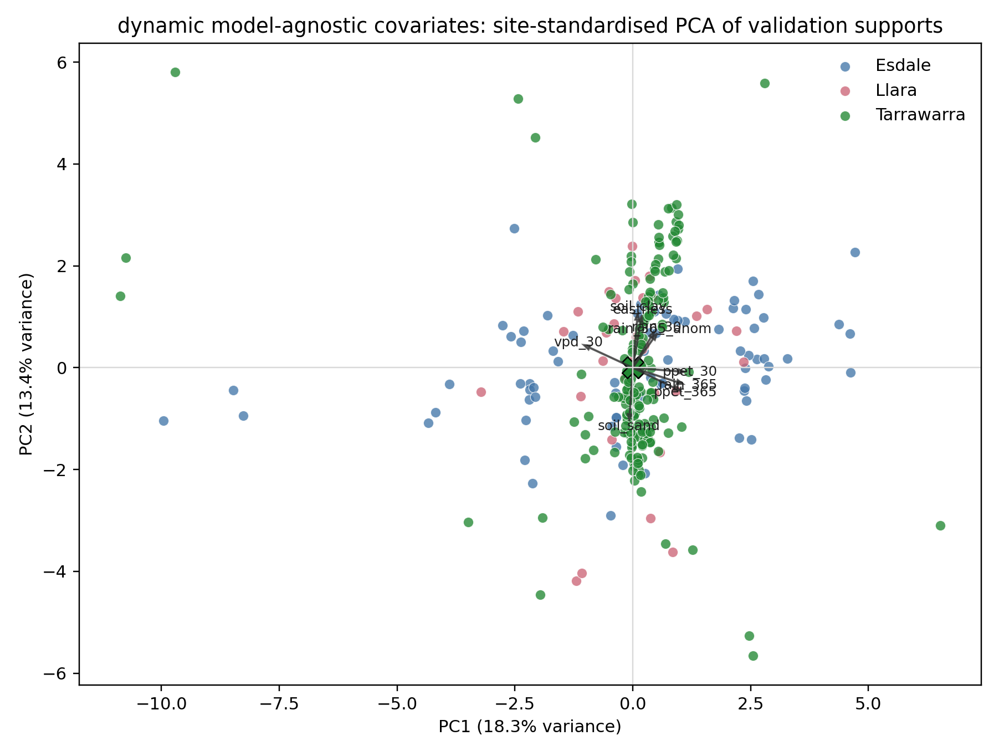

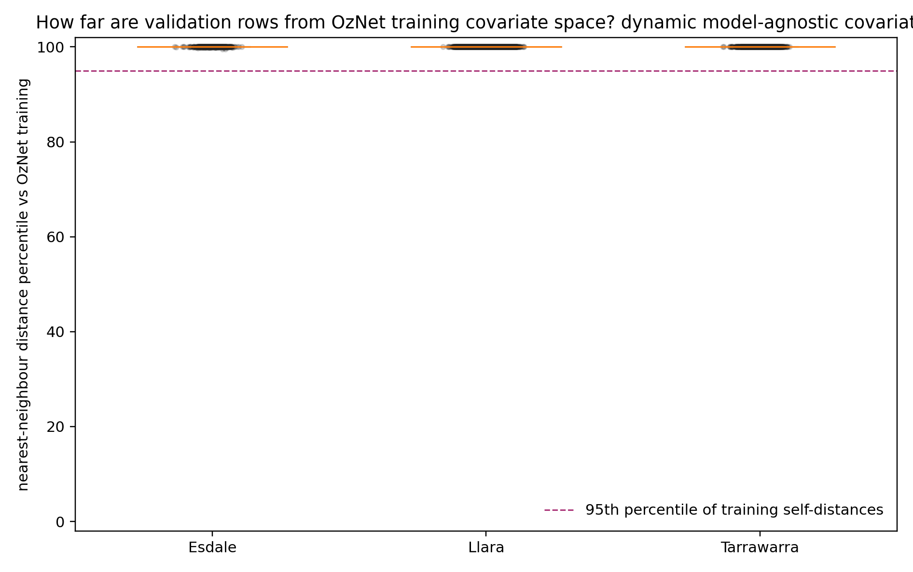

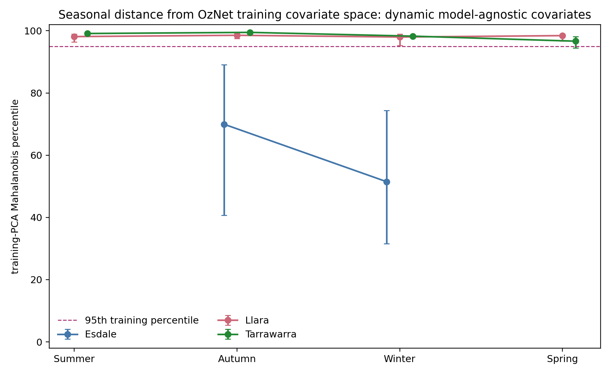

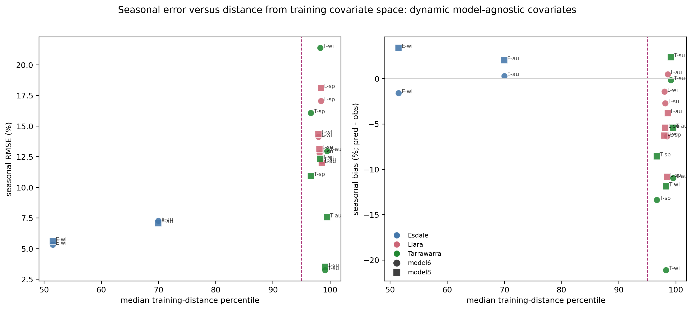

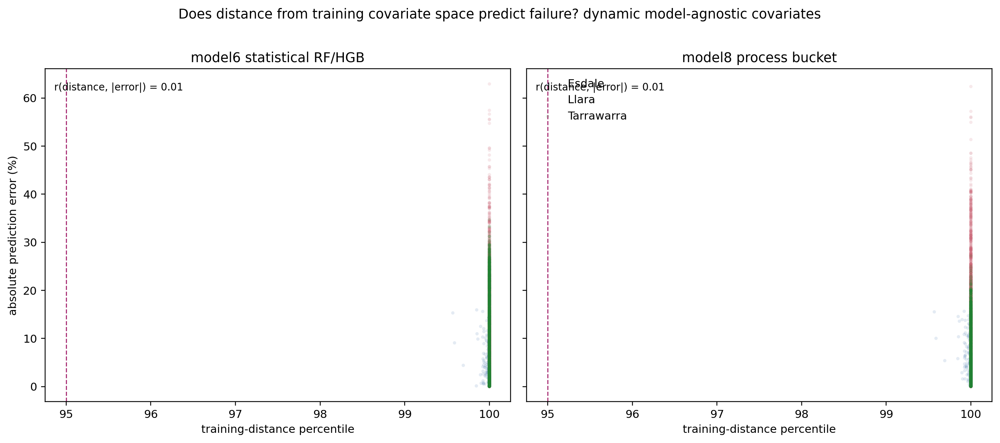

## 9. Interpretation guardrails

- PCA axes are descriptive rotations of correlated covariates; they are not physical mechanisms by themselves. Loadings should be used to name axes cautiously.
- Global-scaled PCA is best for between-site transfer questions. Site-standardised PCA is best for within-site terrain analogues. These are complementary rather than competing versions.
- Training distance is covariate-space distance, not geographic distance. A point can be geographically close to OzNet-like terrain and still be seasonally outlying in the dynamic covariate space.
- Tarrawarra observations have been aggregated to the 30 m prediction support in the upstream validation table; residual sub-pixel variation should still be treated as support mismatch where within-cell variance is high.
- The model8 process-context PCA is exploratory until the unified table carries the complete process-model forcing/static variables for every site.

## 10. Suggested manuscript use

For the publication-facing report, I would use:

1. one global-scaled static terrain-soil PCA panel to show site separation;
2. one site-standardised static PCA panel coloured by RMSE and bias to show whether bad supports occupy analogous covariate positions;
3. one dynamic covariate-space training-distance figure to quantify how far each validation site/date is from OzNet;
4. a small table of PC-decomposed bias/RMSE associations and worst-support overlap.

That combination keeps the story sharp: first, where are these sites relative to each other and to training; second, are the failures terrain-structured; third, does the process model fail differently from the statistical model?
