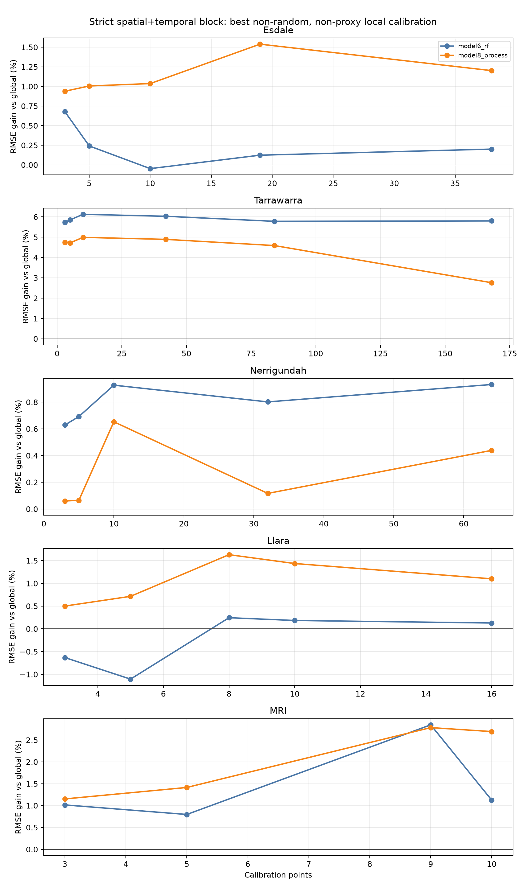
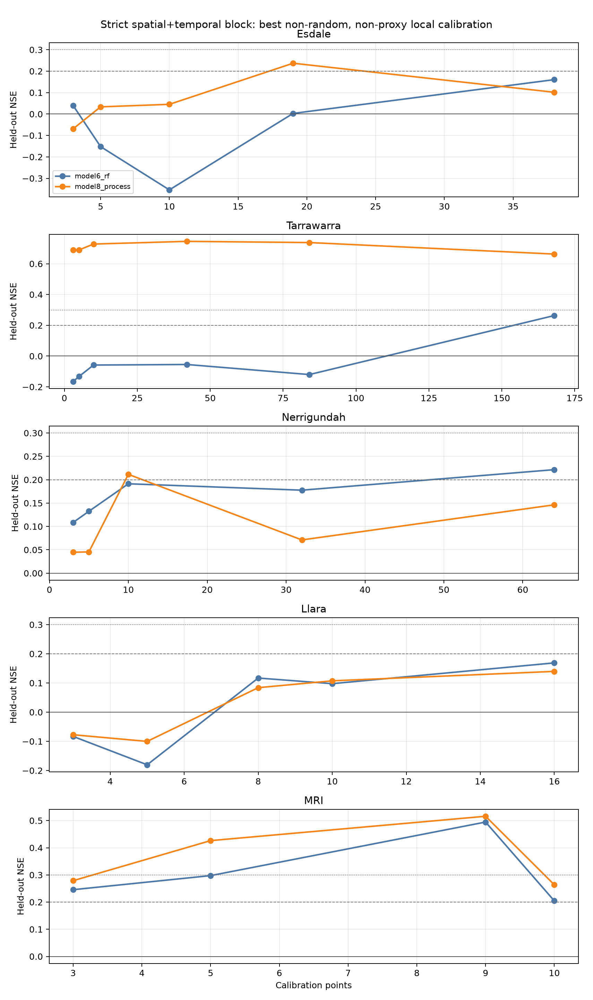
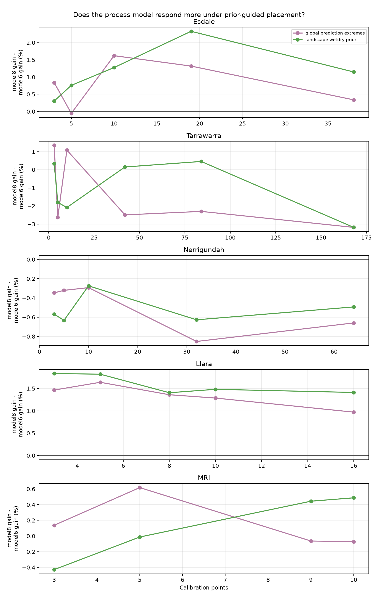
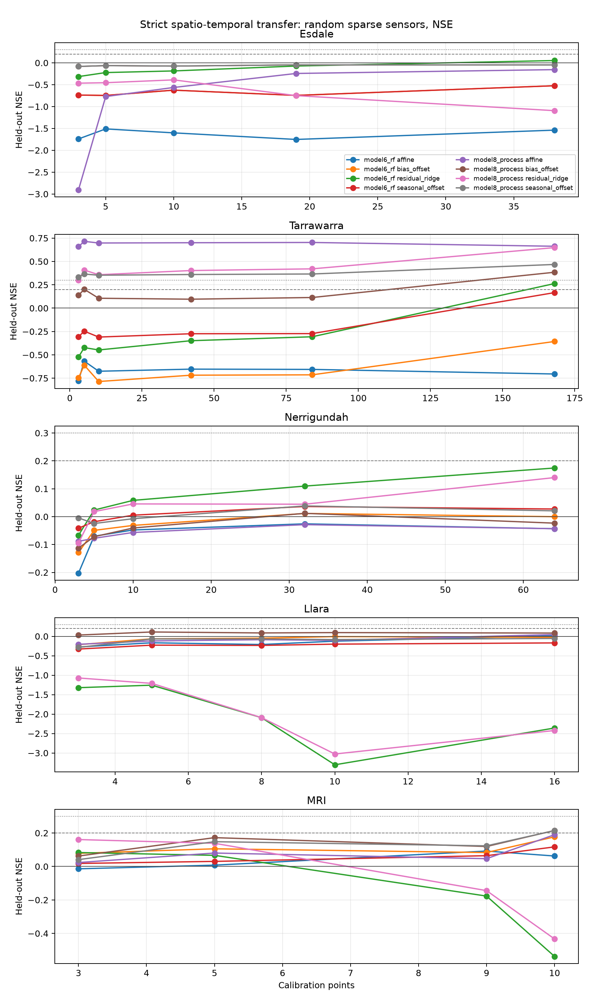

# Stage 2 local-spiking calibration: 5-site validation set

Sites included in this run: Esdale, Tarrawarra, Nerrigundah, Llara, MRI.

The practical question is: if a landowner can afford a small cluster of
soil-moisture sensors, can that local information budget improve property-scale
downscaling enough to matter? The experiment deliberately assumes that a new
site starts with **no measured soil moisture map**. Sensor locations are
therefore chosen using:

- random point selection;
- a terrain/model-input wet-dry landscape prior;
- global prediction extremes;
- an explicitly labelled `field_knowledge_wetdry_proxy`, which uses observed
  chronic wet/dry points as a proxy for landowner knowledge and should not be
  treated as a fully deployable selection rule.

## Blocking design

Each site is tested under three blocks:

1. `spatial_block`: fit selected calibration points across all available dense
   dates, validate unselected points.
2. `temporal_block`: fit selected calibration points in the early dense dates,
   validate those same points in later dates.
3. `spatiotemporal_block`: fit selected calibration points in early dates,
   validate different points in later dates. This is the strictest and most
   relevant property-map transfer test.

Calibration methods:

- `bias_offset`: one local residual offset;
- `seasonal_offset`: separate residual offsets by southern-hemisphere season,
  falling back to the global offset where a season is unseen in calibration;
- `affine`: local intercept and slope correction;
- `residual_ridge`: strongly regularised residual layer using only
  prediction-time model inputs and terrain/soil/weather state.

## Site inputs

| site        | path                                                                                                                                                 | rows      | models                   | points  | eligible_points_train_and_future | dates    | date_min   | date_max   | train_dates | future_dates | seasons                     |
| ----------- | ---------------------------------------------------------------------------------------------------------------------------------------------------- | --------- | ------------------------ | ------- | -------------------------------- | -------- | ---------- | ---------- | ----------- | ------------ | --------------------------- |
| Esdale      | /Volumes/Dmitry_work/borevitz_projects/DMM_validation/outputs/model6_vs_model8_dense/model6_model8_combined_predictions.csv                          | 1120.000  | model6_rf,model8_process | 79.000  | 76.000                           | 9.000    | 2025-04-30 | 2025-07-17 | 3.000       | 6.000        | autumn,winter               |
| Tarrawarra  | /Volumes/Dmitry_work/borevitz_projects/DMM_validation/outputs/tarrawarra_model6_vs_model8/model6_model8_combined_predictions_valid_30m_gridcell.csv  | 4308.000  | model6_rf,model8_process | 178.000 | 168.000                          | 19.000   | 1995-09-25 | 1996-11-29 | 7.000       | 12.000       | autumn,spring,summer,winter |
| Nerrigundah | /Volumes/Dmitry_work/borevitz_projects/DMM_validation/outputs/nerrigundah_model6_vs_model8/model6_model8_combined_predictions_valid_30m_gridcell.csv | 3072.000  | model6_rf,model8_process | 128.000 | 128.000                          | 12.000   | 1997-08-27 | 1997-09-22 | 4.000       | 8.000        | spring,winter               |
| Llara       | /Volumes/Dmitry_work/borevitz_projects/DMM_validation/outputs/llara_unseen_model6_vs_model8/llara_model6_model8_predictions.csv                      | 56780.000 | model6_rf,model8_process | 32.000  | 32.000                           | 911.000  | 2022-01-01 | 2024-06-30 | 301.000     | 610.000      | autumn,spring,summer,winter |
| MRI         | /Volumes/Dmitry_work/borevitz_projects/DMM_validation/outputs/mri_dense_validation/mri_model6_model8_predictions.csv                                 | 58092.000 | model6_rf,model8_process | 18.000  | 18.000                           | 1799.000 | 2021-07-01 | 2026-06-03 | 594.000     | 1205.000     | autumn,spring,summer,winter |

Tarrawarra observations are aggregated to the model prediction grid cell by date before validation, because the raw campaign points are much closer than the raster support. Tarrawarra model6 should also be read with a special caveat: the historical SMIPS inputs in the existing Tarrawarra run are zero, so model6 there is closer to a missing-coarse-anchor ablation than a normal model6 run.

Nerrigundah uses the same grid-cell support logic as Tarrawarra. MRI is a
sparser continuous probe network, so its Stage 2 curves test local temporal
transfer at fewer fixed supports rather than dense campaign spatial structure.

## Uncalibrated global model skill

| site        | base_model     | model_track    | n         | nse    | pearson_r | rmse   | ubrmse | bias    |
| ----------- | -------------- | -------------- | --------- | ------ | --------- | ------ | ------ | ------- |
| Esdale      | model6_rf      | statistical_rf | 560.000   | 0.023  | 0.238     | 6.477  | 6.453  | -0.558  |
| Esdale      | model8_process | process_bucket | 560.000   | 0.031  | 0.462     | 6.452  | 5.884  | 2.645   |
| Tarrawarra  | model6_rf      | statistical_rf | 2154.000  | -1.219 | 0.398     | 14.402 | 9.093  | -11.169 |
| Tarrawarra  | model8_process | process_bucket | 2154.000  | 0.077  | 0.853     | 9.291  | 6.958  | -6.157  |
| Nerrigundah | model6_rf      | statistical_rf | 1536.000  | -0.079 | 0.130     | 6.341  | 6.054  | -1.887  |
| Nerrigundah | model8_process | process_bucket | 1536.000  | -0.050 | 0.102     | 6.254  | 6.078  | 1.476   |
| Llara       | model6_rf      | statistical_rf | 28390.000 | 0.039  | 0.274     | 13.777 | 13.582 | -2.308  |
| Llara       | model8_process | process_bucket | 28390.000 | -0.017 | 0.463     | 14.172 | 12.677 | -6.335  |
| MRI         | model6_rf      | statistical_rf | 29046.000 | 0.006  | 0.545     | 9.972  | 8.413  | -5.354  |
| MRI         | model8_process | process_bucket | 29046.000 | 0.024  | 0.600     | 9.882  | 8.157  | -5.577  |

## Headline inference

- Under the strict prior-guided, non-proxy placement test, the report now
  compares all retained validation sites with model-ready support/date tables.
  The cleanest manuscript reading should focus on whether calibration improves
  held-out RMSE and NSE within each site, then compare process-vs-statistical
  responsiveness as a secondary diagnostic.
- Tarrawarra is different: both models improve strongly with sparse local
  calibration, but model6 often shows larger RMSE gains because its uncalibrated
  bias is very large. However, model8 generally remains the lower-RMSE model
  after calibration. Interpret this alongside the Tarrawarra SMIPS-zero caveat.
- Nerrigundah and MRI should be treated as support-type sensitivity checks:
  Nerrigundah is a Tarrawarra-like campaign grid, while MRI is a sparse
  continuously monitored probe network.
- Random placement is retained as an appendix comparator. It is not consistently
  enough under the strict block, which supports the practical idea of using
  defensible landscape knowledge rather than arbitrary sensor placement.
- The `field_knowledge_wetdry_proxy` can outperform deployable priors in some
  cases, but it is an upper-bound proxy, not a blind deployment rule.
- The residual-ridge layer is useful in selected cases, but simple
  `bias_offset` is often the most robust sparse-sensor calibration layer. This
  matters for deployability: a landowner-facing calibration should probably
  start with a small, interpretable correction before adding flexible residual
  models.

## Prior-guided sparse-sensor learning curves

This table mirrors the main manuscript learning-curve figures and
Table 5-style minimum-budget summary. It keeps only deployable non-random,
non-proxy placement strategies: `landscape_wetdry_prior` and
`global_prediction_extremes`.

| site        | budget_label | calibration_points | base_model     | selection_strategy         | method          | nse_median | pearson_r_median | rmse_median | ubrmse_median | bias_median | rmse_gain_median | delta_nse_median | n_replicates |
| ----------- | ------------ | ------------------ | -------------- | -------------------------- | --------------- | ---------- | ---------------- | ----------- | ------------- | ----------- | ---------------- | ---------------- | ------------ |
| Esdale      | 3            | 3.000              | model6_rf      | global_prediction_extremes | residual_ridge  | 0.040      | 0.441            | 4.138       | 3.804         | 1.627       | 0.678            | 0.341            | 1.000        |
| Esdale      | 5            | 5.000              | model6_rf      | global_prediction_extremes | bias_offset     | -0.152     | 0.085            | 4.547       | 4.546         | -0.106      | 0.241            | 0.125            | 1.000        |
| Esdale      | 10           | 10.000             | model6_rf      | landscape_wetdry_prior     | bias_offset     | -0.354     | 0.090            | 5.113       | 4.828         | -1.683      | -0.048           | -0.025           | 1.000        |
| Esdale      | 25%          | 19.000             | model6_rf      | global_prediction_extremes | residual_ridge  | 0.003      | 0.314            | 4.029       | 3.989         | 0.564       | 0.123            | 0.062            | 1.000        |
| Esdale      | 50%          | 38.000             | model6_rf      | global_prediction_extremes | residual_ridge  | 0.160      | 0.531            | 3.480       | 3.240         | -1.269      | 0.201            | 0.100            | 1.000        |
| Esdale      | 3            | 3.000              | model8_process | global_prediction_extremes | affine          | -0.069     | 0.274            | 4.365       | 4.081         | 1.549       | 0.938            | 0.509            | 1.000        |
| Esdale      | 5            | 5.000              | model8_process | landscape_wetdry_prior     | affine          | 0.034      | 0.254            | 4.420       | 4.396         | -0.457      | 1.006            | 0.490            | 1.000        |
| Esdale      | 10           | 10.000             | model8_process | landscape_wetdry_prior     | residual_ridge  | 0.045      | 0.462            | 4.294       | 4.075         | 1.354       | 1.036            | 0.516            | 1.000        |
| Esdale      | 25%          | 19.000             | model8_process | landscape_wetdry_prior     | residual_ridge  | 0.237      | 0.494            | 3.746       | 3.745         | 0.088       | 1.539            | 0.756            | 1.000        |
| Esdale      | 50%          | 38.000             | model8_process | global_prediction_extremes | bias_offset     | 0.101      | 0.427            | 3.600       | 3.494         | 0.868       | 1.201            | 0.700            | 1.000        |
| Tarrawarra  | 3            | 3.000              | model6_rf      | landscape_wetdry_prior     | seasonal_offset | -0.165     | 0.154            | 10.003      | 9.610         | -2.776      | 5.737            | 1.720            | 1.000        |
| Tarrawarra  | 5            | 5.000              | model6_rf      | landscape_wetdry_prior     | residual_ridge  | -0.133     | 0.799            | 9.848       | 7.106         | -6.817      | 5.847            | 1.745            | 1.000        |
| Tarrawarra  | 10           | 10.000             | model6_rf      | landscape_wetdry_prior     | residual_ridge  | -0.058     | 0.819            | 9.496       | 6.952         | -6.469      | 6.124            | 1.805            | 1.000        |
| Tarrawarra  | 25%          | 42.000             | model6_rf      | global_prediction_extremes | residual_ridge  | -0.055     | 0.830            | 9.628       | 6.761         | -6.854      | 6.029            | 1.734            | 1.000        |
| Tarrawarra  | 50%          | 84.000             | model6_rf      | global_prediction_extremes | residual_ridge  | -0.120     | 0.826            | 10.035      | 6.696         | -7.475      | 5.780            | 1.662            | 1.000        |
| Tarrawarra  | all          | 168.000            | model6_rf      | global_prediction_extremes | residual_ridge  | 0.263      | 0.820            | 9.736       | 8.929         | -3.882      | 5.800            | 1.139            | 1.000        |
| Tarrawarra  | 3            | 3.000              | model8_process | landscape_wetdry_prior     | affine          | 0.689      | 0.859            | 5.163       | 4.822         | 1.847       | 4.747            | 0.834            | 1.000        |
| Tarrawarra  | 5            | 5.000              | model8_process | landscape_wetdry_prior     | affine          | 0.690      | 0.860            | 5.155       | 4.808         | 1.859       | 4.718            | 0.828            | 1.000        |
| Tarrawarra  | 10           | 10.000             | model8_process | landscape_wetdry_prior     | affine          | 0.728      | 0.860            | 4.815       | 4.768         | 0.673       | 4.991            | 0.856            | 1.000        |
| Tarrawarra  | 25%          | 42.000             | model8_process | landscape_wetdry_prior     | affine          | 0.746      | 0.867            | 4.672       | 4.664         | 0.268       | 4.891            | 0.812            | 1.000        |
| Tarrawarra  | 50%          | 84.000             | model8_process | landscape_wetdry_prior     | affine          | 0.738      | 0.863            | 4.764       | 4.756         | -0.280      | 4.588            | 0.748            | 1.000        |
| Tarrawarra  | all          | 168.000            | model8_process | global_prediction_extremes | affine          | 0.663      | 0.822            | 6.587       | 6.505         | 1.033       | 2.758            | 0.341            | 1.000        |
| Nerrigundah | 3            | 3.000              | model6_rf      | landscape_wetdry_prior     | residual_ridge  | 0.108      | 0.381            | 6.278       | 6.277         | -0.125      | 0.629            | 0.187            | 1.000        |
| Nerrigundah | 5            | 5.000              | model6_rf      | landscape_wetdry_prior     | residual_ridge  | 0.132      | 0.423            | 6.180       | 6.171         | 0.339       | 0.692            | 0.205            | 1.000        |
| Nerrigundah | 10           | 10.000             | model6_rf      | landscape_wetdry_prior     | residual_ridge  | 0.191      | 0.507            | 6.003       | 5.863         | -1.290      | 0.927            | 0.269            | 1.000        |
| Nerrigundah | 25%          | 32.000             | model6_rf      | global_prediction_extremes | residual_ridge  | 0.178      | 0.446            | 6.131       | 6.106         | 0.550       | 0.802            | 0.229            | 1.000        |
| Nerrigundah | 50%          | 64.000             | model6_rf      | landscape_wetdry_prior     | residual_ridge  | 0.222      | 0.496            | 5.841       | 5.838         | 0.185       | 0.932            | 0.268            | 1.000        |
| Nerrigundah | 3            | 3.000              | model8_process | landscape_wetdry_prior     | residual_ridge  | 0.045      | 0.307            | 6.499       | 6.377         | 1.255       | 0.060            | 0.018            | 1.000        |
| Nerrigundah | 5            | 5.000              | model8_process | global_prediction_extremes | seasonal_offset | 0.045      | 0.245            | 6.545       | 6.537         | 0.334       | 0.064            | 0.019            | 1.000        |
| Nerrigundah | 10           | 10.000             | model8_process | landscape_wetdry_prior     | residual_ridge  | 0.211      | 0.536            | 5.928       | 5.919         | -0.314      | 0.653            | 0.183            | 1.000        |
| Nerrigundah | 25%          | 32.000             | model8_process | landscape_wetdry_prior     | residual_ridge  | 0.071      | 0.338            | 6.343       | 6.298         | 0.757       | 0.116            | 0.034            | 1.000        |
| Nerrigundah | 50%          | 64.000             | model8_process | landscape_wetdry_prior     | residual_ridge  | 0.146      | 0.389            | 6.116       | 6.104         | 0.396       | 0.439            | 0.127            | 1.000        |
| Llara       | 3            | 3.000              | model6_rf      | landscape_wetdry_prior     | residual_ridge  | -0.083     | 0.418            | 12.530      | 11.859        | -4.046      | -0.631           | -0.106           | 1.000        |
| Llara       | 5            | 5.000              | model6_rf      | landscape_wetdry_prior     | bias_offset     | -0.180     | 0.316            | 12.822      | 11.264        | -6.126      | -1.105           | -0.195           | 1.000        |
| Llara       | 25%          | 8.000              | model6_rf      | landscape_wetdry_prior     | affine          | 0.117      | 0.351            | 11.360      | 11.323        | -0.915      | 0.244            | 0.038            | 1.000        |
| Llara       | 10           | 10.000             | model6_rf      | landscape_wetdry_prior     | affine          | 0.098      | 0.343            | 11.692      | 11.565        | -1.715      | 0.184            | 0.029            | 1.000        |
| Llara       | 50%          | 16.000             | model6_rf      | global_prediction_extremes | bias_offset     | 0.169      | 0.441            | 9.631       | 9.629         | 0.201       | 0.128            | 0.022            | 1.000        |
| Llara       | 3            | 3.000              | model8_process | landscape_wetdry_prior     | bias_offset     | -0.077     | 0.401            | 12.496      | 11.067        | -5.805      | 0.501            | 0.088            | 1.000        |
| Llara       | 5            | 5.000              | model8_process | landscape_wetdry_prior     | bias_offset     | -0.100     | 0.377            | 12.379      | 10.952        | -5.770      | 0.714            | 0.131            | 1.000        |
| Llara       | 25%          | 8.000              | model8_process | landscape_wetdry_prior     | bias_offset     | 0.084      | 0.394            | 11.570      | 11.179        | -2.984      | 1.630            | 0.276            | 1.000        |
| Llara       | 10           | 10.000             | model8_process | global_prediction_extremes | bias_offset     | 0.107      | 0.334            | 11.429      | 11.409        | -0.681      | 1.435            | 0.238            | 1.000        |
| Llara       | 50%          | 16.000             | model8_process | global_prediction_extremes | bias_offset     | 0.140      | 0.403            | 9.799       | 9.699         | 1.396       | 1.100            | 0.204            | 1.000        |
| MRI         | 3            | 3.000              | model6_rf      | global_prediction_extremes | bias_offset     | 0.246      | 0.539            | 8.839       | 8.703         | 1.541       | 1.015            | 0.183            | 1.000        |
| MRI         | 5            | 5.000              | model6_rf      | global_prediction_extremes | residual_ridge  | 0.297      | 0.624            | 8.093       | 8.089         | -0.253      | 0.797            | 0.145            | 1.000        |
| MRI         | 50%          | 9.000              | model6_rf      | global_prediction_extremes | residual_ridge  | 0.495      | 0.730            | 7.346       | 7.340         | 0.307       | 2.847            | 0.468            | 1.000        |
| MRI         | 10           | 10.000             | model6_rf      | global_prediction_extremes | bias_offset     | 0.205      | 0.504            | 9.670       | 9.536         | 1.605       | 1.125            | 0.196            | 1.000        |
| MRI         | 3            | 3.000              | model8_process | global_prediction_extremes | bias_offset     | 0.279      | 0.589            | 8.643       | 8.548         | 1.272       | 1.152            | 0.205            | 1.000        |
| MRI         | 5            | 5.000              | model8_process | global_prediction_extremes | residual_ridge  | 0.426      | 0.688            | 7.313       | 7.288         | 0.606       | 1.414            | 0.243            | 1.000        |
| MRI         | 50%          | 9.000              | model8_process | global_prediction_extremes | residual_ridge  | 0.516      | 0.741            | 7.190       | 7.039         | 1.466       | 2.783            | 0.447            | 1.000        |
| MRI         | 10           | 10.000             | model8_process | landscape_wetdry_prior     | bias_offset     | 0.264      | 0.533            | 6.210       | 6.131         | -0.986      | 2.693            | 0.777            | 1.000        |

## Appendix comparator: random sparse-sensor learning curves

Random placement is retained as a conservative comparator because it does not
assume any landscape knowledge. The report table shows calibrated held-out NSE,
Pearson r, RMSE, ubRMSE and bias; improvement bookkeeping is retained in the
CSV outputs.

| site   | budget_label | calibration_points | base_model     | method          | nse_median | pearson_r_median | rmse_median | ubrmse_median | bias_median | n_replicates |
| ------ | ------------ | ------------------ | -------------- | --------------- | ---------- | ---------------- | ----------- | ------------- | ----------- | ------------ |
| Esdale | 10           | 10.000             | model6_rf      | affine          | -1.602     | 0.000            | 7.237       | 4.466         | -5.617      | 20.000       |
| Esdale | 10           | 10.000             | model6_rf      | bias_offset     | -0.625     | 0.042            | 5.695       | 4.995         | -2.583      | 20.000       |
| Esdale | 10           | 10.000             | model6_rf      | residual_ridge  | -0.185     | 0.333            | 4.853       | 4.393         | -0.428      | 20.000       |
| Esdale | 10           | 10.000             | model6_rf      | seasonal_offset | -0.625     | 0.042            | 5.695       | 4.995         | -2.583      | 20.000       |
| Esdale | 10           | 10.000             | model8_process | affine          | -0.563     | 0.256            | 5.589       | 4.437         | -0.838      | 20.000       |
| Esdale | 10           | 10.000             | model8_process | bias_offset     | -0.074     | 0.262            | 4.654       | 4.468         | 0.948       | 20.000       |
| Esdale | 10           | 10.000             | model8_process | residual_ridge  | -0.390     | 0.474            | 5.316       | 3.998         | 3.522       | 20.000       |
| Esdale | 10           | 10.000             | model8_process | seasonal_offset | -0.074     | 0.262            | 4.654       | 4.468         | 0.948       | 20.000       |
| Esdale | 25%          | 19.000             | model6_rf      | affine          | -1.752     | 0.000            | 7.226       | 4.454         | -5.734      | 20.000       |
| Esdale | 25%          | 19.000             | model6_rf      | bias_offset     | -0.745     | 0.042            | 5.767       | 4.992         | -3.055      | 20.000       |
| Esdale | 25%          | 19.000             | model6_rf      | residual_ridge  | -0.073     | 0.378            | 4.575       | 4.249         | 0.093       | 20.000       |
| Esdale | 25%          | 19.000             | model6_rf      | seasonal_offset | -0.745     | 0.042            | 5.767       | 4.992         | -3.055      | 20.000       |
| Esdale | 25%          | 19.000             | model8_process | affine          | -0.243     | 0.267            | 4.963       | 4.312         | -2.473      | 20.000       |
| Esdale | 25%          | 19.000             | model8_process | bias_offset     | -0.047     | 0.267            | 4.572       | 4.456         | 0.606       | 20.000       |
| Esdale | 25%          | 19.000             | model8_process | residual_ridge  | -0.750     | 0.484            | 5.777       | 3.950         | 4.302       | 20.000       |
| Esdale | 25%          | 19.000             | model8_process | seasonal_offset | -0.047     | 0.267            | 4.572       | 4.456         | 0.606       | 20.000       |
| Esdale | 3            | 3.000              | model6_rf      | affine          | -1.741     | 0.000            | 7.265       | 4.427         | -5.588      | 20.000       |
| Esdale | 3            | 3.000              | model6_rf      | bias_offset     | -0.737     | 0.055            | 5.741       | 4.910         | -3.117      | 20.000       |
| Esdale | 3            | 3.000              | model6_rf      | residual_ridge  | -0.315     | 0.252            | 5.083       | 4.585         | -0.578      | 20.000       |
| Esdale | 3            | 3.000              | model6_rf      | seasonal_offset | -0.737     | 0.055            | 5.741       | 4.910         | -3.117      | 20.000       |
| Esdale | 3            | 3.000              | model8_process | affine          | -2.906     | 0.271            | 8.728       | 6.113         | 4.748       | 20.000       |
| Esdale | 3            | 3.000              | model8_process | bias_offset     | -0.082     | 0.272            | 4.599       | 4.400         | 1.022       | 20.000       |
| Esdale | 3            | 3.000              | model8_process | residual_ridge  | -0.465     | 0.403            | 5.391       | 4.163         | 3.204       | 20.000       |
| Esdale | 3            | 3.000              | model8_process | seasonal_offset | -0.082     | 0.272            | 4.599       | 4.400         | 1.022       | 20.000       |
| Esdale | 5            | 5.000              | model6_rf      | affine          | -1.511     | 0.000            | 6.945       | 4.428         | -5.363      | 20.000       |
| Esdale | 5            | 5.000              | model6_rf      | bias_offset     | -0.746     | 0.051            | 5.794       | 4.916         | -3.142      | 20.000       |
| Esdale | 5            | 5.000              | model6_rf      | residual_ridge  | -0.223     | 0.267            | 4.915       | 4.515         | -0.035      | 20.000       |
| Esdale | 5            | 5.000              | model6_rf      | seasonal_offset | -0.746     | 0.051            | 5.794       | 4.916         | -3.142      | 20.000       |
| Esdale | 5            | 5.000              | model8_process | affine          | -0.771     | 0.263            | 5.813       | 4.366         | -1.229      | 20.000       |
| Esdale | 5            | 5.000              | model8_process | bias_offset     | -0.064     | 0.264            | 4.568       | 4.408         | 0.391       | 20.000       |
| Esdale | 5            | 5.000              | model8_process | residual_ridge  | -0.455     | 0.452            | 5.314       | 4.043         | 3.463       | 20.000       |
| Esdale | 5            | 5.000              | model8_process | seasonal_offset | -0.064     | 0.264            | 4.568       | 4.408         | 0.391       | 20.000       |
| Esdale | 50%          | 38.000             | model6_rf      | affine          | -1.539     | 0.000            | 7.136       | 4.404         | -5.522      | 20.000       |
| Esdale | 50%          | 38.000             | model6_rf      | bias_offset     | -0.524     | 0.082            | 5.556       | 4.798         | -2.411      | 20.000       |
| Esdale | 50%          | 38.000             | model6_rf      | residual_ridge  | 0.052      | 0.449            | 4.373       | 3.996         | 0.255       | 20.000       |
| Esdale | 50%          | 38.000             | model6_rf      | seasonal_offset | -0.524     | 0.082            | 5.556       | 4.798         | -2.411      | 20.000       |
| Esdale | 50%          | 38.000             | model8_process | affine          | -0.155     | 0.270            | 4.795       | 4.261         | -2.218      | 20.000       |
| Esdale | 50%          | 38.000             | model8_process | bias_offset     | -0.047     | 0.270            | 4.507       | 4.353         | 1.083       | 20.000       |
| Esdale | 50%          | 38.000             | model8_process | residual_ridge  | -1.094     | 0.526            | 6.401       | 3.856         | 4.858       | 20.000       |
| Esdale | 50%          | 38.000             | model8_process | seasonal_offset | -0.047     | 0.270            | 4.507       | 4.353         | 1.083       | 20.000       |
| Llara  | 10           | 10.000             | model6_rf      | affine          | -0.125     | 0.300            | 12.544      | 12.049        | -1.867      | 20.000       |
| Llara  | 10           | 10.000             | model6_rf      | bias_offset     | -0.008     | 0.302            | 12.277      | 11.643        | -0.658      | 20.000       |
| Llara  | 10           | 10.000             | model6_rf      | residual_ridge  | -3.304     | 0.227            | 24.179      | 21.766        | 3.644       | 20.000       |
| Llara  | 10           | 10.000             | model6_rf      | seasonal_offset | -0.202     | 0.252            | 13.384      | 12.772        | -0.368      | 20.000       |
| Llara  | 10           | 10.000             | model8_process | affine          | -0.104     | 0.417            | 12.013      | 11.570        | -2.383      | 20.000       |
| Llara  | 10           | 10.000             | model8_process | bias_offset     | 0.096      | 0.417            | 11.594      | 11.246        | 0.684       | 20.000       |
| Llara  | 10           | 10.000             | model8_process | residual_ridge  | -3.027     | 0.236            | 24.613      | 22.477        | 2.373       | 20.000       |
| Llara  | 10           | 10.000             | model8_process | seasonal_offset | -0.085     | 0.288            | 12.711      | 12.350        | 0.578       | 20.000       |
| Llara  | 25%          | 8.000              | model6_rf      | affine          | -0.211     | 0.289            | 13.486      | 11.919        | -2.552      | 20.000       |
| Llara  | 25%          | 8.000              | model6_rf      | bias_offset     | -0.048     | 0.295            | 12.557      | 11.607        | -2.912      | 20.000       |
| Llara  | 25%          | 8.000              | model6_rf      | residual_ridge  | -2.094     | 0.261            | 21.665      | 19.816        | 1.152       | 20.000       |
| Llara  | 25%          | 8.000              | model6_rf      | seasonal_offset | -0.234     | 0.245            | 13.345      | 12.532        | -2.165      | 20.000       |
| Llara  | 25%          | 8.000              | model8_process | affine          | -0.087     | 0.413            | 12.687      | 11.754        | -3.876      | 20.000       |
| Llara  | 25%          | 8.000              | model8_process | bias_offset     | 0.086      | 0.413            | 11.764      | 11.185        | -1.622      | 20.000       |
| Llara  | 25%          | 8.000              | model8_process | residual_ridge  | -2.091     | 0.263            | 22.065      | 20.132        | 0.339       | 20.000       |
| Llara  | 25%          | 8.000              | model8_process | seasonal_offset | -0.069     | 0.309            | 12.678      | 12.075        | -1.556      | 20.000       |
| Llara  | 3            | 3.000              | model6_rf      | affine          | -0.275     | 0.301            | 13.587      | 12.013        | -1.286      | 20.000       |
| Llara  | 3            | 3.000              | model6_rf      | bias_offset     | -0.215     | 0.309            | 13.134      | 11.432        | -2.256      | 20.000       |
| Llara  | 3            | 3.000              | model6_rf      | residual_ridge  | -1.321     | 0.418            | 18.192      | 12.260        | -0.360      | 20.000       |
| Llara  | 3            | 3.000              | model6_rf      | seasonal_offset | -0.328     | 0.244            | 14.035      | 12.570        | -1.798      | 20.000       |

_Showing first 60 of 200 rows._

## Process-vs-statistical calibration responsiveness

Positive `process_minus_statistical_rmse_gain_median` means model8 process
benefited more from the same sparse local calibration than model6 RF. Negative
values mean model6 RF benefited more.

| site        | budget_label | calibration_points | method          | statistical_rmse_gain_median | process_rmse_gain_median | process_minus_statistical_rmse_gain_median | fraction_process_wins | n_replicates |
| ----------- | ------------ | ------------------ | --------------- | ---------------------------- | ------------------------ | ------------------------------------------ | --------------------- | ------------ |
| Esdale      | 10           | 10.000             | affine          | -1.873                       | -0.303                   | 1.891                                      | 0.750                 | 20.000       |
| Esdale      | 10           | 10.000             | bias_offset     | -0.363                       | 0.740                    | 1.199                                      | 0.900                 | 20.000       |
| Esdale      | 10           | 10.000             | residual_ridge  | 0.407                        | 0.096                    | -0.983                                     | 0.300                 | 20.000       |
| Esdale      | 10           | 10.000             | seasonal_offset | -0.363                       | 0.740                    | 1.199                                      | 0.900                 | 20.000       |
| Esdale      | 25%          | 19.000             | affine          | -2.095                       | 0.181                    | 2.224                                      | 1.000                 | 20.000       |
| Esdale      | 25%          | 19.000             | bias_offset     | -0.546                       | 0.772                    | 1.296                                      | 1.000                 | 20.000       |
| Esdale      | 25%          | 19.000             | residual_ridge  | 0.711                        | -0.388                   | -1.569                                     | 0.200                 | 20.000       |
| Esdale      | 25%          | 19.000             | seasonal_offset | -0.546                       | 0.772                    | 1.296                                      | 1.000                 | 20.000       |
| Esdale      | 3            | 3.000              | affine          | -2.041                       | -3.434                   | 0.057                                      | 0.350                 | 20.000       |
| Esdale      | 3            | 3.000              | bias_offset     | -0.627                       | 0.708                    | 1.372                                      | 0.750                 | 20.000       |
| Esdale      | 3            | 3.000              | residual_ridge  | 0.182                        | -0.036                   | -0.510                                     | 0.450                 | 20.000       |
| Esdale      | 3            | 3.000              | seasonal_offset | -0.627                       | 0.708                    | 1.372                                      | 0.750                 | 20.000       |
| Esdale      | 5            | 5.000              | affine          | -1.809                       | -0.652                   | 1.471                                      | 0.650                 | 20.000       |
| Esdale      | 5            | 5.000              | bias_offset     | -0.617                       | 0.785                    | 1.435                                      | 0.900                 | 20.000       |
| Esdale      | 5            | 5.000              | residual_ridge  | 0.362                        | 0.009                    | -0.779                                     | 0.200                 | 20.000       |
| Esdale      | 5            | 5.000              | seasonal_offset | -0.617                       | 0.785                    | 1.435                                      | 0.900                 | 20.000       |
| Esdale      | 50%          | 38.000             | affine          | -1.987                       | 0.499                    | 2.709                                      | 1.000                 | 20.000       |
| Esdale      | 50%          | 38.000             | bias_offset     | -0.312                       | 0.814                    | 1.151                                      | 1.000                 | 20.000       |
| Esdale      | 50%          | 38.000             | residual_ridge  | 0.757                        | -0.955                   | -1.761                                     | 0.200                 | 20.000       |
| Esdale      | 50%          | 38.000             | seasonal_offset | -0.312                       | 0.814                    | 1.151                                      | 1.000                 | 20.000       |
| Llara       | 10           | 10.000             | affine          | -1.083                       | -0.070                   | 1.285                                      | 0.750                 | 20.000       |
| Llara       | 10           | 10.000             | bias_offset     | -0.270                       | 1.018                    | 1.432                                      | 0.900                 | 20.000       |
| Llara       | 10           | 10.000             | residual_ridge  | -12.827                      | -11.389                  | 0.628                                      | 0.550                 | 20.000       |
| Llara       | 10           | 10.000             | seasonal_offset | -1.498                       | -0.235                   | 1.405                                      | 0.950                 | 20.000       |
| Llara       | 25%          | 8.000              | affine          | -1.452                       | -0.089                   | 1.092                                      | 0.600                 | 20.000       |
| Llara       | 25%          | 8.000              | bias_offset     | -0.507                       | 1.286                    | 1.665                                      | 1.000                 | 20.000       |
| Llara       | 25%          | 8.000              | residual_ridge  | -9.214                       | -9.061                   | 0.732                                      | 0.500                 | 20.000       |
| Llara       | 25%          | 8.000              | seasonal_offset | -1.420                       | 0.212                    | 1.600                                      | 1.000                 | 20.000       |
| Llara       | 3            | 3.000              | affine          | -1.796                       | -0.619                   | 1.959                                      | 0.700                 | 20.000       |
| Llara       | 3            | 3.000              | bias_offset     | -1.364                       | 0.868                    | 1.654                                      | 0.900                 | 20.000       |
| Llara       | 3            | 3.000              | residual_ridge  | -6.347                       | -4.550                   | 0.690                                      | 0.450                 | 20.000       |
| Llara       | 3            | 3.000              | seasonal_offset | -2.152                       | -0.766                   | 1.589                                      | 0.850                 | 20.000       |
| Llara       | 5            | 5.000              | affine          | -0.904                       | -0.108                   | 1.309                                      | 0.700                 | 20.000       |
| Llara       | 5            | 5.000              | bias_offset     | -0.679                       | 1.182                    | 1.619                                      | 1.000                 | 20.000       |
| Llara       | 5            | 5.000              | residual_ridge  | -6.186                       | -4.928                   | -0.155                                     | 0.300                 | 20.000       |
| Llara       | 5            | 5.000              | seasonal_offset | -1.347                       | 0.166                    | 1.599                                      | 1.000                 | 20.000       |
| Llara       | 50%          | 16.000             | affine          | -0.505                       | 0.384                    | 1.181                                      | 0.500                 | 20.000       |
| Llara       | 50%          | 16.000             | bias_offset     | -0.256                       | 1.156                    | 1.600                                      | 0.850                 | 20.000       |
| Llara       | 50%          | 16.000             | residual_ridge  | -10.342                      | -9.975                   | 0.978                                      | 0.500                 | 20.000       |
| Llara       | 50%          | 16.000             | seasonal_offset | -1.261                       | 0.229                    | 1.560                                      | 0.900                 | 20.000       |
| MRI         | 10           | 10.000             | affine          | 0.805                        | 1.131                    | 0.485                                      | 0.900                 | 20.000       |
| MRI         | 10           | 10.000             | bias_offset     | 1.119                        | 1.286                    | 0.075                                      | 0.700                 | 20.000       |
| MRI         | 10           | 10.000             | residual_ridge  | -2.444                       | -2.359                   | 0.080                                      | 0.650                 | 20.000       |
| MRI         | 10           | 10.000             | seasonal_offset | 0.862                        | 1.196                    | 0.282                                      | 0.900                 | 20.000       |
| MRI         | 3            | 3.000              | affine          | -0.444                       | 0.045                    | 0.489                                      | 0.750                 | 20.000       |
| MRI         | 3            | 3.000              | bias_offset     | 0.427                        | 0.177                    | 0.066                                      | 0.550                 | 20.000       |
| MRI         | 3            | 3.000              | residual_ridge  | -0.031                       | 0.228                    | 0.234                                      | 0.800                 | 20.000       |
| MRI         | 3            | 3.000              | seasonal_offset | 0.169                        | 0.184                    | 0.273                                      | 0.800                 | 20.000       |
| MRI         | 5            | 5.000              | affine          | -0.024                       | 0.366                    | 0.425                                      | 0.800                 | 20.000       |
| MRI         | 5            | 5.000              | bias_offset     | 0.746                        | 0.808                    | 0.160                                      | 0.800                 | 20.000       |
| MRI         | 5            | 5.000              | residual_ridge  | 0.395                        | 0.471                    | 0.181                                      | 0.750                 | 20.000       |
| MRI         | 5            | 5.000              | seasonal_offset | 0.414                        | 0.684                    | 0.418                                      | 0.950                 | 20.000       |
| MRI         | 50%          | 9.000              | affine          | -0.368                       | 0.773                    | 0.791                                      | 0.850                 | 20.000       |
| MRI         | 50%          | 9.000              | bias_offset     | 0.573                        | 0.607                    | 0.066                                      | 0.550                 | 20.000       |
| MRI         | 50%          | 9.000              | residual_ridge  | -1.391                       | -1.361                   | 0.176                                      | 0.650                 | 20.000       |
| MRI         | 50%          | 9.000              | seasonal_offset | 0.323                        | 0.565                    | 0.270                                      | 0.900                 | 20.000       |
| Nerrigundah | 10           | 10.000             | affine          | 0.103                        | -0.275                   | -0.384                                     | 0.100                 | 20.000       |
| Nerrigundah | 10           | 10.000             | bias_offset     | 0.165                        | -0.230                   | -0.388                                     | 0.250                 | 20.000       |
| Nerrigundah | 10           | 10.000             | residual_ridge  | 0.441                        | 0.065                    | -0.351                                     | 0.450                 | 20.000       |
| Nerrigundah | 10           | 10.000             | seasonal_offset | 0.291                        | -0.103                   | -0.361                                     | 0.500                 | 20.000       |

_Showing first 60 of 100 rows._

## Figures

### Figure 1. Uncalibrated global model skill by validation site

Baseline RMSE and NSE for model6 RF and model8 process before any local calibration.

### Figure 2. Strict spatio-temporal prior-guided learning curves: RMSE gain

Best RMSE gain from deployable non-random placement priors under the strict spatial+temporal block.

### Figure 3. Strict spatio-temporal prior-guided learning curves: NSE

Best held-out NSE from deployable non-random placement priors under the strict spatial+temporal block.

### Figure 4. Process-vs-statistical responsiveness under prior-guided placement

Positive values indicate model8 process gains more from the same deployable non-random placement strategy than model6 RF.

### Figure 5. Appendix: random strict spatio-temporal learning curves, RMSE gain

Median RMSE gain from random sparse local sensors when calibration and validation are separated in space and time.

### Figure 6. Appendix: random strict spatio-temporal learning curves, NSE

Median held-out NSE from random sparse local sensors when calibration and validation are separated in space and time.

### Figure 7. Appendix: process-vs-statistical responsiveness under random placement

Positive values indicate model8 process gains more from the same random sparse calibration budget than model6 RF.

## Interpretation guardrails

- Local calibration is not independent validation. It is a separate
  intervention/sensor-placement experiment layered after unseen-site
  validation.
- The `spatiotemporal_block` results are the most defensible for property-scale
  transfer because calibration and validation are separated in both space and
  time.
- The field-knowledge proxy is useful for thinking with landowners, but it is
  not a strict blind selection rule because the proxy is generated from observed
  chronic wet/dry behaviour.
- A calibration layer that improves RMSE by destroying seasonal behaviour should
  not be treated as a win. Seasonal metrics are written to
  `metrics_by_design_season.csv` for that reason.
- The process-vs-statistical question should be read as **responsiveness to a
  sparse local information budget**, not as a universal ranking of model types.
