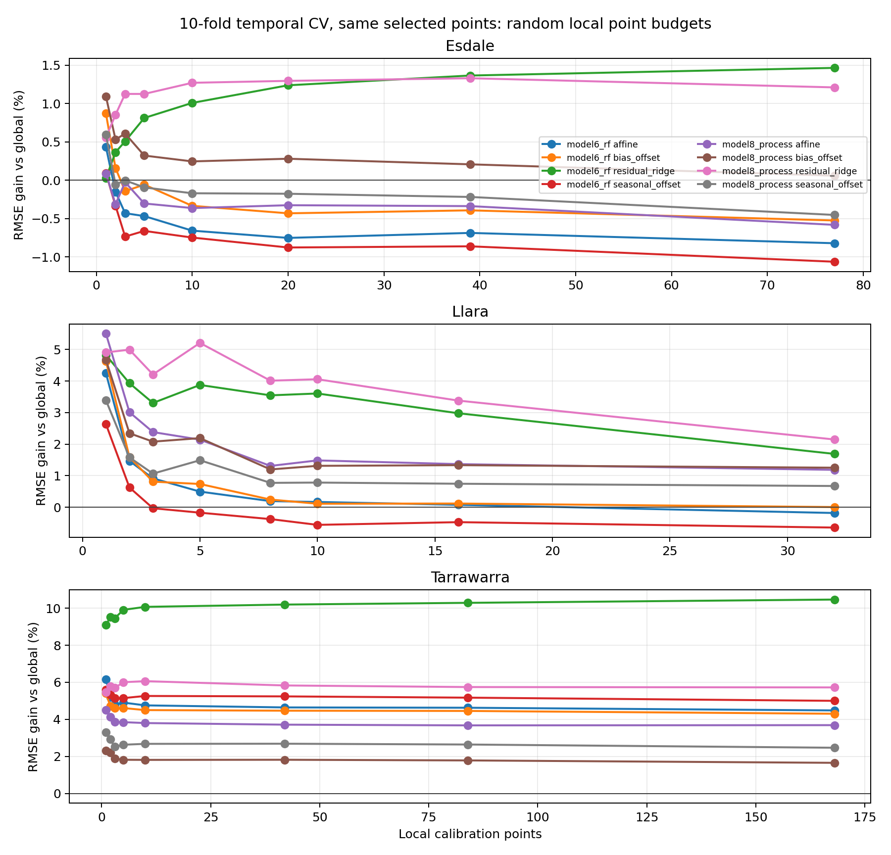
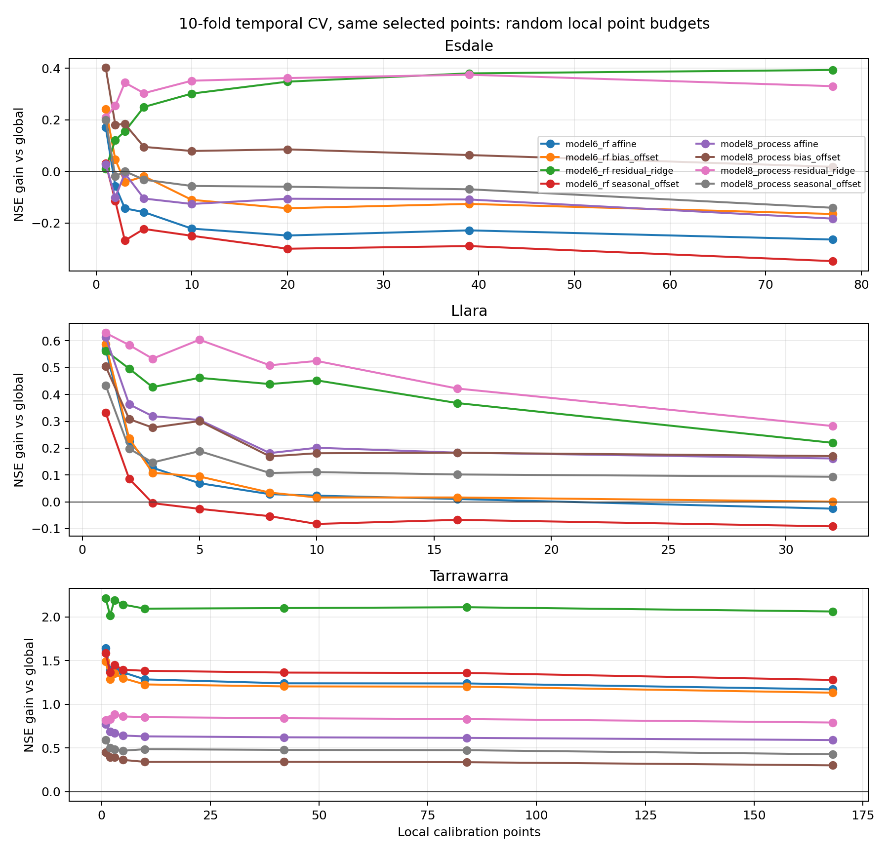
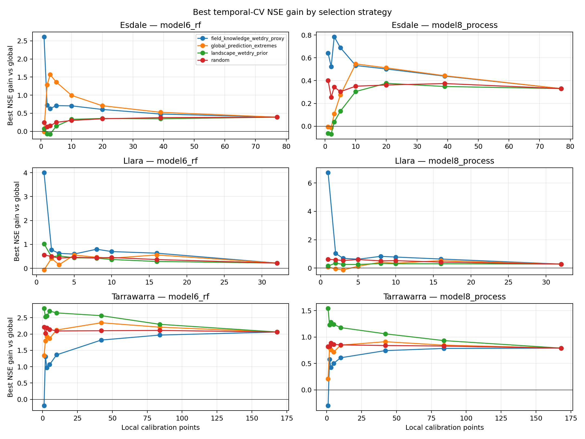
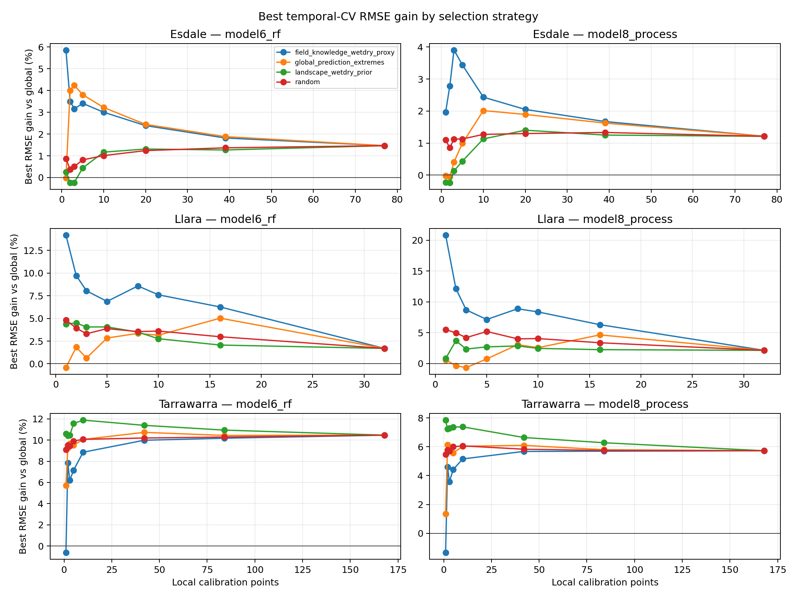

# Stage 2 temporal-blocked local calibration CV

This report adds a less spatially punitive local-calibration diagnostic to the
strict spatio-temporal experiment. The question here is:

> If a landowner measures a few known locations during some dates, does that
> local information improve predictions for **unseen dates at those same
> locations**?

## Validation design

- Dates are sorted chronologically and split into contiguous temporal folds.
- Requested folds: 10. Sites with fewer than 10 dates use the maximum possible
  number of date folds.
- For each fold, selected local points are calibrated using all other dates.
- Validation is performed on the held-out dates at the same selected points.
- Metrics are pooled across held-out folds before NSE/RMSE are calculated. This
  avoids unstable fold-level NSE when a fold contains only one or two dates.
- Selection strategies that use observed soil moisture, especially
  `field_knowledge_wetdry_proxy`, are calculated from calibration dates only.

This is not an independent validation score. It is a temporal transfer /
sensor-budget diagnostic layered on top of the independent dense validation.

## Site and fold inventory

| site       | rows      | models                   | points  | dates   | date_min   | date_max   | actual_temporal_folds | seasons                     |
| ---------- | --------- | ------------------------ | ------- | ------- | ---------- | ---------- | --------------------- | --------------------------- |
| Esdale     | 1120.000  | model6_rf,model8_process | 79.000  | 9.000   | 2025-04-30 | 2025-07-17 | 9.000                 | autumn,winter               |
| Tarrawarra | 4308.000  | model6_rf,model8_process | 178.000 | 19.000  | 1995-09-25 | 1996-11-29 | 10.000                | autumn,spring,summer,winter |
| Llara      | 58494.000 | model6_rf,model8_process | 32.000  | 955.000 | 2021-10-19 | 2024-06-30 | 10.000                | autumn,spring,summer,winter |

| site       | fold   | n_folds | n_train_dates | n_test_dates | test_date_min | test_date_max |
| ---------- | ------ | ------- | ------------- | ------------ | ------------- | ------------- |
| Esdale     | 1.000  | 9.000   | 8.000         | 1.000        | 2025-04-30    | 2025-04-30    |
| Esdale     | 2.000  | 9.000   | 8.000         | 1.000        | 2025-05-07    | 2025-05-07    |
| Esdale     | 3.000  | 9.000   | 8.000         | 1.000        | 2025-05-21    | 2025-05-21    |
| Esdale     | 4.000  | 9.000   | 8.000         | 1.000        | 2025-05-27    | 2025-05-27    |
| Esdale     | 5.000  | 9.000   | 8.000         | 1.000        | 2025-06-22    | 2025-06-22    |
| Esdale     | 6.000  | 9.000   | 8.000         | 1.000        | 2025-06-26    | 2025-06-26    |
| Esdale     | 7.000  | 9.000   | 8.000         | 1.000        | 2025-07-03    | 2025-07-03    |
| Esdale     | 8.000  | 9.000   | 8.000         | 1.000        | 2025-07-11    | 2025-07-11    |
| Esdale     | 9.000  | 9.000   | 8.000         | 1.000        | 2025-07-17    | 2025-07-17    |
| Tarrawarra | 1.000  | 10.000  | 17.000        | 2.000        | 1995-09-25    | 1995-09-26    |
| Tarrawarra | 2.000  | 10.000  | 17.000        | 2.000        | 1995-09-27    | 1996-02-13    |
| Tarrawarra | 3.000  | 10.000  | 17.000        | 2.000        | 1996-02-14    | 1996-02-22    |
| Tarrawarra | 4.000  | 10.000  | 17.000        | 2.000        | 1996-02-23    | 1996-03-28    |
| Tarrawarra | 5.000  | 10.000  | 17.000        | 2.000        | 1996-04-13    | 1996-04-22    |
| Tarrawarra | 6.000  | 10.000  | 17.000        | 2.000        | 1996-05-02    | 1996-05-03    |
| Tarrawarra | 7.000  | 10.000  | 17.000        | 2.000        | 1996-07-03    | 1996-09-02    |
| Tarrawarra | 8.000  | 10.000  | 17.000        | 2.000        | 1996-09-20    | 1996-10-25    |
| Tarrawarra | 9.000  | 10.000  | 17.000        | 2.000        | 1996-11-10    | 1996-11-11    |
| Tarrawarra | 10.000 | 10.000  | 18.000        | 1.000        | 1996-11-29    | 1996-11-29    |
| Llara      | 1.000  | 10.000  | 859.000       | 96.000       | 2021-10-19    | 2022-02-21    |
| Llara      | 2.000  | 10.000  | 859.000       | 96.000       | 2022-02-22    | 2022-05-28    |
| Llara      | 3.000  | 10.000  | 859.000       | 96.000       | 2022-05-29    | 2022-09-01    |
| Llara      | 4.000  | 10.000  | 859.000       | 96.000       | 2022-09-02    | 2022-12-06    |
| Llara      | 5.000  | 10.000  | 859.000       | 96.000       | 2022-12-07    | 2023-03-12    |
| Llara      | 6.000  | 10.000  | 860.000       | 95.000       | 2023-03-13    | 2023-06-15    |
| Llara      | 7.000  | 10.000  | 860.000       | 95.000       | 2023-06-16    | 2023-09-18    |
| Llara      | 8.000  | 10.000  | 860.000       | 95.000       | 2023-09-19    | 2023-12-22    |
| Llara      | 9.000  | 10.000  | 860.000       | 95.000       | 2023-12-23    | 2024-03-27    |
| Llara      | 10.000 | 10.000  | 860.000       | 95.000       | 2024-03-28    | 2024-06-30    |

## Headline result: best temporal-CV calibration by site/model

This table reports the best local calibration result found for each site and
model, ranked by RMSE gain and then NSE gain. Positive RMSE gain and positive
NSE gain mean the local layer improved over the uncalibrated model.

| site       | base_model     | selection_strategy           | budget_label | calibration_points | method         | nse_median | delta_nse_median | rmse_median | rmse_gain_median | bias_median | n_replicates |
| ---------- | -------------- | ---------------------------- | ------------ | ------------------ | -------------- | ---------- | ---------------- | ----------- | ---------------- | ----------- | ------------ |
| Esdale     | model6_rf      | field_knowledge_wetdry_proxy | 1            | 1.000              | affine         | 0.094      | 2.615            | 6.036       | 5.861            | 0.571       | 1.000        |
| Esdale     | model8_process | field_knowledge_wetdry_proxy | 3            | 3.000              | residual_ridge | 0.602      | 0.785            | 5.396       | 3.907            | -0.832      | 1.000        |
| Llara      | model6_rf      | field_knowledge_wetdry_proxy | 1            | 1.000              | bias_offset    | 0.125      | 4.005            | 10.423      | 14.188           | -0.018      | 1.000        |
| Llara      | model8_process | field_knowledge_wetdry_proxy | 1            | 1.000              | affine         | 0.256      | 6.730            | 9.610       | 20.847           | -0.152      | 1.000        |
| Tarrawarra | model6_rf      | landscape_wetdry_prior       | 10           | 10.000             | residual_ridge | 0.794      | 2.647            | 4.363       | 11.889           | -0.120      | 1.000        |
| Tarrawarra | model8_process | landscape_wetdry_prior       | 1            | 1.000              | residual_ridge | 0.821      | 1.542            | 3.741       | 7.848            | -0.527      | 1.000        |

## Random point-budget learning curves

Random placement is the most conservative deployment analogue because it does
not assume the landowner already knows where the model fails. The table below
keeps the best calibration method per random point budget and reports median
pooled 10-fold temporal-CV metrics across random replicates. The full
method-by-method table is retained in `temporal_cv_summary.csv`.

| site       | base_model     | budget_label | calibration_points | method         | nse_median | delta_nse_median | rmse_median | rmse_gain_median | ubrmse_median | bias_median | pearson_r_median | n_replicates |
| ---------- | -------------- | ------------ | ------------------ | -------------- | ---------- | ---------------- | ----------- | ---------------- | ------------- | ----------- | ---------------- | ------------ |
| Esdale     | model6_rf      | 1            | 1.000              | bias_offset    | 0.132      | 0.242            | 5.502       | 0.870            | 5.445         | -0.382      | 0.427            | 20.000       |
| Esdale     | model6_rf      | 2            | 2.000              | residual_ridge | 0.112      | 0.122            | 5.857       | 0.366            | 5.828         | 0.201       | 0.462            | 20.000       |
| Esdale     | model6_rf      | 3            | 3.000              | residual_ridge | 0.186      | 0.155            | 5.666       | 0.508            | 5.603         | 0.027       | 0.493            | 20.000       |
| Esdale     | model6_rf      | 5            | 5.000              | residual_ridge | 0.283      | 0.250            | 5.327       | 0.813            | 5.313         | 0.135       | 0.589            | 20.000       |
| Esdale     | model6_rf      | 10           | 10.000             | residual_ridge | 0.319      | 0.301            | 5.201       | 1.009            | 5.183         | -0.285      | 0.599            | 20.000       |
| Esdale     | model6_rf      | 25%          | 20.000             | residual_ridge | 0.349      | 0.348            | 5.118       | 1.239            | 5.108         | -0.356      | 0.607            | 20.000       |
| Esdale     | model6_rf      | 50%          | 39.000             | residual_ridge | 0.399      | 0.380            | 4.976       | 1.366            | 4.957         | -0.513      | 0.642            | 20.000       |
| Esdale     | model6_rf      | all          | 77.000             | residual_ridge | 0.413      | 0.393            | 5.021       | 1.466            | 5.000         | -0.455      | 0.650            | 1.000        |
| Esdale     | model8_process | 1            | 1.000              | bias_offset    | 0.321      | 0.402            | 4.993       | 1.094            | 4.890         | 0.123       | 0.587            | 20.000       |
| Esdale     | model8_process | 2            | 2.000              | residual_ridge | 0.257      | 0.254            | 5.491       | 0.856            | 5.472         | 0.052       | 0.538            | 20.000       |
| Esdale     | model8_process | 3            | 3.000              | residual_ridge | 0.286      | 0.344            | 5.335       | 1.126            | 5.290         | -0.275      | 0.588            | 20.000       |
| Esdale     | model8_process | 5            | 5.000              | residual_ridge | 0.350      | 0.303            | 4.992       | 1.126            | 4.990         | -0.086      | 0.637            | 20.000       |
| Esdale     | model8_process | 10           | 10.000             | residual_ridge | 0.353      | 0.351            | 5.002       | 1.272            | 4.981         | -0.424      | 0.629            | 20.000       |
| Esdale     | model8_process | 25%          | 20.000             | residual_ridge | 0.376      | 0.362            | 5.031       | 1.297            | 5.003         | -0.486      | 0.633            | 20.000       |
| Esdale     | model8_process | 50%          | 39.000             | residual_ridge | 0.385      | 0.374            | 5.015       | 1.331            | 4.973         | -0.629      | 0.646            | 20.000       |
| Esdale     | model8_process | all          | 77.000             | residual_ridge | 0.359      | 0.330            | 5.244       | 1.212            | 5.205         | -0.639      | 0.626            | 1.000        |
| Llara      | model6_rf      | 1            | 1.000              | residual_ridge | 0.526      | 0.563            | 9.817       | 4.824            | 9.721         | -0.483      | 0.741            | 20.000       |
| Llara      | model6_rf      | 2            | 2.000              | residual_ridge | 0.438      | 0.496            | 10.826      | 3.932            | 10.812        | -1.181      | 0.690            | 20.000       |
| Llara      | model6_rf      | 3            | 3.000              | residual_ridge | 0.435      | 0.427            | 10.179      | 3.306            | 10.059        | -1.090      | 0.693            | 20.000       |
| Llara      | model6_rf      | 5            | 5.000              | residual_ridge | 0.509      | 0.462            | 10.472      | 3.877            | 10.459        | -0.685      | 0.726            | 20.000       |
| Llara      | model6_rf      | 25%          | 8.000              | residual_ridge | 0.469      | 0.439            | 10.071      | 3.548            | 10.029        | -0.741      | 0.703            | 20.000       |
| Llara      | model6_rf      | 10           | 10.000             | residual_ridge | 0.451      | 0.453            | 10.287      | 3.606            | 10.271        | -0.795      | 0.689            | 20.000       |
| Llara      | model6_rf      | 50%          | 16.000             | residual_ridge | 0.403      | 0.368            | 11.061      | 2.979            | 11.049        | -0.473      | 0.643            | 20.000       |
| Llara      | model6_rf      | all          | 32.000             | residual_ridge | 0.256      | 0.220            | 12.236      | 1.691            | 12.236        | 0.006       | 0.526            | 1.000        |
| Llara      | model8_process | 1            | 1.000              | affine         | 0.530      | 0.614            | 9.423       | 5.501            | 9.208         | -1.169      | 0.746            | 20.000       |
| Llara      | model8_process | 2            | 2.000              | residual_ridge | 0.468      | 0.584            | 10.577      | 4.995            | 10.547        | -1.049      | 0.704            | 20.000       |
| Llara      | model8_process | 3            | 3.000              | residual_ridge | 0.486      | 0.533            | 9.619       | 4.209            | 9.532         | -0.882      | 0.721            | 20.000       |
| Llara      | model8_process | 5            | 5.000              | residual_ridge | 0.547      | 0.604            | 9.990       | 5.209            | 9.904         | -0.650      | 0.743            | 20.000       |
| Llara      | model8_process | 25%          | 8.000              | residual_ridge | 0.501      | 0.509            | 9.729       | 4.012            | 9.662         | -0.747      | 0.723            | 20.000       |
| Llara      | model8_process | 10           | 10.000             | residual_ridge | 0.481      | 0.525            | 9.939       | 4.058            | 9.923         | -0.959      | 0.703            | 20.000       |
| Llara      | model8_process | 50%          | 16.000             | residual_ridge | 0.427      | 0.422            | 10.900      | 3.381            | 10.892        | -0.478      | 0.659            | 20.000       |
| Llara      | model8_process | all          | 32.000             | residual_ridge | 0.265      | 0.283            | 12.158      | 2.148            | 12.158        | -0.066      | 0.534            | 1.000        |
| Tarrawarra | model6_rf      | 1            | 1.000              | residual_ridge | 0.628      | 2.215            | 5.330       | 9.098            | 5.273         | -0.172      | 0.844            | 20.000       |
| Tarrawarra | model6_rf      | 2            | 2.000              | residual_ridge | 0.717      | 2.018            | 5.024       | 9.517            | 4.997         | 0.145       | 0.863            | 20.000       |
| Tarrawarra | model6_rf      | 3            | 3.000              | residual_ridge | 0.726      | 2.190            | 4.743       | 9.455            | 4.714         | 0.048       | 0.859            | 20.000       |
| Tarrawarra | model6_rf      | 5            | 5.000              | residual_ridge | 0.776      | 2.142            | 4.479       | 9.913            | 4.453         | -0.078      | 0.885            | 20.000       |
| Tarrawarra | model6_rf      | 10           | 10.000             | residual_ridge | 0.792      | 2.095            | 4.299       | 10.074           | 4.272         | 0.078       | 0.893            | 20.000       |
| Tarrawarra | model6_rf      | 25%          | 42.000             | residual_ridge | 0.805      | 2.101            | 4.197       | 10.198           | 4.195         | 0.054       | 0.898            | 20.000       |
| Tarrawarra | model6_rf      | 50%          | 84.000             | residual_ridge | 0.814      | 2.111            | 4.094       | 10.291           | 4.089         | 0.163       | 0.905            | 20.000       |
| Tarrawarra | model6_rf      | all          | 168.000            | residual_ridge | 0.833      | 2.062            | 3.944       | 10.468           | 3.938         | 0.204       | 0.917            | 1.000        |
| Tarrawarra | model8_process | 1            | 1.000              | residual_ridge | 0.788      | 0.817            | 3.986       | 5.466            | 3.854         | -0.187      | 0.924            | 20.000       |
| Tarrawarra | model8_process | 2            | 2.000              | residual_ridge | 0.843      | 0.826            | 3.709       | 5.788            | 3.646         | -0.208      | 0.931            | 20.000       |
| Tarrawarra | model8_process | 3            | 3.000              | residual_ridge | 0.851      | 0.885            | 3.507       | 5.695            | 3.443         | -0.278      | 0.932            | 20.000       |
| Tarrawarra | model8_process | 5            | 5.000              | residual_ridge | 0.867      | 0.860            | 3.418       | 6.004            | 3.362         | -0.334      | 0.935            | 20.000       |
| Tarrawarra | model8_process | 10           | 10.000             | residual_ridge | 0.881      | 0.853            | 3.217       | 6.062            | 3.208         | -0.120      | 0.940            | 20.000       |
| Tarrawarra | model8_process | 25%          | 42.000             | residual_ridge | 0.860      | 0.840            | 3.544       | 5.829            | 3.533         | -0.237      | 0.928            | 20.000       |
| Tarrawarra | model8_process | 50%          | 84.000             | residual_ridge | 0.855      | 0.830            | 3.598       | 5.743            | 3.591         | -0.213      | 0.925            | 20.000       |
| Tarrawarra | model8_process | all          | 168.000            | residual_ridge | 0.863      | 0.791            | 3.575       | 5.723            | 3.571         | -0.180      | 0.929            | 1.000        |

## Strategy comparison

This compact table keeps only the best calibration method per
site/model/selection-strategy/budget. It is useful for comparing random
selection against terrain/model-prior placement and the observed wet/dry
upper-bound proxy.

| site       | base_model     | selection_strategy         | budget_label | calibration_points | method         | nse_median | delta_nse_median | rmse_median | rmse_gain_median | bias_median | n_replicates |
| ---------- | -------------- | -------------------------- | ------------ | ------------------ | -------------- | ---------- | ---------------- | ----------- | ---------------- | ----------- | ------------ |
| Esdale     | model6_rf      | global_prediction_extremes | 1            | 1.000              | bias_offset    | 0.086      | -0.006           | 6.572       | -0.023           | -0.283      | 1.000        |
| Esdale     | model6_rf      | global_prediction_extremes | 2            | 2.000              | residual_ridge | 0.316      | 1.283            | 5.757       | 4.005            | -0.535      | 1.000        |
| Esdale     | model6_rf      | global_prediction_extremes | 3            | 3.000              | residual_ridge | 0.252      | 1.568            | 5.573       | 4.235            | -0.515      | 1.000        |
| Esdale     | model6_rf      | global_prediction_extremes | 5            | 5.000              | residual_ridge | 0.330      | 1.361            | 5.137       | 3.808            | -0.530      | 1.000        |
| Esdale     | model6_rf      | global_prediction_extremes | 10           | 10.000             | residual_ridge | 0.448      | 0.994            | 4.776       | 3.220            | -0.269      | 1.000        |
| Esdale     | model6_rf      | global_prediction_extremes | 25%          | 20.000             | residual_ridge | 0.392      | 0.709            | 5.178       | 2.442            | -0.252      | 1.000        |
| Esdale     | model6_rf      | global_prediction_extremes | 50%          | 39.000             | residual_ridge | 0.425      | 0.527            | 4.888       | 1.880            | -0.395      | 1.000        |
| Esdale     | model6_rf      | global_prediction_extremes | all          | 77.000             | residual_ridge | 0.413      | 0.393            | 5.021       | 1.466            | -0.455      | 1.000        |
| Esdale     | model6_rf      | landscape_wetdry_prior     | 1            | 1.000              | bias_offset    | 0.052      | 0.073            | 6.552       | 0.247            | -0.000      | 1.000        |
| Esdale     | model6_rf      | landscape_wetdry_prior     | 2            | 2.000              | bias_offset    | -0.032     | -0.069           | 6.750       | -0.231           | 0.072       | 1.000        |
| Esdale     | model6_rf      | landscape_wetdry_prior     | 3            | 3.000              | bias_offset    | -0.013     | -0.074           | 6.174       | -0.230           | 0.047       | 1.000        |
| Esdale     | model6_rf      | landscape_wetdry_prior     | 5            | 5.000              | residual_ridge | 0.158      | 0.144            | 5.356       | 0.441            | 0.106       | 1.000        |
| Esdale     | model6_rf      | landscape_wetdry_prior     | 10           | 10.000             | residual_ridge | 0.329      | 0.333            | 5.243       | 1.169            | -0.025      | 1.000        |
| Esdale     | model6_rf      | landscape_wetdry_prior     | 25%          | 20.000             | residual_ridge | 0.403      | 0.356            | 4.972       | 1.311            | -0.444      | 1.000        |
| Esdale     | model6_rf      | landscape_wetdry_prior     | 50%          | 39.000             | residual_ridge | 0.396      | 0.347            | 4.975       | 1.268            | -0.561      | 1.000        |
| Esdale     | model6_rf      | landscape_wetdry_prior     | all          | 77.000             | residual_ridge | 0.413      | 0.393            | 5.021       | 1.466            | -0.455      | 1.000        |
| Esdale     | model6_rf      | random                     | 1            | 1.000              | bias_offset    | 0.132      | 0.242            | 5.502       | 0.870            | -0.382      | 20.000       |
| Esdale     | model6_rf      | random                     | 2            | 2.000              | residual_ridge | 0.112      | 0.122            | 5.857       | 0.366            | 0.201       | 20.000       |
| Esdale     | model6_rf      | random                     | 3            | 3.000              | residual_ridge | 0.186      | 0.155            | 5.666       | 0.508            | 0.027       | 20.000       |
| Esdale     | model6_rf      | random                     | 5            | 5.000              | residual_ridge | 0.283      | 0.250            | 5.327       | 0.813            | 0.135       | 20.000       |
| Esdale     | model6_rf      | random                     | 10           | 10.000             | residual_ridge | 0.319      | 0.301            | 5.201       | 1.009            | -0.285      | 20.000       |
| Esdale     | model6_rf      | random                     | 25%          | 20.000             | residual_ridge | 0.349      | 0.348            | 5.118       | 1.239            | -0.356      | 20.000       |
| Esdale     | model6_rf      | random                     | 50%          | 39.000             | residual_ridge | 0.399      | 0.380            | 4.976       | 1.366            | -0.513      | 20.000       |
| Esdale     | model6_rf      | random                     | all          | 77.000             | residual_ridge | 0.413      | 0.393            | 5.021       | 1.466            | -0.455      | 1.000        |
| Esdale     | model8_process | global_prediction_extremes | 1            | 1.000              | bias_offset    | 0.240      | -0.005           | 5.993       | -0.021           | -0.095      | 1.000        |
| Esdale     | model8_process | global_prediction_extremes | 2            | 2.000              | residual_ridge | 0.276      | -0.012           | 5.919       | -0.051           | -0.331      | 1.000        |
| Esdale     | model8_process | global_prediction_extremes | 3            | 3.000              | residual_ridge | 0.314      | 0.109            | 5.338       | 0.407            | -0.721      | 1.000        |
| Esdale     | model8_process | global_prediction_extremes | 5            | 5.000              | residual_ridge | 0.377      | 0.275            | 4.956       | 0.992            | -0.763      | 1.000        |
| Esdale     | model8_process | global_prediction_extremes | 10           | 10.000             | residual_ridge | 0.487      | 0.547            | 4.606       | 2.014            | -0.484      | 1.000        |
| Esdale     | model8_process | global_prediction_extremes | 25%          | 20.000             | residual_ridge | 0.431      | 0.512            | 5.009       | 1.895            | -0.419      | 1.000        |
| Esdale     | model8_process | global_prediction_extremes | 50%          | 39.000             | residual_ridge | 0.433      | 0.443            | 4.854       | 1.625            | -0.528      | 1.000        |
| Esdale     | model8_process | global_prediction_extremes | all          | 77.000             | residual_ridge | 0.359      | 0.330            | 5.244       | 1.212            | -0.639      | 1.000        |
| Esdale     | model8_process | landscape_wetdry_prior     | 1            | 1.000              | bias_offset    | 0.148      | -0.063           | 6.212       | -0.233           | -0.000      | 1.000        |
| Esdale     | model8_process | landscape_wetdry_prior     | 2            | 2.000              | residual_ridge | 0.029      | -0.068           | 6.547       | -0.235           | -0.006      | 1.000        |
| Esdale     | model8_process | landscape_wetdry_prior     | 3            | 3.000              | residual_ridge | 0.191      | 0.039            | 5.517       | 0.130            | 0.031       | 1.000        |
| Esdale     | model8_process | landscape_wetdry_prior     | 5            | 5.000              | residual_ridge | 0.272      | 0.133            | 4.980       | 0.435            | -0.054      | 1.000        |
| Esdale     | model8_process | landscape_wetdry_prior     | 10           | 10.000             | residual_ridge | 0.401      | 0.304            | 4.952       | 1.130            | -0.186      | 1.000        |
| Esdale     | model8_process | landscape_wetdry_prior     | 25%          | 20.000             | residual_ridge | 0.431      | 0.376            | 4.852       | 1.402            | -0.583      | 1.000        |
| Esdale     | model8_process | landscape_wetdry_prior     | 50%          | 39.000             | residual_ridge | 0.368      | 0.349            | 5.087       | 1.250            | -0.671      | 1.000        |
| Esdale     | model8_process | landscape_wetdry_prior     | all          | 77.000             | residual_ridge | 0.359      | 0.330            | 5.244       | 1.212            | -0.639      | 1.000        |
| Esdale     | model8_process | random                     | 1            | 1.000              | bias_offset    | 0.321      | 0.402            | 4.993       | 1.094            | 0.123       | 20.000       |
| Esdale     | model8_process | random                     | 2            | 2.000              | residual_ridge | 0.257      | 0.254            | 5.491       | 0.856            | 0.052       | 20.000       |
| Esdale     | model8_process | random                     | 3            | 3.000              | residual_ridge | 0.286      | 0.344            | 5.335       | 1.126            | -0.275      | 20.000       |
| Esdale     | model8_process | random                     | 5            | 5.000              | residual_ridge | 0.350      | 0.303            | 4.992       | 1.126            | -0.086      | 20.000       |
| Esdale     | model8_process | random                     | 10           | 10.000             | residual_ridge | 0.353      | 0.351            | 5.002       | 1.272            | -0.424      | 20.000       |
| Esdale     | model8_process | random                     | 25%          | 20.000             | residual_ridge | 0.376      | 0.362            | 5.031       | 1.297            | -0.486      | 20.000       |
| Esdale     | model8_process | random                     | 50%          | 39.000             | residual_ridge | 0.385      | 0.374            | 5.015       | 1.331            | -0.629      | 20.000       |
| Esdale     | model8_process | random                     | all          | 77.000             | residual_ridge | 0.359      | 0.330            | 5.244       | 1.212            | -0.639      | 1.000        |
| Llara      | model6_rf      | global_prediction_extremes | 1            | 1.000              | residual_ridge | 0.244      | -0.064           | 9.770       | -0.425           | -1.217      | 1.000        |
| Llara      | model6_rf      | global_prediction_extremes | 2            | 2.000              | affine         | -0.060     | 0.419            | 10.100      | 1.830            | 0.023       | 1.000        |
| Llara      | model6_rf      | global_prediction_extremes | 3            | 3.000              | affine         | -0.153     | 0.150            | 10.062      | 0.632            | 0.150       | 1.000        |
| Llara      | model6_rf      | global_prediction_extremes | 5            | 5.000              | residual_ridge | 0.210      | 0.556            | 9.294       | 2.839            | -0.497      | 1.000        |
| Llara      | model6_rf      | global_prediction_extremes | 25%          | 8.000              | residual_ridge | 0.416      | 0.464            | 9.866       | 3.348            | -0.931      | 1.000        |
| Llara      | model6_rf      | global_prediction_extremes | 10           | 10.000             | residual_ridge | 0.363      | 0.426            | 10.787      | 3.148            | -1.129      | 1.000        |
| Llara      | model6_rf      | global_prediction_extremes | 50%          | 16.000             | residual_ridge | 0.512      | 0.561            | 10.788      | 5.025            | -0.678      | 1.000        |
| Llara      | model6_rf      | global_prediction_extremes | all          | 32.000             | residual_ridge | 0.256      | 0.220            | 12.236      | 1.691            | 0.006       | 1.000        |
| Llara      | model6_rf      | landscape_wetdry_prior     | 1            | 1.000              | bias_offset    | 0.183      | 1.027            | 8.741       | 4.391            | 0.398       | 1.000        |
| Llara      | model6_rf      | landscape_wetdry_prior     | 2            | 2.000              | residual_ridge | 0.610      | 0.486            | 9.018       | 4.495            | -0.970      | 1.000        |
| Llara      | model6_rf      | landscape_wetdry_prior     | 3            | 3.000              | residual_ridge | 0.566      | 0.518            | 8.419       | 4.053            | -0.860      | 1.000        |
| Llara      | model6_rf      | landscape_wetdry_prior     | 5            | 5.000              | residual_ridge | 0.539      | 0.442            | 10.165      | 4.065            | -0.757      | 1.000        |
| Llara      | model6_rf      | landscape_wetdry_prior     | 25%          | 8.000              | residual_ridge | 0.455      | 0.427            | 10.409      | 3.491            | -0.983      | 1.000        |
| Llara      | model6_rf      | landscape_wetdry_prior     | 10           | 10.000             | residual_ridge | 0.389      | 0.370            | 10.334      | 2.761            | -1.043      | 1.000        |
| Llara      | model6_rf      | landscape_wetdry_prior     | 50%          | 16.000             | residual_ridge | 0.376      | 0.288            | 9.874       | 2.064            | -0.731      | 1.000        |
| Llara      | model6_rf      | landscape_wetdry_prior     | all          | 32.000             | residual_ridge | 0.256      | 0.220            | 12.236      | 1.691            | 0.006       | 1.000        |
| Llara      | model6_rf      | random                     | 1            | 1.000              | residual_ridge | 0.526      | 0.563            | 9.817       | 4.824            | -0.483      | 20.000       |
| Llara      | model6_rf      | random                     | 2            | 2.000              | residual_ridge | 0.438      | 0.496            | 10.826      | 3.932            | -1.181      | 20.000       |
| Llara      | model6_rf      | random                     | 3            | 3.000              | residual_ridge | 0.435      | 0.427            | 10.179      | 3.306            | -1.090      | 20.000       |
| Llara      | model6_rf      | random                     | 5            | 5.000              | residual_ridge | 0.509      | 0.462            | 10.472      | 3.877            | -0.685      | 20.000       |
| Llara      | model6_rf      | random                     | 25%          | 8.000              | residual_ridge | 0.469      | 0.439            | 10.071      | 3.548            | -0.741      | 20.000       |
| Llara      | model6_rf      | random                     | 10           | 10.000             | residual_ridge | 0.451      | 0.453            | 10.287      | 3.606            | -0.795      | 20.000       |
| Llara      | model6_rf      | random                     | 50%          | 16.000             | residual_ridge | 0.403      | 0.368            | 11.061      | 2.979            | -0.473      | 20.000       |
| Llara      | model6_rf      | random                     | all          | 32.000             | residual_ridge | 0.256      | 0.220            | 12.236      | 1.691            | 0.006       | 1.000        |
| Llara      | model8_process | global_prediction_extremes | 1            | 1.000              | affine         | 0.434      | 0.084            | 8.451       | 0.607            | -0.500      | 1.000        |
| Llara      | model8_process | global_prediction_extremes | 2            | 2.000              | bias_offset    | 0.183      | -0.060           | 8.865       | -0.331           | -0.004      | 1.000        |
| Llara      | model8_process | global_prediction_extremes | 3            | 3.000              | bias_offset    | 0.126      | -0.125           | 8.758       | -0.653           | 0.159       | 1.000        |
| Llara      | model8_process | global_prediction_extremes | 5            | 5.000              | affine         | 0.289      | 0.127            | 8.818       | 0.758            | 0.473       | 1.000        |
| Llara      | model8_process | global_prediction_extremes | 25%          | 8.000              | residual_ridge | 0.412      | 0.420            | 9.900       | 3.064            | -0.990      | 1.000        |
| Llara      | model8_process | global_prediction_extremes | 10           | 10.000             | residual_ridge | 0.344      | 0.346            | 10.943      | 2.583            | -1.293      | 1.000        |
| Llara      | model8_process | global_prediction_extremes | 50%          | 16.000             | residual_ridge | 0.474      | 0.528            | 11.196      | 4.655            | -0.855      | 1.000        |
| Llara      | model8_process | global_prediction_extremes | all          | 32.000             | residual_ridge | 0.265      | 0.283            | 12.158      | 2.148            | -0.066      | 1.000        |
| Llara      | model8_process | landscape_wetdry_prior     | 1            | 1.000              | bias_offset    | 0.288      | 0.149            | 8.159       | 0.815            | 0.364       | 1.000        |
| Llara      | model8_process | landscape_wetdry_prior     | 2            | 2.000              | residual_ridge | 0.686      | 0.353            | 8.084       | 3.700            | -0.693      | 1.000        |
| Llara      | model8_process | landscape_wetdry_prior     | 3            | 3.000              | affine         | 0.636      | 0.257            | 7.714       | 2.357            | -0.006      | 1.000        |
| Llara      | model8_process | landscape_wetdry_prior     | 5            | 5.000              | affine         | 0.619      | 0.256            | 9.246       | 2.710            | 0.184       | 1.000        |
| Llara      | model8_process | landscape_wetdry_prior     | 25%          | 8.000              | residual_ridge | 0.524      | 0.322            | 9.734       | 2.866            | -0.855      | 1.000        |
| Llara      | model8_process | landscape_wetdry_prior     | 10           | 10.000             | residual_ridge | 0.467      | 0.307            | 9.645       | 2.467            | -0.876      | 1.000        |
| Llara      | model8_process | landscape_wetdry_prior     | 50%          | 16.000             | residual_ridge | 0.425      | 0.307            | 9.485       | 2.259            | -0.714      | 1.000        |
| Llara      | model8_process | landscape_wetdry_prior     | all          | 32.000             | residual_ridge | 0.265      | 0.283            | 12.158      | 2.148            | -0.066      | 1.000        |
| Llara      | model8_process | random                     | 1            | 1.000              | affine         | 0.530      | 0.614            | 9.423       | 5.501            | -1.169      | 20.000       |
| Llara      | model8_process | random                     | 2            | 2.000              | residual_ridge | 0.468      | 0.584            | 10.577      | 4.995            | -1.049      | 20.000       |
| Llara      | model8_process | random                     | 3            | 3.000              | residual_ridge | 0.486      | 0.533            | 9.619       | 4.209            | -0.882      | 20.000       |
| Llara      | model8_process | random                     | 5            | 5.000              | residual_ridge | 0.547      | 0.604            | 9.990       | 5.209            | -0.650      | 20.000       |
| Llara      | model8_process | random                     | 25%          | 8.000              | residual_ridge | 0.501      | 0.509            | 9.729       | 4.012            | -0.747      | 20.000       |
| Llara      | model8_process | random                     | 10           | 10.000             | residual_ridge | 0.481      | 0.525            | 9.939       | 4.058            | -0.959      | 20.000       |
| Llara      | model8_process | random                     | 50%          | 16.000             | residual_ridge | 0.427      | 0.422            | 10.900      | 3.381            | -0.478      | 20.000       |
| Llara      | model8_process | random                     | all          | 32.000             | residual_ridge | 0.265      | 0.283            | 12.158      | 2.148            | -0.066      | 1.000        |
| Tarrawarra | model6_rf      | global_prediction_extremes | 1            | 1.000              | residual_ridge | 0.205      | 1.343            | 8.937       | 5.722            | -0.813      | 1.000        |
| Tarrawarra | model6_rf      | global_prediction_extremes | 2            | 2.000              | residual_ridge | 0.736      | 1.786            | 5.201       | 9.289            | -0.608      | 1.000        |
| Tarrawarra | model6_rf      | global_prediction_extremes | 3            | 3.000              | residual_ridge | 0.759      | 1.920            | 4.836       | 9.644            | -0.522      | 1.000        |
| Tarrawarra | model6_rf      | global_prediction_extremes | 5            | 5.000              | residual_ridge | 0.776      | 1.868            | 4.633       | 9.513            | -0.508      | 1.000        |
| Tarrawarra | model6_rf      | global_prediction_extremes | 10           | 10.000             | residual_ridge | 0.802      | 2.123            | 4.149       | 10.063           | -0.605      | 1.000        |
| Tarrawarra | model6_rf      | global_prediction_extremes | 25%          | 42.000             | residual_ridge | 0.820      | 2.345            | 3.912       | 10.731           | 0.159       | 1.000        |
| Tarrawarra | model6_rf      | global_prediction_extremes | 50%          | 84.000             | residual_ridge | 0.825      | 2.210            | 3.874       | 10.443           | 0.109       | 1.000        |
| Tarrawarra | model6_rf      | global_prediction_extremes | all          | 168.000            | residual_ridge | 0.833      | 2.062            | 3.944       | 10.468           | 0.204       | 1.000        |
| Tarrawarra | model6_rf      | landscape_wetdry_prior     | 1            | 1.000              | residual_ridge | 0.686      | 2.785            | 4.950       | 10.600           | -0.236      | 1.000        |
| Tarrawarra | model6_rf      | landscape_wetdry_prior     | 2            | 2.000              | residual_ridge | 0.620      | 2.525            | 5.896       | 10.410           | -0.260      | 1.000        |
| Tarrawarra | model6_rf      | landscape_wetdry_prior     | 3            | 3.000              | residual_ridge | 0.660      | 2.555            | 5.448       | 10.447           | -0.321      | 1.000        |
| Tarrawarra | model6_rf      | landscape_wetdry_prior     | 5            | 5.000              | residual_ridge | 0.752      | 2.702            | 4.726       | 11.565           | -0.094      | 1.000        |
| Tarrawarra | model6_rf      | landscape_wetdry_prior     | 10           | 10.000             | residual_ridge | 0.794      | 2.647            | 4.363       | 11.889           | -0.120      | 1.000        |
| Tarrawarra | model6_rf      | landscape_wetdry_prior     | 25%          | 42.000             | residual_ridge | 0.812      | 2.563            | 4.031       | 11.396           | -0.112      | 1.000        |
| Tarrawarra | model6_rf      | landscape_wetdry_prior     | 50%          | 84.000             | residual_ridge | 0.829      | 2.298            | 3.909       | 10.945           | 0.160       | 1.000        |
| Tarrawarra | model6_rf      | landscape_wetdry_prior     | all          | 168.000            | residual_ridge | 0.833      | 2.062            | 3.944       | 10.468           | 0.204       | 1.000        |
| Tarrawarra | model6_rf      | random                     | 1            | 1.000              | residual_ridge | 0.628      | 2.215            | 5.330       | 9.098            | -0.172      | 20.000       |
| Tarrawarra | model6_rf      | random                     | 2            | 2.000              | residual_ridge | 0.717      | 2.018            | 5.024       | 9.517            | 0.145       | 20.000       |
| Tarrawarra | model6_rf      | random                     | 3            | 3.000              | residual_ridge | 0.726      | 2.190            | 4.743       | 9.455            | 0.048       | 20.000       |
| Tarrawarra | model6_rf      | random                     | 5            | 5.000              | residual_ridge | 0.776      | 2.142            | 4.479       | 9.913            | -0.078      | 20.000       |
| Tarrawarra | model6_rf      | random                     | 10           | 10.000             | residual_ridge | 0.792      | 2.095            | 4.299       | 10.074           | 0.078       | 20.000       |
| Tarrawarra | model6_rf      | random                     | 25%          | 42.000             | residual_ridge | 0.805      | 2.101            | 4.197       | 10.198           | 0.054       | 20.000       |
| Tarrawarra | model6_rf      | random                     | 50%          | 84.000             | residual_ridge | 0.814      | 2.111            | 4.094       | 10.291           | 0.163       | 20.000       |
| Tarrawarra | model6_rf      | random                     | all          | 168.000            | residual_ridge | 0.833      | 2.062            | 3.944       | 10.468           | 0.204       | 1.000        |

_Showing first 120 of 144 rows._

## Figures

### Figure 1. Random point-budget temporal CV: RMSE gain

Median pooled 10-fold temporal-CV RMSE gain as local point budgets increase. Positive values mean the local calibration improved RMSE relative to the uncalibrated model on the same held-out dates/supports.

### Figure 2. Random point-budget temporal CV: NSE gain

Median pooled 10-fold temporal-CV change in NSE as local point budgets increase. Positive values mean the local calibration improved temporal skill relative to the uncalibrated model on the same held-out dates/supports.

### Figure 3. Best temporal-CV NSE gain by selection strategy

Best median NSE gain across calibration methods for each point-selection strategy and budget.

### Figure 4. Best temporal-CV RMSE gain by selection strategy

Best median RMSE gain across calibration methods for each point-selection strategy and budget.

## Interpretation guardrails

- This is a **same-location temporal transfer** test, not a spatial transfer
  test. It should be read alongside, not instead of, the strict
  spatial+temporal block.
- A 10-fold temporal CV uses roughly 90% of dates for calibration in each fold.
  It isolates the effect of adding more local point locations, but it is
  optimistic relative to a landowner collecting only one or two campaign dates.
- Esdale has only nine dense-campaign dates, so it uses nine temporal folds
  rather than ten.
- Tarrawarra still uses grid-cell-aggregated supports, not raw TDR points.
- Tarrawarra model6 remains affected by the historical missing/zero coarse
  SMIPS-anchor caveat.

CSV outputs are written under:

`/Volumes/Dmitry_work/borevitz_projects/DMM_validation/outputs/unified_dense_validation/stage2_temporal_blocked_cv`
