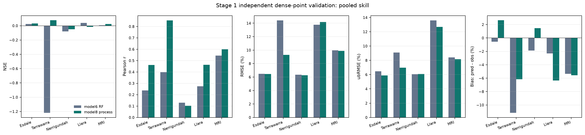
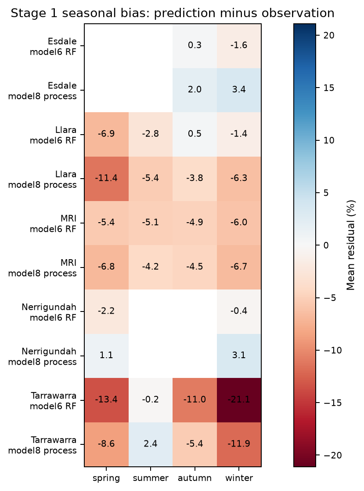
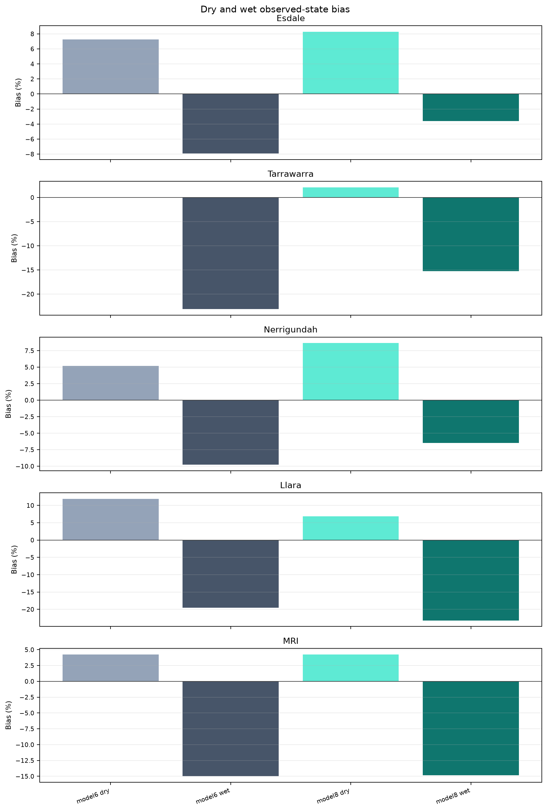
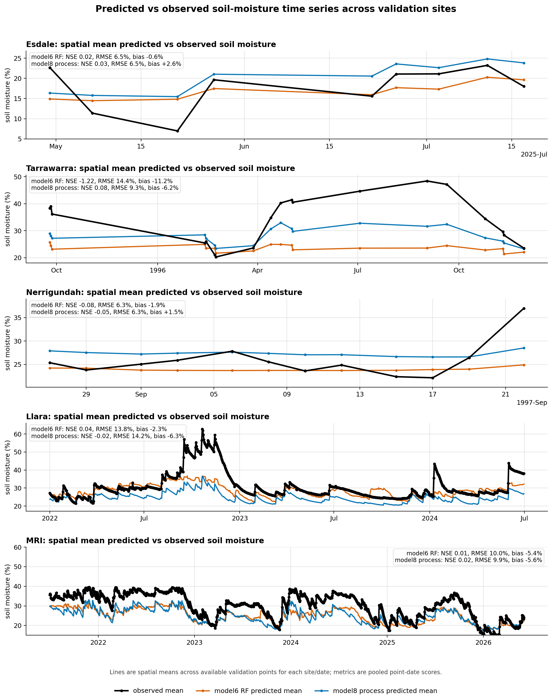
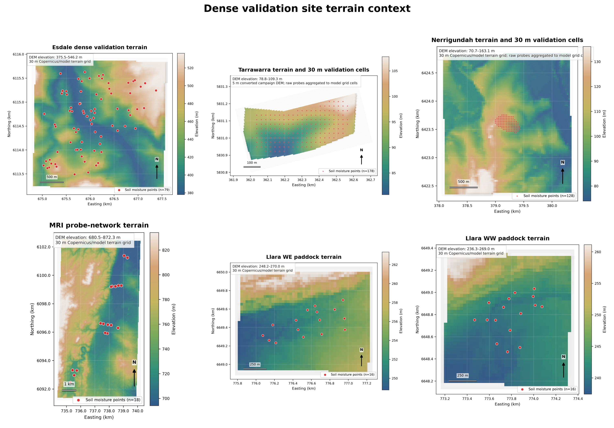
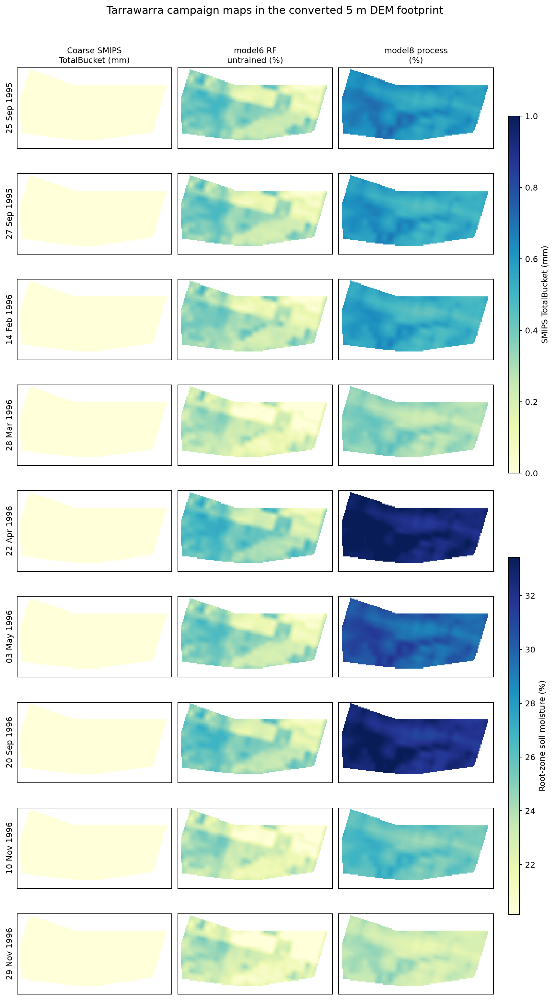
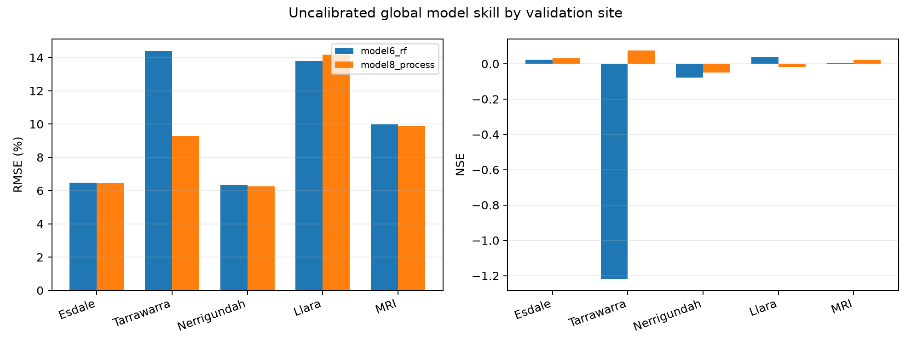
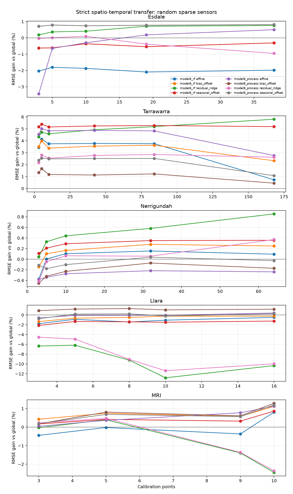
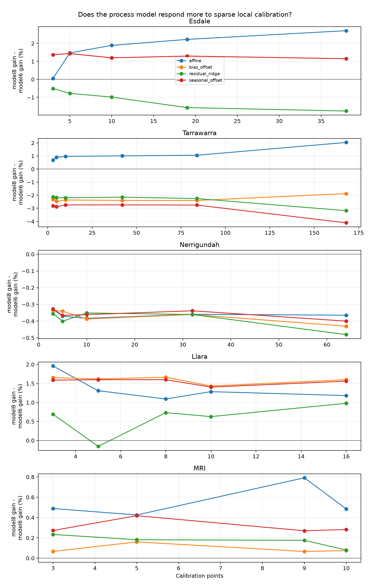

# Unified validation and local-spiking report

This report collects the currently model-ready DMM validation datasets into the
two-stage protocol described in
`docs/Downscaling moisture validation plan.pdf`.

The two stages are deliberately kept separate:

1. **Stage 1 — independent validation:** all dense point/date observations are
   used only as external validation. No local measurements are supplied to the
   models or calibration layers.
2. **Stage 2 — local-spiking sensitivity:** small controlled subsets of local
   points are used as calibration spikes, and validation is performed on held-out
   points/dates. The strict `spatiotemporal_block` is treated as the primary
   transfer test.

## Data inventory

| site        | source_table                                                                                                                                         | qc_start_date | rows      | models                   | points_unique | dates    | date_min   | date_max   | seasons                     | eligible_points_stage2 | smips_columns_present | note                                                                                                                                                                                                                                                                                                                                                                   |
| ----------- | ---------------------------------------------------------------------------------------------------------------------------------------------------- | ------------- | --------- | ------------------------ | ------------- | -------- | ---------- | ---------- | --------------------------- | ---------------------- | --------------------- | ---------------------------------------------------------------------------------------------------------------------------------------------------------------------------------------------------------------------------------------------------------------------------------------------------------------------------------------------------------------------- |
| Esdale      | /Volumes/Dmitry_work/borevitz_projects/DMM_validation/outputs/model6_vs_model8_dense/model6_model8_combined_predictions.csv                          |               | 1120.000  | model6_rf,model8_process | 79.000        | 9.000    | 2025-04-30 | 2025-07-17 | autumn,winter               | 76.000                 | yes                   | Autumn/winter 2025 dense campaign. Strongest spatial/terrain coverage among the modern validation points, but only nine sampling dates are present.                                                                                                                                                                                                                    |
| Tarrawarra  | /Volumes/Dmitry_work/borevitz_projects/DMM_validation/outputs/tarrawarra_model6_vs_model8/model6_model8_combined_predictions_valid_30m_gridcell.csv  |               | 4308.000  | model6_rf,model8_process | 178.000       | 19.000   | 1995-09-25 | 1996-11-29 | autumn,spring,summer,winter | 168.000                | yes                   | Very dense 1995/96 campaign. Raw sub-cell campaign points are aggregated to the model prediction grid cell by date before validation, so the validation unit matches the raster support. The existing model6 run has a known SMIPS-zero caveat, so model6 skill here should be read partly as a missing coarse-anchor ablation rather than a normal model6 prediction. |
| Nerrigundah | /Volumes/Dmitry_work/borevitz_projects/DMM_validation/outputs/nerrigundah_model6_vs_model8/model6_model8_combined_predictions_valid_30m_gridcell.csv |               | 3072.000  | model6_rf,model8_process | 128.000       | 12.000   | 1997-08-27 | 1997-09-22 | spring,winter               | 128.000                | yes                   | Tarrawarra-like 1997 15 cm TDR grid campaign. Local grid observations are converted from the published AMG/local transform and aggregated to model prediction grid cells by date before validation.                                                                                                                                                                    |
| Llara       | /Volumes/Dmitry_work/borevitz_projects/DMM_validation/outputs/llara_unseen_model6_vs_model8/llara_model6_model8_predictions.csv                      | 2022-01-01    | 56780.000 | model6_rf,model8_process | 32.000        | 911.000  | 2022-01-01 | 2024-06-30 | autumn,spring,summer,winter | 32.000                 | yes                   | Thirty-two profile-mean probes across two paddocks from 2021–2024. Strongest temporal/seasonal coverage. Point-level SMIPS-derived columns are present, but full gridded Llara model GeoTIFFs are not currently cached.                                                                                                                                                |
| MRI         | /Volumes/Dmitry_work/borevitz_projects/DMM_validation/outputs/mri_dense_validation/mri_model6_model8_predictions.csv                                 | 2021-07-01    | 58092.000 | model6_rf,model8_process | 18.000        | 1799.000 | 2021-07-01 | 2026-06-03 | autumn,spring,summer,winter | 18.000                 | yes                   | Mulloon Rehydration Initiative profile-mean probe network. Probe labels and coordinates are read from the Soil_Moisture_Probes GeoPackage layer and crosswalked to logger serials where possible.                                                                                                                                                                      |

Important caveats:

- Llara is trimmed to observations from `2022-01-01` onward for QC. MRI is
  trimmed to observations from `2021-07-01` onward for QC. The original cached
  site prediction tables are left intact; the trims are applied at unified-report
  load time.
- Nerrigundah is included as a Tarrawarra-like dense TDR grid campaign when its
  converted/model-scored table is present. Its TDR points are aggregated to the
  model prediction grid cell by date before validation.
- Tarrawarra is retained because it is uniquely dense, but raw campaign points
  have been aggregated to the model prediction grid cell by date so that the
  validation support matches the raster support. The existing model6 run also
  has a known SMIPS-zero caveat. Treat Tarrawarra model6 as partly a
  missing-coarse-anchor stress test.
- Llara has SMIPS-derived point-level predictors in the validation tables, but
  full gridded model6/model8 GeoTIFF prediction maps are not currently cached.
  Llara map outputs therefore focus on point-level validation and interpolated
  point-quality surfaces, not full raster-native model surfaces.
- The PDF says Esdale has 540 points; the current model-agnostic prediction
  table contains 79 unique point IDs and 560 model6 rows across nine dates. This
  likely reflects a point-vs-observation wording mismatch and should be checked
  by a human before publication.

## Stage 1 — independent dense-point validation

### Overall model skill

| site        | base_model     | n         | nse    | pearson_r | rmse   | ubrmse | bias    |
| ----------- | -------------- | --------- | ------ | --------- | ------ | ------ | ------- |
| Esdale      | model6_rf      | 560.000   | 0.023  | 0.238     | 6.477  | 6.453  | -0.558  |
| Esdale      | model8_process | 560.000   | 0.031  | 0.462     | 6.452  | 5.884  | 2.645   |
| Tarrawarra  | model6_rf      | 2154.000  | -1.219 | 0.398     | 14.402 | 9.093  | -11.169 |
| Tarrawarra  | model8_process | 2154.000  | 0.077  | 0.853     | 9.291  | 6.958  | -6.157  |
| Nerrigundah | model6_rf      | 1536.000  | -0.079 | 0.130     | 6.341  | 6.054  | -1.887  |
| Nerrigundah | model8_process | 1536.000  | -0.050 | 0.102     | 6.254  | 6.078  | 1.476   |
| Llara       | model6_rf      | 28390.000 | 0.039  | 0.274     | 13.777 | 13.582 | -2.308  |
| Llara       | model8_process | 28390.000 | -0.017 | 0.463     | 14.172 | 12.677 | -6.335  |
| MRI         | model6_rf      | 29046.000 | 0.006  | 0.545     | 9.972  | 8.413  | -5.354  |
| MRI         | model8_process | 29046.000 | 0.024  | 0.600     | 9.882  | 8.157  | -5.577  |

### Seasonal skill

| site        | base_model     | season | n        | nse     | pearson_r | rmse   | ubrmse | bias    |
| ----------- | -------------- | ------ | -------- | ------- | --------- | ------ | ------ | ------- |
| Esdale      | model6_rf      | autumn | 308.000  | -0.030  | 0.100     | 7.279  | 7.273  | 0.296   |
| Esdale      | model6_rf      | winter | 252.000  | -0.292  | 0.111     | 5.336  | 5.090  | -1.601  |
| Esdale      | model8_process | autumn | 308.000  | 0.027   | 0.336     | 7.076  | 6.777  | 2.033   |
| Esdale      | model8_process | winter | 252.000  | -0.421  | 0.355     | 5.595  | 4.448  | 3.394   |
| Tarrawarra  | model6_rf      | autumn | 663.000  | -1.886  | 0.474     | 12.975 | 6.953  | -10.955 |
| Tarrawarra  | model6_rf      | spring | 994.000  | -1.765  | 0.478     | 16.068 | 8.928  | -13.360 |
| Tarrawarra  | model6_rf      | summer | 333.000  | 0.135   | 0.380     | 3.260  | 3.256  | -0.168  |
| Tarrawarra  | model6_rf      | winter | 164.000  | -38.796 | 0.143     | 21.384 | 3.533  | -21.090 |
| Tarrawarra  | model8_process | autumn | 663.000  | 0.020   | 0.829     | 7.562  | 5.284  | -5.409  |
| Tarrawarra  | model8_process | spring | 994.000  | -0.281  | 0.916     | 10.938 | 6.796  | -8.571  |
| Tarrawarra  | model8_process | summer | 333.000  | -0.014  | 0.678     | 3.530  | 2.616  | 2.370   |
| Tarrawarra  | model8_process | winter | 164.000  | -12.251 | 0.137     | 12.339 | 3.375  | -11.869 |
| Nerrigundah | model6_rf      | spring | 1280.000 | -0.087  | 0.187     | 6.592  | 6.217  | -2.190  |
| Nerrigundah | model6_rf      | winter | 256.000  | -0.095  | -0.171    | 4.898  | 4.884  | -0.372  |
| Nerrigundah | model8_process | spring | 1280.000 | -0.002  | 0.181     | 6.327  | 6.223  | 1.143   |
| Nerrigundah | model8_process | winter | 256.000  | -0.575  | -0.340    | 5.874  | 4.964  | 3.141   |
| Llara       | model6_rf      | autumn | 8617.000 | -0.074  | 0.093     | 12.132 | 12.122 | 0.483   |
| Llara       | model6_rf      | spring | 5821.000 | 0.047   | 0.468     | 16.787 | 15.309 | -6.887  |
| Llara       | model6_rf      | summer | 7188.000 | -0.109  | 0.104     | 12.537 | 12.228 | -2.769  |
| Llara       | model6_rf      | winter | 6764.000 | -0.008  | 0.183     | 14.128 | 14.055 | -1.431  |
| Llara       | model8_process | autumn | 8617.000 | -0.051  | 0.238     | 11.999 | 11.384 | -3.793  |
| Llara       | model8_process | spring | 5821.000 | -0.087  | 0.693     | 17.924 | 13.866 | -11.358 |
| Llara       | model8_process | summer | 7188.000 | -0.180  | 0.180     | 12.933 | 11.768 | -5.366  |
| Llara       | model8_process | winter | 6764.000 | -0.037  | 0.438     | 14.329 | 12.879 | -6.281  |
| MRI         | model6_rf      | autumn | 7179.000 | 0.080   | 0.580     | 9.605  | 8.258  | -4.905  |
| MRI         | model6_rf      | spring | 7490.000 | -0.025  | 0.522     | 10.116 | 8.526  | -5.446  |
| MRI         | model6_rf      | summer | 7129.000 | 0.084   | 0.592     | 9.930  | 8.530  | -5.083  |
| MRI         | model6_rf      | winter | 7248.000 | -0.432  | 0.285     | 10.217 | 8.292  | -5.969  |
| MRI         | model8_process | autumn | 7179.000 | 0.121   | 0.597     | 9.386  | 8.258  | -4.461  |
| MRI         | model8_process | spring | 7490.000 | -0.098  | 0.616     | 10.468 | 7.963  | -6.795  |
| MRI         | model8_process | summer | 7129.000 | 0.217   | 0.664     | 9.181  | 8.141  | -4.245  |
| MRI         | model8_process | winter | 7248.000 | -0.480  | 0.378     | 10.388 | 7.908  | -6.735  |

### Dry/wet observed-state bias

| site        | base_model     | obs_moisture_quantile | n        | rmse   | ubrmse | bias    |
| ----------- | -------------- | --------------------- | -------- | ------ | ------ | ------- |
| Esdale      | model6_rf      | dry_q1                | 140.000  | 8.019  | 3.383  | 7.270   |
| Esdale      | model6_rf      | q2                    | 140.000  | 2.941  | 2.727  | 1.100   |
| Esdale      | model6_rf      | q3                    | 140.000  | 3.846  | 2.744  | -2.694  |
| Esdale      | model6_rf      | wet_q4                | 140.000  | 8.949  | 4.190  | -7.907  |
| Esdale      | model8_process | dry_q1                | 140.000  | 9.030  | 3.610  | 8.277   |
| Esdale      | model8_process | q2                    | 140.000  | 5.802  | 3.298  | 4.773   |
| Esdale      | model8_process | q3                    | 140.000  | 3.604  | 3.414  | 1.154   |
| Esdale      | model8_process | wet_q4                | 140.000  | 6.188  | 5.017  | -3.622  |
| Tarrawarra  | model6_rf      | dry_q1                | 539.000  | 2.530  | 2.530  | 0.031   |
| Tarrawarra  | model6_rf      | q2                    | 538.000  | 7.624  | 3.154  | -6.941  |
| Tarrawarra  | model6_rf      | q3                    | 539.000  | 14.900 | 2.562  | -14.678 |
| Tarrawarra  | model6_rf      | wet_q4                | 538.000  | 23.314 | 3.139  | -23.101 |
| Tarrawarra  | model8_process | dry_q1                | 539.000  | 3.186  | 2.416  | 2.078   |
| Tarrawarra  | model8_process | q2                    | 538.000  | 3.935  | 2.612  | -2.943  |
| Tarrawarra  | model8_process | q3                    | 539.000  | 8.903  | 2.545  | -8.531  |
| Tarrawarra  | model8_process | wet_q4                | 538.000  | 15.510 | 2.868  | -15.243 |
| Nerrigundah | model6_rf      | dry_q1                | 386.000  | 5.745  | 2.437  | 5.203   |
| Nerrigundah | model6_rf      | q2                    | 387.000  | 1.368  | 1.339  | 0.279   |
| Nerrigundah | model6_rf      | q3                    | 380.000  | 3.598  | 1.335  | -3.341  |
| Nerrigundah | model6_rf      | wet_q4                | 383.000  | 10.642 | 4.198  | -9.779  |
| Nerrigundah | model8_process | dry_q1                | 386.000  | 8.967  | 2.396  | 8.641   |
| Nerrigundah | model8_process | q2                    | 387.000  | 3.862  | 1.299  | 3.637   |
| Nerrigundah | model8_process | q3                    | 380.000  | 1.270  | 1.270  | 0.017   |
| Nerrigundah | model8_process | wet_q4                | 383.000  | 7.692  | 4.141  | -6.483  |
| Llara       | model6_rf      | dry_q1                | 7098.000 | 13.536 | 6.433  | 11.910  |
| Llara       | model6_rf      | q2                    | 7097.000 | 6.315  | 5.237  | 3.529   |
| Llara       | model6_rf      | q3                    | 7098.000 | 7.723  | 5.744  | -5.163  |
| Llara       | model6_rf      | wet_q4                | 7097.000 | 21.828 | 9.793  | -19.508 |
| Llara       | model8_process | dry_q1                | 7098.000 | 8.162  | 4.408  | 6.870   |
| Llara       | model8_process | q2                    | 7097.000 | 4.181  | 4.181  | 0.065   |
| Llara       | model8_process | q3                    | 7098.000 | 10.329 | 4.937  | -9.073  |
| Llara       | model8_process | wet_q4                | 7097.000 | 24.751 | 8.618  | -23.202 |
| MRI         | model6_rf      | dry_q1                | 7262.000 | 7.184  | 5.796  | 4.244   |
| MRI         | model6_rf      | q2                    | 7261.000 | 4.940  | 3.793  | -3.165  |
| MRI         | model6_rf      | q3                    | 7262.000 | 8.822  | 4.603  | -7.525  |
| MRI         | model6_rf      | wet_q4                | 7261.000 | 15.619 | 4.457  | -14.969 |
| MRI         | model8_process | dry_q1                | 7262.000 | 6.750  | 5.250  | 4.242   |
| MRI         | model8_process | q2                    | 7261.000 | 5.032  | 3.366  | -3.740  |
| MRI         | model8_process | q3                    | 7262.000 | 8.928  | 4.043  | -7.961  |
| MRI         | model8_process | wet_q4                | 7261.000 | 15.492 | 4.407  | -14.852 |

### Most notable terrain/model-input strata

The table below ranks terrain/model-input strata by the range of bias and RMSE
across low/mid/high strata within each site/model. These are diagnostic
validation covariates rather than a claim that every variable is used by every
model internally.

| site        | base_model     | terrain_var   | n_strata | nse_min | nse_max | rmse_min | rmse_max | bias_min | bias_max | nse_range | rmse_range | bias_range |
| ----------- | -------------- | ------------- | -------- | ------- | ------- | -------- | -------- | -------- | -------- | --------- | ---------- | ---------- |
| Esdale      | model6_rf      | rain_7        | 3.000    | -1.425  | -0.977  | 5.280    | 7.366    | -3.641   | 4.164    | 0.449     | 2.086      | 7.804      |
| Esdale      | model6_rf      | ppet_365      | 3.000    | -0.879  | -0.671  | 5.158    | 7.089    | -2.962   | 3.729    | 0.208     | 1.931      | 6.692      |
| Esdale      | model6_rf      | rain_365      | 3.000    | -0.876  | -0.671  | 5.167    | 7.089    | -2.950   | 3.729    | 0.205     | 1.922      | 6.679      |
| Esdale      | model6_rf      | rain_365_anom | 3.000    | -0.876  | -0.671  | 5.167    | 7.089    | -2.950   | 3.729    | 0.205     | 1.922      | 6.679      |
| Esdale      | model6_rf      | ppet_30       | 3.000    | -0.843  | -0.131  | 4.912    | 7.935    | -2.354   | 1.104    | 0.712     | 3.024      | 3.458      |
| Esdale      | model8_process | rain_7        | 3.000    | -1.452  | -0.334  | 4.337    | 7.340    | -0.346   | 6.016    | 1.118     | 3.003      | 6.363      |
| Esdale      | model8_process | ppet_365      | 3.000    | -0.890  | -0.373  | 4.465    | 7.409    | 0.736    | 5.186    | 0.517     | 2.944      | 4.450      |
| Esdale      | model8_process | rain_365      | 3.000    | -0.901  | -0.354  | 4.429    | 7.409    | 0.779    | 5.186    | 0.547     | 2.980      | 4.407      |
| Esdale      | model8_process | rain_365_anom | 3.000    | -0.901  | -0.354  | 4.429    | 7.409    | 0.779    | 5.186    | 0.547     | 2.980      | 4.407      |
| Esdale      | model8_process | soil_sand     | 3.000    | -0.337  | 0.299   | 5.609    | 7.350    | -0.286   | 4.969    | 0.637     | 1.741      | 5.254      |
| Llara       | model6_rf      | hli           | 3.000    | -0.365  | 0.075   | 11.582   | 15.080   | -7.317   | 5.515    | 0.439     | 3.498      | 12.833     |
| Llara       | model6_rf      | eastness      | 3.000    | -0.289  | 0.123   | 10.792   | 16.697   | -5.696   | 4.557    | 0.412     | 5.905      | 10.253     |
| Llara       | model6_rf      | elevation     | 3.000    | -0.063  | 0.143   | 10.544   | 16.488   | -8.355   | 1.252    | 0.206     | 5.944      | 9.607      |
| Llara       | model6_rf      | soil_bdw      | 3.000    | -0.151  | 0.134   | 12.756   | 15.344   | -7.289   | 5.138    | 0.285     | 2.588      | 12.427     |
| Llara       | model6_rf      | northness     | 3.000    | -0.306  | 0.126   | 12.362   | 15.445   | -6.737   | 3.412    | 0.432     | 3.083      | 10.149     |
| Llara       | model8_process | eastness      | 3.000    | -0.218  | 0.134   | 8.847    | 16.709   | -9.233   | -1.692   | 0.352     | 7.861      | 7.542      |
| Llara       | model8_process | hli           | 3.000    | -0.255  | 0.125   | 9.277    | 15.925   | -9.482   | -0.853   | 0.379     | 6.648      | 8.629      |
| Llara       | model8_process | northness     | 3.000    | -0.300  | 0.092   | 10.310   | 16.569   | -9.815   | -1.315   | 0.392     | 6.260      | 8.500      |
| Llara       | model8_process | soil_bdw      | 3.000    | -0.382  | 0.143   | 11.195   | 16.813   | -10.411  | -1.530   | 0.525     | 5.618      | 8.881      |
| Llara       | model8_process | ppet_365      | 3.000    | -0.107  | -0.029  | 11.141   | 17.852   | -9.537   | -4.433   | 0.078     | 6.712      | 5.103      |
| MRI         | model6_rf      | northness     | 3.000    | -1.237  | 0.420   | 7.070    | 13.228   | -11.193  | 0.708    | 1.656     | 6.158      | 11.901     |
| MRI         | model6_rf      | twi           | 3.000    | -1.481  | 0.302   | 8.245    | 12.516   | -10.314  | -0.341   | 1.783     | 4.271      | 9.974      |
| MRI         | model6_rf      | elevation     | 3.000    | -0.640  | 0.360   | 8.087    | 12.477   | -9.855   | -0.781   | 1.000     | 4.390      | 9.074      |
| MRI         | model6_rf      | soil_bdw      | 3.000    | -0.220  | 0.304   | 8.882    | 11.816   | -8.641   | -1.509   | 0.524     | 2.934      | 7.132      |
| MRI         | model6_rf      | slope         | 3.000    | -0.728  | 0.267   | 8.816    | 10.555   | -7.684   | -0.296   | 0.995     | 1.738      | 7.388      |
| MRI         | model8_process | northness     | 3.000    | -1.221  | 0.463   | 6.803    | 13.181   | -11.275  | 0.114    | 1.684     | 6.378      | 11.389     |
| MRI         | model8_process | twi           | 3.000    | -1.436  | 0.378   | 7.785    | 12.403   | -10.647  | -0.330   | 1.814     | 4.618      | 10.317     |
| MRI         | model8_process | elevation     | 3.000    | -0.492  | 0.356   | 8.109    | 11.901   | -9.075   | -1.409   | 0.849     | 3.792      | 7.667      |
| MRI         | model8_process | slope         | 3.000    | -0.656  | 0.346   | 8.328    | 10.615   | -8.001   | -0.264   | 1.002     | 2.287      | 7.737      |
| MRI         | model8_process | soil_bdw      | 3.000    | -0.204  | 0.263   | 8.461    | 11.739   | -8.398   | -2.514   | 0.467     | 3.278      | 5.884      |
| Nerrigundah | model6_rf      | rain_7        | 3.000    | -0.357  | -0.051  | 5.006    | 8.387    | -4.689   | 0.119    | 0.306     | 3.381      | 4.807      |
| Nerrigundah | model6_rf      | elevation     | 3.000    | -0.609  | 0.041   | 5.346    | 7.870    | -4.993   | 0.062    | 0.649     | 2.524      | 5.055      |
| Nerrigundah | model6_rf      | soil_sand     | 3.000    | -0.682  | 0.066   | 5.168    | 7.540    | -5.006   | 0.108    | 0.747     | 2.373      | 5.114      |
| Nerrigundah | model6_rf      | ppet_30       | 3.000    | -0.337  | -0.046  | 4.844    | 8.266    | -3.402   | 0.322    | 0.291     | 3.422      | 3.724      |
| Nerrigundah | model6_rf      | northness     | 3.000    | -0.535  | 0.019   | 5.400    | 7.152    | -4.403   | 0.759    | 0.554     | 1.753      | 5.161      |
| Nerrigundah | model8_process | hli           | 3.000    | -0.610  | 0.060   | 5.686    | 7.113    | -0.593   | 4.533    | 0.670     | 1.427      | 5.126      |
| Nerrigundah | model8_process | ppet_30       | 3.000    | -0.691  | 0.071   | 4.951    | 7.443    | -0.239   | 3.722    | 0.761     | 2.493      | 3.961      |
| Nerrigundah | model8_process | soil_sand     | 3.000    | -0.253  | -0.021  | 5.692    | 7.064    | -1.691   | 3.376    | 0.232     | 1.372      | 5.067      |
| Nerrigundah | model8_process | northness     | 3.000    | -0.522  | -0.020  | 5.830    | 6.727    | -1.436   | 4.082    | 0.502     | 0.897      | 5.518      |
| Nerrigundah | model8_process | elevation     | 3.000    | -0.426  | -0.049  | 5.851    | 6.541    | -1.761   | 3.650    | 0.377     | 0.690      | 5.411      |

_Showing first 40 of 50 rows._

### Paired model comparison

Positive `rmse_delta_a_minus_b` means model B has lower RMSE than model A on
matched observations. `bias_delta_a_minus_b` is model A bias minus model B bias.

| site        | model_a   | model_b        | n_matched | rmse_a | rmse_b | rmse_delta_a_minus_b | bias_a  | bias_b | bias_delta_a_minus_b |
| ----------- | --------- | -------------- | --------- | ------ | ------ | -------------------- | ------- | ------ | -------------------- |
| Esdale      | model6_rf | model8_process | 560.000   | 6.477  | 6.452  | 0.026                | -0.558  | 2.645  | -3.203               |
| Tarrawarra  | model6_rf | model8_process | 2154.000  | 14.402 | 9.291  | 5.111                | -11.169 | -6.157 | -5.012               |
| Nerrigundah | model6_rf | model8_process | 1536.000  | 6.341  | 6.254  | 0.087                | -1.887  | 1.476  | -3.363               |
| Llara       | model6_rf | model8_process | 28390.000 | 13.777 | 14.172 | -0.395               | -2.308  | -6.335 | 4.027                |
| MRI         | model6_rf | model8_process | 29046.000 | 9.972  | 9.882  | 0.090                | -5.354  | -5.577 | 0.224                |

## Stage 2 — local training-data spiking

Budgets used: `3,5,10,25%,50%,all`.

Stage 2 scope in the current summary tables: Esdale, Tarrawarra, Nerrigundah, Llara, MRI. MRI and
Nerrigundah are kept out of this local-spiking intervention unless a
separate Stage 2 design is added for their different sampling supports.

Calibration methods:

- `bias_offset`: constant local residual offset;
- `seasonal_offset`: season-specific residual offset;
- `affine`: local intercept and slope correction;
- `residual_ridge`: regularised residual model using prediction-time model
  inputs such as weather, SMIPS/process state, terrain and soil attributes.

The target requested in the plan is average held-out NSE > 0.4. The table
below reports the smallest strict-block design that reaches that target, or the
best strict-block design if the target is not reached.

| site        | base_model     | target_status               | selection_strategy         | budget_label | calibration_points | method         | nse_median | pearson_r_median | rmse_median | ubrmse_median | bias_median | n_replicates |
| ----------- | -------------- | --------------------------- | -------------------------- | ------------ | ------------------ | -------------- | ---------- | ---------------- | ----------- | ------------- | ----------- | ------------ |
| Esdale      | model6_rf      | not reached; best NSE 0.160 | global_prediction_extremes | 50%          | 38.000             | residual_ridge | 0.160      | 0.531            | 3.480       | 3.240         | -1.269      | 1.000        |
| Esdale      | model8_process | not reached; best NSE 0.237 | landscape_wetdry_prior     | 25%          | 19.000             | residual_ridge | 0.237      | 0.494            | 3.746       | 3.745         | 0.088       | 1.000        |
| Llara       | model6_rf      | not reached; best NSE 0.169 | global_prediction_extremes | 50%          | 16.000             | bias_offset    | 0.169      | 0.441            | 9.631       | 9.629         | 0.201       | 1.000        |
| Llara       | model8_process | not reached; best NSE 0.140 | global_prediction_extremes | 50%          | 16.000             | bias_offset    | 0.140      | 0.403            | 9.799       | 9.699         | 1.396       | 1.000        |
| MRI         | model6_rf      | reached NSE ≥ 0.4           | global_prediction_extremes | 50%          | 9.000              | residual_ridge | 0.495      | 0.730            | 7.346       | 7.340         | 0.307       | 1.000        |
| MRI         | model8_process | reached NSE ≥ 0.4           | global_prediction_extremes | 5            | 5.000              | residual_ridge | 0.426      | 0.688            | 7.313       | 7.288         | 0.606       | 1.000        |
| Nerrigundah | model6_rf      | not reached; best NSE 0.222 | landscape_wetdry_prior     | 50%          | 64.000             | residual_ridge | 0.222      | 0.496            | 5.841       | 5.838         | 0.185       | 1.000        |
| Nerrigundah | model8_process | not reached; best NSE 0.211 | landscape_wetdry_prior     | 10           | 10.000             | residual_ridge | 0.211      | 0.536            | 5.928       | 5.919         | -0.314      | 1.000        |
| Tarrawarra  | model6_rf      | not reached; best NSE 0.263 | global_prediction_extremes | all          | 168.000            | residual_ridge | 0.263      | 0.820            | 9.736       | 8.929         | -3.882      | 1.000        |
| Tarrawarra  | model8_process | reached NSE ≥ 0.4           | landscape_wetdry_prior     | 3            | 3.000              | affine         | 0.689      | 0.859            | 5.163       | 4.822         | 1.847       | 1.000        |

### Best strict-block local calibration design per site/model

| site        | base_model     | selection_strategy           | budget_label | calibration_points | method          | nse_median | pearson_r_median | rmse_median | ubrmse_median | bias_median | n_replicates |
| ----------- | -------------- | ---------------------------- | ------------ | ------------------ | --------------- | ---------- | ---------------- | ----------- | ------------- | ----------- | ------------ |
| Esdale      | model6_rf      | global_prediction_extremes   | 50%          | 38.000             | residual_ridge  | 0.160      | 0.531            | 3.480       | 3.240         | -1.269      | 1.000        |
| Esdale      | model8_process | field_knowledge_wetdry_proxy | 50%          | 38.000             | bias_offset     | 0.099      | 0.452            | 2.952       | 2.925         | 0.397       | 1.000        |
| Llara       | model6_rf      | field_knowledge_wetdry_proxy | 50%          | 16.000             | affine          | 0.172      | 0.417            | 8.892       | 8.891         | -0.110      | 1.000        |
| Llara       | model8_process | field_knowledge_wetdry_proxy | 50%          | 16.000             | bias_offset     | 0.142      | 0.392            | 9.049       | 8.990         | 1.028       | 1.000        |
| MRI         | model6_rf      | field_knowledge_wetdry_proxy | 50%          | 9.000              | affine          | 0.156      | 0.427            | 6.438       | 6.386         | 0.819       | 1.000        |
| MRI         | model8_process | landscape_wetdry_prior       | 50%          | 9.000              | bias_offset     | 0.261      | 0.517            | 6.031       | 6.023         | -0.303      | 1.000        |
| Nerrigundah | model6_rf      | field_knowledge_wetdry_proxy | 50%          | 64.000             | seasonal_offset | 0.094      | 0.375            | 5.010       | 5.009         | -0.112      | 1.000        |
| Nerrigundah | model8_process | field_knowledge_wetdry_proxy | 50%          | 64.000             | seasonal_offset | 0.143      | 0.559            | 4.873       | 4.859         | -0.370      | 1.000        |
| Tarrawarra  | model6_rf      | landscape_wetdry_prior       | 10           | 10.000             | residual_ridge  | -0.058     | 0.819            | 9.496       | 6.952         | -6.469      | 1.000        |
| Tarrawarra  | model8_process | landscape_wetdry_prior       | 25%          | 42.000             | affine          | 0.746      | 0.867            | 4.672       | 4.664         | 0.268       | 1.000        |

### Random-placement learning curves

Random placement is the most defensible deployment-oriented strategy because it
does not assume the landowner already knows where the model fails. Landscape and
global-prediction extreme strategies are still useful as practical priors.

| site   | base_model     | budget_label | calibration_points | method          | nse_median | pearson_r_median | rmse_median | ubrmse_median | bias_median | n_replicates |
| ------ | -------------- | ------------ | ------------------ | --------------- | ---------- | ---------------- | ----------- | ------------- | ----------- | ------------ |
| Esdale | model6_rf      | 3            | 3.000              | affine          | -1.741     | 0.000            | 7.265       | 4.427         | -5.588      | 20.000       |
| Esdale | model6_rf      | 3            | 3.000              | bias_offset     | -0.737     | 0.055            | 5.741       | 4.910         | -3.117      | 20.000       |
| Esdale | model6_rf      | 3            | 3.000              | residual_ridge  | -0.315     | 0.252            | 5.083       | 4.585         | -0.578      | 20.000       |
| Esdale | model6_rf      | 3            | 3.000              | seasonal_offset | -0.737     | 0.055            | 5.741       | 4.910         | -3.117      | 20.000       |
| Esdale | model6_rf      | 5            | 5.000              | affine          | -1.511     | 0.000            | 6.945       | 4.428         | -5.363      | 20.000       |
| Esdale | model6_rf      | 5            | 5.000              | bias_offset     | -0.746     | 0.051            | 5.794       | 4.916         | -3.142      | 20.000       |
| Esdale | model6_rf      | 5            | 5.000              | residual_ridge  | -0.223     | 0.267            | 4.915       | 4.515         | -0.035      | 20.000       |
| Esdale | model6_rf      | 5            | 5.000              | seasonal_offset | -0.746     | 0.051            | 5.794       | 4.916         | -3.142      | 20.000       |
| Esdale | model6_rf      | 10           | 10.000             | affine          | -1.602     | 0.000            | 7.237       | 4.466         | -5.617      | 20.000       |
| Esdale | model6_rf      | 10           | 10.000             | bias_offset     | -0.625     | 0.042            | 5.695       | 4.995         | -2.583      | 20.000       |
| Esdale | model6_rf      | 10           | 10.000             | residual_ridge  | -0.185     | 0.333            | 4.853       | 4.393         | -0.428      | 20.000       |
| Esdale | model6_rf      | 10           | 10.000             | seasonal_offset | -0.625     | 0.042            | 5.695       | 4.995         | -2.583      | 20.000       |
| Esdale | model6_rf      | 25%          | 19.000             | affine          | -1.752     | 0.000            | 7.226       | 4.454         | -5.734      | 20.000       |
| Esdale | model6_rf      | 25%          | 19.000             | bias_offset     | -0.745     | 0.042            | 5.767       | 4.992         | -3.055      | 20.000       |
| Esdale | model6_rf      | 25%          | 19.000             | residual_ridge  | -0.073     | 0.378            | 4.575       | 4.249         | 0.093       | 20.000       |
| Esdale | model6_rf      | 25%          | 19.000             | seasonal_offset | -0.745     | 0.042            | 5.767       | 4.992         | -3.055      | 20.000       |
| Esdale | model6_rf      | 50%          | 38.000             | affine          | -1.539     | 0.000            | 7.136       | 4.404         | -5.522      | 20.000       |
| Esdale | model6_rf      | 50%          | 38.000             | bias_offset     | -0.524     | 0.082            | 5.556       | 4.798         | -2.411      | 20.000       |
| Esdale | model6_rf      | 50%          | 38.000             | residual_ridge  | 0.052      | 0.449            | 4.373       | 3.996         | 0.255       | 20.000       |
| Esdale | model6_rf      | 50%          | 38.000             | seasonal_offset | -0.524     | 0.082            | 5.556       | 4.798         | -2.411      | 20.000       |
| Esdale | model8_process | 3            | 3.000              | affine          | -2.906     | 0.271            | 8.728       | 6.113         | 4.748       | 20.000       |
| Esdale | model8_process | 3            | 3.000              | bias_offset     | -0.082     | 0.272            | 4.599       | 4.400         | 1.022       | 20.000       |
| Esdale | model8_process | 3            | 3.000              | residual_ridge  | -0.465     | 0.403            | 5.391       | 4.163         | 3.204       | 20.000       |
| Esdale | model8_process | 3            | 3.000              | seasonal_offset | -0.082     | 0.272            | 4.599       | 4.400         | 1.022       | 20.000       |
| Esdale | model8_process | 5            | 5.000              | affine          | -0.771     | 0.263            | 5.813       | 4.366         | -1.229      | 20.000       |
| Esdale | model8_process | 5            | 5.000              | bias_offset     | -0.064     | 0.264            | 4.568       | 4.408         | 0.391       | 20.000       |
| Esdale | model8_process | 5            | 5.000              | residual_ridge  | -0.455     | 0.452            | 5.314       | 4.043         | 3.463       | 20.000       |
| Esdale | model8_process | 5            | 5.000              | seasonal_offset | -0.064     | 0.264            | 4.568       | 4.408         | 0.391       | 20.000       |
| Esdale | model8_process | 10           | 10.000             | affine          | -0.563     | 0.256            | 5.589       | 4.437         | -0.838      | 20.000       |
| Esdale | model8_process | 10           | 10.000             | bias_offset     | -0.074     | 0.262            | 4.654       | 4.468         | 0.948       | 20.000       |
| Esdale | model8_process | 10           | 10.000             | residual_ridge  | -0.390     | 0.474            | 5.316       | 3.998         | 3.522       | 20.000       |
| Esdale | model8_process | 10           | 10.000             | seasonal_offset | -0.074     | 0.262            | 4.654       | 4.468         | 0.948       | 20.000       |
| Esdale | model8_process | 25%          | 19.000             | affine          | -0.243     | 0.267            | 4.963       | 4.312         | -2.473      | 20.000       |
| Esdale | model8_process | 25%          | 19.000             | bias_offset     | -0.047     | 0.267            | 4.572       | 4.456         | 0.606       | 20.000       |
| Esdale | model8_process | 25%          | 19.000             | residual_ridge  | -0.750     | 0.484            | 5.777       | 3.950         | 4.302       | 20.000       |
| Esdale | model8_process | 25%          | 19.000             | seasonal_offset | -0.047     | 0.267            | 4.572       | 4.456         | 0.606       | 20.000       |
| Esdale | model8_process | 50%          | 38.000             | affine          | -0.155     | 0.270            | 4.795       | 4.261         | -2.218      | 20.000       |
| Esdale | model8_process | 50%          | 38.000             | bias_offset     | -0.047     | 0.270            | 4.507       | 4.353         | 1.083       | 20.000       |
| Esdale | model8_process | 50%          | 38.000             | residual_ridge  | -1.094     | 0.526            | 6.401       | 3.856         | 4.858       | 20.000       |
| Esdale | model8_process | 50%          | 38.000             | seasonal_offset | -0.047     | 0.270            | 4.507       | 4.353         | 1.083       | 20.000       |
| Llara  | model6_rf      | 3            | 3.000              | affine          | -0.275     | 0.301            | 13.587      | 12.013        | -1.286      | 20.000       |
| Llara  | model6_rf      | 3            | 3.000              | bias_offset     | -0.215     | 0.309            | 13.134      | 11.432        | -2.256      | 20.000       |
| Llara  | model6_rf      | 3            | 3.000              | residual_ridge  | -1.321     | 0.418            | 18.192      | 12.260        | -0.360      | 20.000       |
| Llara  | model6_rf      | 3            | 3.000              | seasonal_offset | -0.328     | 0.244            | 14.035      | 12.570        | -1.798      | 20.000       |
| Llara  | model6_rf      | 5            | 5.000              | affine          | -0.167     | 0.292            | 13.004      | 12.024        | -2.133      | 20.000       |
| Llara  | model6_rf      | 5            | 5.000              | bias_offset     | -0.065     | 0.307            | 12.663      | 11.475        | -2.826      | 20.000       |
| Llara  | model6_rf      | 5            | 5.000              | residual_ridge  | -1.257     | 0.298            | 17.669      | 14.924        | -5.199      | 20.000       |
| Llara  | model6_rf      | 5            | 5.000              | seasonal_offset | -0.228     | 0.256            | 13.277      | 12.511        | -2.792      | 20.000       |
| Llara  | model6_rf      | 25%          | 8.000              | affine          | -0.211     | 0.289            | 13.486      | 11.919        | -2.552      | 20.000       |
| Llara  | model6_rf      | 25%          | 8.000              | bias_offset     | -0.048     | 0.295            | 12.557      | 11.607        | -2.912      | 20.000       |
| Llara  | model6_rf      | 25%          | 8.000              | residual_ridge  | -2.094     | 0.261            | 21.665      | 19.816        | 1.152       | 20.000       |
| Llara  | model6_rf      | 25%          | 8.000              | seasonal_offset | -0.234     | 0.245            | 13.345      | 12.532        | -2.165      | 20.000       |
| Llara  | model6_rf      | 10           | 10.000             | affine          | -0.125     | 0.300            | 12.544      | 12.049        | -1.867      | 20.000       |
| Llara  | model6_rf      | 10           | 10.000             | bias_offset     | -0.008     | 0.302            | 12.277      | 11.643        | -0.658      | 20.000       |
| Llara  | model6_rf      | 10           | 10.000             | residual_ridge  | -3.304     | 0.227            | 24.179      | 21.766        | 3.644       | 20.000       |
| Llara  | model6_rf      | 10           | 10.000             | seasonal_offset | -0.202     | 0.252            | 13.384      | 12.772        | -0.368      | 20.000       |
| Llara  | model6_rf      | 50%          | 16.000             | affine          | 0.014      | 0.349            | 12.141      | 11.369        | 0.614       | 20.000       |
| Llara  | model6_rf      | 50%          | 16.000             | bias_offset     | -0.024     | 0.349            | 11.986      | 10.961        | -0.253      | 20.000       |
| Llara  | model6_rf      | 50%          | 16.000             | residual_ridge  | -2.359     | 0.310            | 21.176      | 18.607        | -0.394      | 20.000       |
| Llara  | model6_rf      | 50%          | 16.000             | seasonal_offset | -0.170     | 0.285            | 13.084      | 12.216        | 0.010       | 20.000       |
| Llara  | model8_process | 3            | 3.000              | affine          | -0.206     | 0.416            | 13.166      | 11.898        | -3.165      | 20.000       |
| Llara  | model8_process | 3            | 3.000              | bias_offset     | 0.032      | 0.416            | 11.652      | 10.923        | -0.604      | 20.000       |
| Llara  | model8_process | 3            | 3.000              | residual_ridge  | -1.072     | 0.405            | 16.778      | 12.762        | 0.366       | 20.000       |
| Llara  | model8_process | 3            | 3.000              | seasonal_offset | -0.285     | 0.299            | 13.469      | 11.936        | -1.113      | 20.000       |
| Llara  | model8_process | 5            | 5.000              | affine          | -0.119     | 0.411            | 12.756      | 11.783        | -3.964      | 20.000       |
| Llara  | model8_process | 5            | 5.000              | bias_offset     | 0.111      | 0.411            | 11.537      | 11.027        | -1.138      | 20.000       |
| Llara  | model8_process | 5            | 5.000              | residual_ridge  | -1.211     | 0.320            | 18.082      | 15.173        | -4.512      | 20.000       |
| Llara  | model8_process | 5            | 5.000              | seasonal_offset | -0.068     | 0.307            | 12.265      | 11.941        | -1.177      | 20.000       |
| Llara  | model8_process | 25%          | 8.000              | affine          | -0.087     | 0.413            | 12.687      | 11.754        | -3.876      | 20.000       |
| Llara  | model8_process | 25%          | 8.000              | bias_offset     | 0.086      | 0.413            | 11.764      | 11.185        | -1.622      | 20.000       |

_Showing first 70 of 200 rows._

### Process-vs-statistical response to local spiking

Positive `process_minus_statistical_rmse_gain_median` means model8 process
benefited more from the same sparse local calibration budget than model6 RF.

| site        | budget_label | calibration_points | method          | statistical_rmse_gain_median | process_rmse_gain_median | process_minus_statistical_rmse_gain_median | fraction_process_wins | n_replicates |
| ----------- | ------------ | ------------------ | --------------- | ---------------------------- | ------------------------ | ------------------------------------------ | --------------------- | ------------ |
| Esdale      | 10           | 10.000             | affine          | -1.873                       | -0.303                   | 1.891                                      | 0.750                 | 20.000       |
| Esdale      | 10           | 10.000             | bias_offset     | -0.363                       | 0.740                    | 1.199                                      | 0.900                 | 20.000       |
| Esdale      | 10           | 10.000             | residual_ridge  | 0.407                        | 0.096                    | -0.983                                     | 0.300                 | 20.000       |
| Esdale      | 10           | 10.000             | seasonal_offset | -0.363                       | 0.740                    | 1.199                                      | 0.900                 | 20.000       |
| Esdale      | 25%          | 19.000             | affine          | -2.095                       | 0.181                    | 2.224                                      | 1.000                 | 20.000       |
| Esdale      | 25%          | 19.000             | bias_offset     | -0.546                       | 0.772                    | 1.296                                      | 1.000                 | 20.000       |
| Esdale      | 25%          | 19.000             | residual_ridge  | 0.711                        | -0.388                   | -1.569                                     | 0.200                 | 20.000       |
| Esdale      | 25%          | 19.000             | seasonal_offset | -0.546                       | 0.772                    | 1.296                                      | 1.000                 | 20.000       |
| Esdale      | 3            | 3.000              | affine          | -2.041                       | -3.434                   | 0.057                                      | 0.350                 | 20.000       |
| Esdale      | 3            | 3.000              | bias_offset     | -0.627                       | 0.708                    | 1.372                                      | 0.750                 | 20.000       |
| Esdale      | 3            | 3.000              | residual_ridge  | 0.182                        | -0.036                   | -0.510                                     | 0.450                 | 20.000       |
| Esdale      | 3            | 3.000              | seasonal_offset | -0.627                       | 0.708                    | 1.372                                      | 0.750                 | 20.000       |
| Esdale      | 5            | 5.000              | affine          | -1.809                       | -0.652                   | 1.471                                      | 0.650                 | 20.000       |
| Esdale      | 5            | 5.000              | bias_offset     | -0.617                       | 0.785                    | 1.435                                      | 0.900                 | 20.000       |
| Esdale      | 5            | 5.000              | residual_ridge  | 0.362                        | 0.009                    | -0.779                                     | 0.200                 | 20.000       |
| Esdale      | 5            | 5.000              | seasonal_offset | -0.617                       | 0.785                    | 1.435                                      | 0.900                 | 20.000       |
| Esdale      | 50%          | 38.000             | affine          | -1.987                       | 0.499                    | 2.709                                      | 1.000                 | 20.000       |
| Esdale      | 50%          | 38.000             | bias_offset     | -0.312                       | 0.814                    | 1.151                                      | 1.000                 | 20.000       |
| Esdale      | 50%          | 38.000             | residual_ridge  | 0.757                        | -0.955                   | -1.761                                     | 0.200                 | 20.000       |
| Esdale      | 50%          | 38.000             | seasonal_offset | -0.312                       | 0.814                    | 1.151                                      | 1.000                 | 20.000       |
| Llara       | 10           | 10.000             | affine          | -1.083                       | -0.070                   | 1.285                                      | 0.750                 | 20.000       |
| Llara       | 10           | 10.000             | bias_offset     | -0.270                       | 1.018                    | 1.432                                      | 0.900                 | 20.000       |
| Llara       | 10           | 10.000             | residual_ridge  | -12.827                      | -11.389                  | 0.628                                      | 0.550                 | 20.000       |
| Llara       | 10           | 10.000             | seasonal_offset | -1.498                       | -0.235                   | 1.405                                      | 0.950                 | 20.000       |
| Llara       | 25%          | 8.000              | affine          | -1.452                       | -0.089                   | 1.092                                      | 0.600                 | 20.000       |
| Llara       | 25%          | 8.000              | bias_offset     | -0.507                       | 1.286                    | 1.665                                      | 1.000                 | 20.000       |
| Llara       | 25%          | 8.000              | residual_ridge  | -9.214                       | -9.061                   | 0.732                                      | 0.500                 | 20.000       |
| Llara       | 25%          | 8.000              | seasonal_offset | -1.420                       | 0.212                    | 1.600                                      | 1.000                 | 20.000       |
| Llara       | 3            | 3.000              | affine          | -1.796                       | -0.619                   | 1.959                                      | 0.700                 | 20.000       |
| Llara       | 3            | 3.000              | bias_offset     | -1.364                       | 0.868                    | 1.654                                      | 0.900                 | 20.000       |
| Llara       | 3            | 3.000              | residual_ridge  | -6.347                       | -4.550                   | 0.690                                      | 0.450                 | 20.000       |
| Llara       | 3            | 3.000              | seasonal_offset | -2.152                       | -0.766                   | 1.589                                      | 0.850                 | 20.000       |
| Llara       | 5            | 5.000              | affine          | -0.904                       | -0.108                   | 1.309                                      | 0.700                 | 20.000       |
| Llara       | 5            | 5.000              | bias_offset     | -0.679                       | 1.182                    | 1.619                                      | 1.000                 | 20.000       |
| Llara       | 5            | 5.000              | residual_ridge  | -6.186                       | -4.928                   | -0.155                                     | 0.300                 | 20.000       |
| Llara       | 5            | 5.000              | seasonal_offset | -1.347                       | 0.166                    | 1.599                                      | 1.000                 | 20.000       |
| Llara       | 50%          | 16.000             | affine          | -0.505                       | 0.384                    | 1.181                                      | 0.500                 | 20.000       |
| Llara       | 50%          | 16.000             | bias_offset     | -0.256                       | 1.156                    | 1.600                                      | 0.850                 | 20.000       |
| Llara       | 50%          | 16.000             | residual_ridge  | -10.342                      | -9.975                   | 0.978                                      | 0.500                 | 20.000       |
| Llara       | 50%          | 16.000             | seasonal_offset | -1.261                       | 0.229                    | 1.560                                      | 0.900                 | 20.000       |
| MRI         | 10           | 10.000             | affine          | 0.805                        | 1.131                    | 0.485                                      | 0.900                 | 20.000       |
| MRI         | 10           | 10.000             | bias_offset     | 1.119                        | 1.286                    | 0.075                                      | 0.700                 | 20.000       |
| MRI         | 10           | 10.000             | residual_ridge  | -2.444                       | -2.359                   | 0.080                                      | 0.650                 | 20.000       |
| MRI         | 10           | 10.000             | seasonal_offset | 0.862                        | 1.196                    | 0.282                                      | 0.900                 | 20.000       |
| MRI         | 3            | 3.000              | affine          | -0.444                       | 0.045                    | 0.489                                      | 0.750                 | 20.000       |
| MRI         | 3            | 3.000              | bias_offset     | 0.427                        | 0.177                    | 0.066                                      | 0.550                 | 20.000       |
| MRI         | 3            | 3.000              | residual_ridge  | -0.031                       | 0.228                    | 0.234                                      | 0.800                 | 20.000       |
| MRI         | 3            | 3.000              | seasonal_offset | 0.169                        | 0.184                    | 0.273                                      | 0.800                 | 20.000       |
| MRI         | 5            | 5.000              | affine          | -0.024                       | 0.366                    | 0.425                                      | 0.800                 | 20.000       |
| MRI         | 5            | 5.000              | bias_offset     | 0.746                        | 0.808                    | 0.160                                      | 0.800                 | 20.000       |
| MRI         | 5            | 5.000              | residual_ridge  | 0.395                        | 0.471                    | 0.181                                      | 0.750                 | 20.000       |
| MRI         | 5            | 5.000              | seasonal_offset | 0.414                        | 0.684                    | 0.418                                      | 0.950                 | 20.000       |
| MRI         | 50%          | 9.000              | affine          | -0.368                       | 0.773                    | 0.791                                      | 0.850                 | 20.000       |
| MRI         | 50%          | 9.000              | bias_offset     | 0.573                        | 0.607                    | 0.066                                      | 0.550                 | 20.000       |
| MRI         | 50%          | 9.000              | residual_ridge  | -1.391                       | -1.361                   | 0.176                                      | 0.650                 | 20.000       |
| MRI         | 50%          | 9.000              | seasonal_offset | 0.323                        | 0.565                    | 0.270                                      | 0.900                 | 20.000       |
| Nerrigundah | 10           | 10.000             | affine          | 0.103                        | -0.275                   | -0.384                                     | 0.100                 | 20.000       |
| Nerrigundah | 10           | 10.000             | bias_offset     | 0.165                        | -0.230                   | -0.388                                     | 0.250                 | 20.000       |
| Nerrigundah | 10           | 10.000             | residual_ridge  | 0.441                        | 0.065                    | -0.351                                     | 0.450                 | 20.000       |
| Nerrigundah | 10           | 10.000             | seasonal_offset | 0.291                        | -0.103                   | -0.361                                     | 0.500                 | 20.000       |
| Nerrigundah | 25%          | 32.000             | affine          | 0.155                        | -0.218                   | -0.359                                     | 0.000                 | 20.000       |
| Nerrigundah | 25%          | 32.000             | bias_offset     | 0.280                        | -0.073                   | -0.361                                     | 0.400                 | 20.000       |
| Nerrigundah | 25%          | 32.000             | residual_ridge  | 0.581                        | 0.056                    | -0.361                                     | 0.500                 | 20.000       |
| Nerrigundah | 25%          | 32.000             | seasonal_offset | 0.351                        | 0.037                    | -0.338                                     | 0.600                 | 20.000       |
| Nerrigundah | 3            | 3.000              | affine          | -0.376                       | -0.382                   | -0.331                                     | 0.400                 | 20.000       |
| Nerrigundah | 3            | 3.000              | bias_offset     | -0.146                       | -0.452                   | -0.335                                     | 0.500                 | 20.000       |
| Nerrigundah | 3            | 3.000              | residual_ridge  | 0.046                        | -0.422                   | -0.356                                     | 0.500                 | 20.000       |
| Nerrigundah | 3            | 3.000              | seasonal_offset | 0.110                        | -0.112                   | -0.328                                     | 0.600                 | 20.000       |
| Nerrigundah | 5            | 5.000              | affine          | 0.004                        | -0.341                   | -0.370                                     | 0.150                 | 20.000       |
| Nerrigundah | 5            | 5.000              | bias_offset     | 0.102                        | -0.323                   | -0.341                                     | 0.400                 | 20.000       |

_Showing first 70 of 100 rows._

## Figures

### Stage 1 overall model skill by site

Independent pooled skill for each model/site, before any local calibration.

### Seasonal bias by site and model

Mean residual by season; positive values mean overprediction.

### Dry/wet observed-state bias

Bias in driest and wettest observed moisture quartiles.

### Observed and predicted spatial-mean time series

Date-wise observed soil moisture compared with model6 and model8 spatial means for each site.

### DEM terrain context and validation supports

True DEM rasters with validation points or grid-cell centroids overlaid for each site.

### Esdale raster-native dry/wet prediction gallery

Actual cached coarse/model6/model8 gridded products for Esdale dates.

### Tarrawarra raster-native prediction gallery

Actual cached gridded model products plotted in the Tarrawarra 5 m DEM footprint.

### Stage 2 global baseline skill

Uncalibrated baseline for the same held-out design used by local spiking.

### Stage 2 random sparse-sensor learning curves

Median RMSE gain under the strict spatial+temporal block.

### Process-vs-statistical local calibration responsiveness

Positive values indicate model8 gained more from the same sparse local information budget.

## Gallery generation warnings

_None._

## Output index

- Stage 1 tables: `outputs/unified_dense_validation/stage1_independent_validation/`
- Stage 2 tables: `outputs/unified_dense_validation/stage2_local_spiking/`
- Report figures: `reports/analyses/unified_dense_validation/figures/`
- Stage 2 standalone report: `reports/analyses/unified_dense_validation/stage2_local_spiking_report.md`

## Interpretation guardrails

- Stage 1 is the independent validation score. Stage 2 is an intervention
  experiment and should not be mixed into the primary model-transfer score.
- Only spatial+temporal blocking should be treated as strong evidence of local
  calibration transfer.
- Field-knowledge-like placement strategies are useful for exploring landowner
  deployment, but anything using observed chronic wet/dry behaviour is an upper
  bound rather than a blind operational rule.
- Interpolated prediction-quality surfaces are diagnostic maps of point metrics.
  They are not substitutes for full gridded model prediction rasters.
