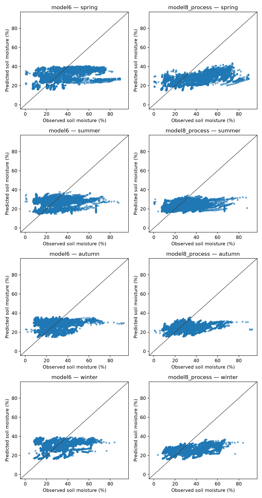
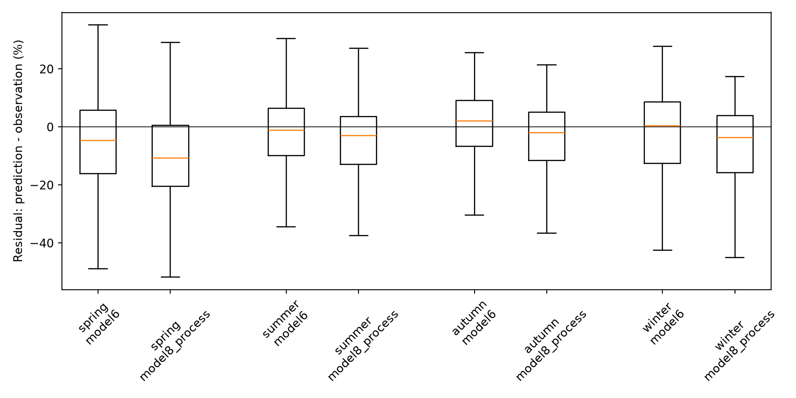
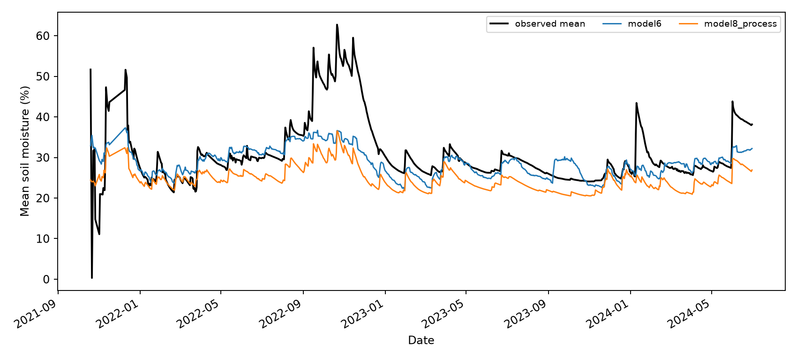
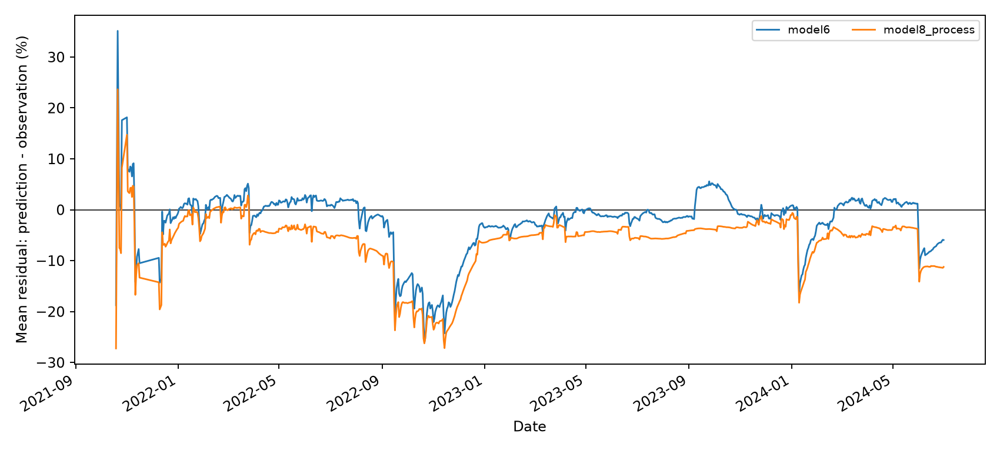
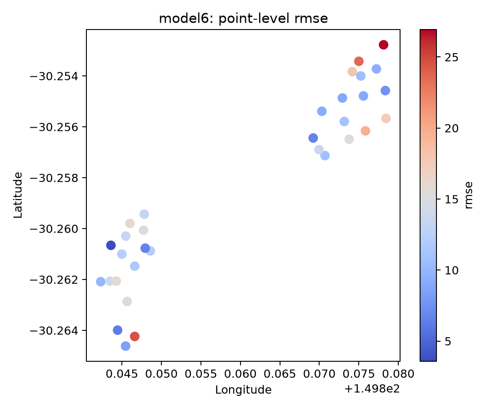
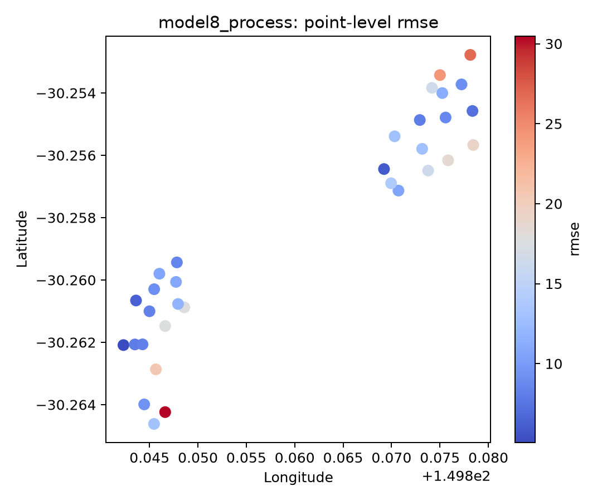
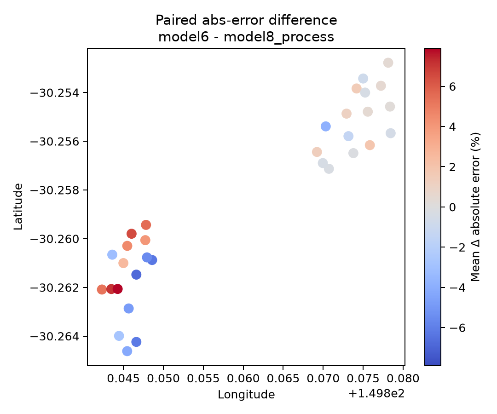
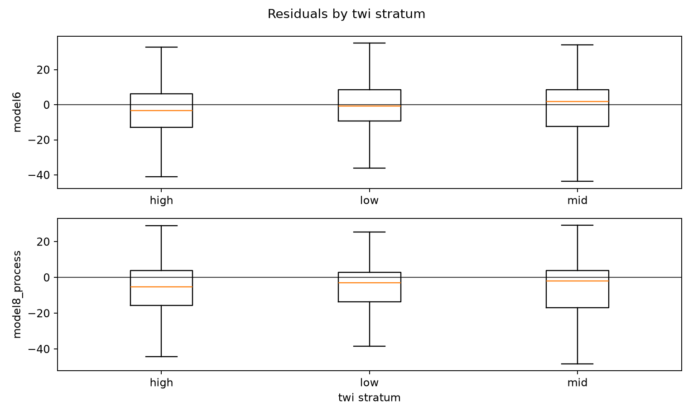
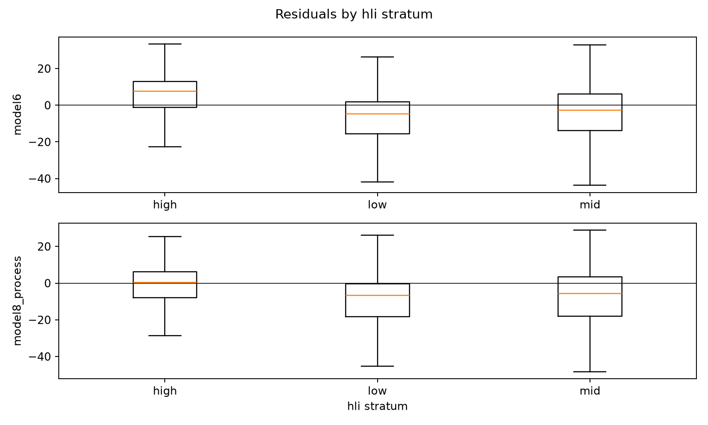
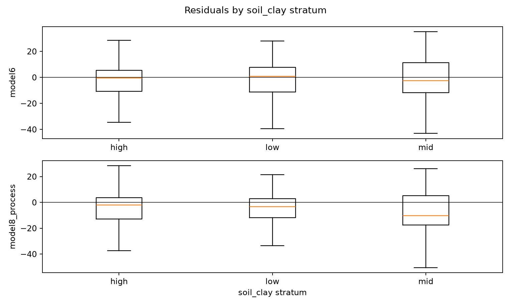

# Llara unseen validation — model6 boosted ML vs model8 process

This report validates the global DownscalingMoistureModel outputs against the 32 in-situ soil-moisture probes from the Llara Landscape Rehydration Project. The validation is independent and unseen: no Llara observations are used for local calibration or spiking.

The Llara CSVs contain daily depth-channel records. For comparability with the model root-zone/profile-style outputs, observations are converted to a daily profile mean for each physical probe. Replacement device records are collapsed onto the same physical probe before profile means are calculated.

## Data preparation and assumptions

- Source folder: `/Volumes/Dmitry_work/borevitz_projects/Data/Llara_data`
- Physical probes with coordinates: 32
- Profile-mean probe-date observations after filtering: 29247
- Dates used: 2021-10-19 to 2024-06-30 (955 dates)
- Feature/prediction bbox W/S/E/N: `(149.83230896457547, -30.274618550636745, 149.8884446427678, -30.242777849300744)`
- Coordinate source: `sm_probe_locs.csv`, interpreted as EPSG:32755 / UTM zone 55S and transformed to WGS84 lon/lat.
- Profile mean policy: valid depth channels are averaged per probe/date after replacement devices are collapsed by probe/date/channel.
- Sensor filtering: zero/negative values are treated as missing; values above 100% VWC are treated as physically implausible and removed.
- SMIPS lookback window used for model6 dynamic features: 365 days.
- Depth-channel assumption: 12-series probes use channels `v2`–`v12`; 16-series probes use `v2`–`v16`. The exact channel-depth metadata should be checked by a human if available.

## Overall skill

| model | n | nse | r2 | pearson_r | rmse | ubrmse | bias | mae | pred_vs_obs_slope |
| --- | --- | --- | --- | --- | --- | --- | --- | --- | --- |
| model6 boosted ML | 29247.000 | 0.036 | 0.036 | 0.267 | 13.927 | 13.744 | -2.249 | 10.872 | 0.098 |
| model8 process | 29247.000 | -0.017 | -0.017 | 0.453 | 14.306 | 12.855 | -6.278 | 10.796 | 0.132 |

Overall, model8 has RMSE 14.31% and R² -0.02, compared with model6 boosted ML RMSE 13.93% and R² 0.04. Bias is prediction minus observation, so negative values indicate dry bias.

The paired comparison below uses the same probe-date observations for both models. Positive mean Δ absolute error means model8 has lower absolute error than model6.

| n_matched | mean_delta_abs_error | mean_delta_abs_error_ci95_low | mean_delta_abs_error_ci95_high | rmse_a | rmse_b | fraction_model_a_better_abs_error |
| --- | --- | --- | --- | --- | --- | --- |
| 29247.000 | 0.076 | -1.278 | 1.467 | 13.927 | 14.306 | 0.509 |

## Seasonal skill and bias

| model | season | n | nse | r2 | pearson_r | rmse | ubrmse | bias | mae |
| --- | --- | --- | --- | --- | --- | --- | --- | --- | --- |
| model6 boosted ML | spring | 6208.000 | 0.060 | 0.060 | 0.449 | 17.043 | 15.809 | -6.367 | 13.146 |
| model6 boosted ML | summer | 7658.000 | -0.113 | -0.113 | 0.094 | 12.782 | 12.492 | -2.709 | 9.774 |
| model6 boosted ML | autumn | 8617.000 | -0.074 | -0.074 | 0.093 | 12.132 | 12.122 | 0.483 | 9.706 |
| model6 boosted ML | winter | 6764.000 | -0.008 | -0.008 | 0.183 | 14.128 | 14.055 | -1.431 | 11.513 |
| model8 process | spring | 6208.000 | -0.060 | -0.060 | 0.657 | 18.104 | 14.520 | -10.813 | 14.012 |
| model8 process | summer | 7658.000 | -0.176 | -0.176 | 0.178 | 13.136 | 11.978 | -5.395 | 9.782 |
| model8 process | autumn | 8617.000 | -0.051 | -0.051 | 0.238 | 11.999 | 11.384 | -3.793 | 9.206 |
| model8 process | winter | 6764.000 | -0.037 | -0.037 | 0.438 | 14.329 | 12.879 | -6.281 | 11.018 |

## Field and probe-depth-group diagnostics

| model | field | n | nse | r2 | pearson_r | rmse | ubrmse | bias | mae |
| --- | --- | --- | --- | --- | --- | --- | --- | --- | --- |
| model6 boosted ML | WE | 14589.000 | 0.002 | 0.002 | 0.412 | 14.470 | 13.200 | -5.928 | 10.609 |
| model6 boosted ML | WW | 14658.000 | 0.049 | 0.049 | 0.244 | 13.365 | 13.290 | 1.412 | 11.133 |
| model8 process | WE | 14589.000 | -0.041 | -0.041 | 0.467 | 14.779 | 12.930 | -7.158 | 10.668 |
| model8 process | WW | 14658.000 | -0.017 | -0.017 | 0.432 | 13.819 | 12.719 | -5.402 | 10.924 |

| model | probe_depth_group | n | nse | r2 | pearson_r | rmse | ubrmse | bias | mae |
| --- | --- | --- | --- | --- | --- | --- | --- | --- | --- |
| model6 boosted ML | 12.000 | 14396.000 | -0.151 | -0.151 | 0.235 | 16.457 | 14.973 | -6.829 | 13.032 |
| model6 boosted ML | 16.000 | 14851.000 | 0.055 | 0.055 | 0.336 | 10.929 | 10.708 | 2.190 | 8.778 |
| model8 process | 12.000 | 14396.000 | -0.332 | -0.332 | 0.408 | 17.700 | 14.152 | -10.631 | 13.856 |
| model8 process | 16.000 | 14851.000 | 0.214 | 0.214 | 0.524 | 9.968 | 9.753 | -2.058 | 7.830 |

## Dry/wet regime bias

| model | obs_moisture_quantile | n | obs_mean | pred_mean | bias | rmse | mae |
| --- | --- | --- | --- | --- | --- | --- | --- |
| model6 boosted ML | dry_q1 | 7312.000 | 15.259 | 27.504 | 12.245 | 13.868 | 12.336 |
| model6 boosted ML | q2 | 7312.000 | 24.335 | 27.935 | 3.600 | 6.352 | 5.380 |
| model6 boosted ML | q3 | 7311.000 | 33.320 | 28.162 | -5.159 | 7.724 | 6.086 |
| model6 boosted ML | wet_q4 | 7312.000 | 50.734 | 31.050 | -19.684 | 21.989 | 19.684 |
| model8 process | dry_q1 | 7312.000 | 15.259 | 22.474 | 7.215 | 8.559 | 7.304 |
| model8 process | q2 | 7312.000 | 24.335 | 24.454 | 0.119 | 4.166 | 3.338 |
| model8 process | q3 | 7311.000 | 33.320 | 24.248 | -9.072 | 10.343 | 9.168 |
| model8 process | wet_q4 | 7312.000 | 50.734 | 27.360 | -23.374 | 24.921 | 23.374 |

## Spatial diagnostics

Point-level spatial diagnostics are exported as PNG figures, shapefiles, and rasterized GeoTIFFs. The shapefiles are useful for GIS inspection; the GeoTIFFs are simple point-raster products in EPSG:32755 for quick overlay.

Spatial files:

- Shapefiles: `/Volumes/Dmitry_work/borevitz_projects/DMM_validation/outputs/llara_unseen_model6_vs_model8/spatial/shapefiles`
- GeoTIFF point rasters: `/Volumes/Dmitry_work/borevitz_projects/DMM_validation/outputs/llara_unseen_model6_vs_model8/spatial/tifs`

## Terrain and meteorology stratification

These strata use model-input style variables sampled over the Llara point-derived bbox. They are diagnostic strata, not evidence of local calibration.

### Strata where model8 gains most relative to model6

| terrain_var | terrain_stratum | n_matched | mean_delta_abs_error | rmse_a | rmse_b | bias_a | bias_b |
| --- | --- | --- | --- | --- | --- | --- | --- |
| hli | high | 9128.000 | 2.306 | 11.762 | 9.480 | 5.567 | -0.801 |
| northness | high | 9126.000 | 2.129 | 12.490 | 10.445 | 3.454 | -1.261 |
| soil_bdw | high | 9168.000 | 2.105 | 13.007 | 11.476 | 5.144 | -1.533 |
| eastness | high | 9123.000 | 2.023 | 10.961 | 9.006 | 4.642 | -1.609 |
| soil_sand | high | 9013.000 | 1.922 | 15.506 | 14.064 | -2.125 | -5.548 |
| slope | high | 9234.000 | 1.547 | 14.307 | 13.840 | 1.389 | -3.301 |
| soil_clay | low | 9929.000 | 1.451 | 14.648 | 13.538 | -2.078 | -5.664 |
| accumulation | high | 7249.000 | 1.193 | 13.624 | 12.264 | -1.284 | -3.253 |

### Strata where model6 is closest to, or better than, model8

| terrain_var | terrain_stratum | n_matched | mean_delta_abs_error | rmse_a | rmse_b | bias_a | bias_b |
| --- | --- | --- | --- | --- | --- | --- | --- |
| eastness | low | 10189.000 | -1.871 | 13.120 | 15.423 | -5.131 | -9.164 |
| northness | low | 9915.000 | -1.263 | 15.624 | 16.679 | -6.552 | -9.652 |
| soil_bdw | mid | 10003.000 | -1.229 | 15.486 | 16.933 | -7.303 | -10.419 |
| soil_clay | mid | 10128.000 | -0.997 | 14.310 | 15.840 | -1.145 | -7.626 |
| hli | low | 9921.000 | -0.971 | 15.291 | 16.063 | -7.178 | -9.361 |
| slope | low | 10065.000 | -0.942 | 14.107 | 15.178 | -7.176 | -9.318 |
| hli | mid | 10198.000 | -0.903 | 14.317 | 15.984 | -4.451 | -8.180 |
| soil_sand | low | 10135.000 | -0.783 | 14.190 | 15.710 | -5.413 | -7.636 |

## Data inference notes

- This validation is temporally rich: unlike the dense campaign, it spans hundreds of daily observations per probe.
- It is spatially sparse relative to Tarrawarra, with 32 fixed probes across two 40 ha fields, so spatial maps should be interpreted as point-support diagnostics rather than continuous surfaces.
- The observations are described by the source metadata as uncalibrated probe data. Absolute bias should therefore be interpreted carefully; correlation, seasonality, and relative wet/dry dynamics are especially informative.
- The strongest scientific use here is seasonal transfer testing: do model6 boosted-ML and process-model predictions track daily/seasonal dynamics at unseen probes without local calibration?

## Output files

- Model-agnostic prediction table: `/Volumes/Dmitry_work/borevitz_projects/DMM_validation/outputs/llara_unseen_model6_vs_model8/llara_model6_model8_predictions.csv`
- Prepared profile-mean observations: `/Volumes/Dmitry_work/borevitz_projects/DMM_validation/outputs/llara_unseen_model6_vs_model8/llara_profile_mean_observations.csv`
- Full validation outputs: `/Volumes/Dmitry_work/borevitz_projects/DMM_validation/outputs/llara_unseen_model6_vs_model8/validation_report`
- GitHub-readable report folder: `/Volumes/Dmitry_work/borevitz_projects/DMM_validation/reports/llara_unseen_model6_vs_model8`

Validator row count: 58494; models: model6, model8_process.
