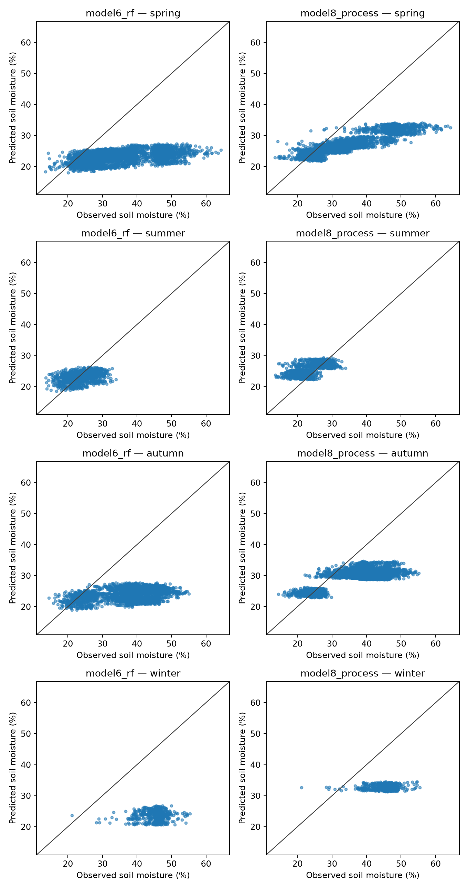
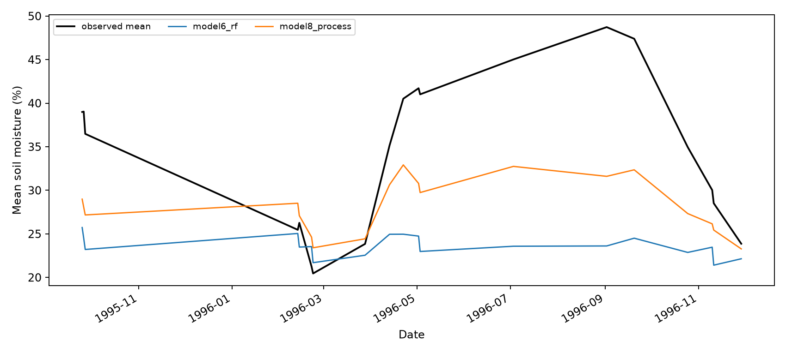
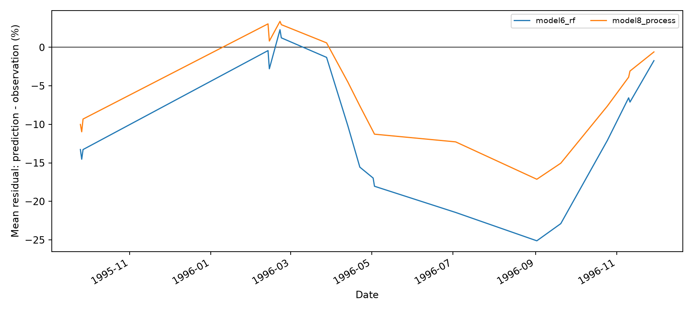
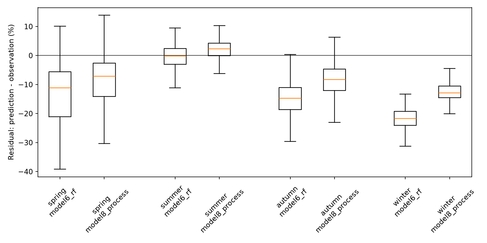
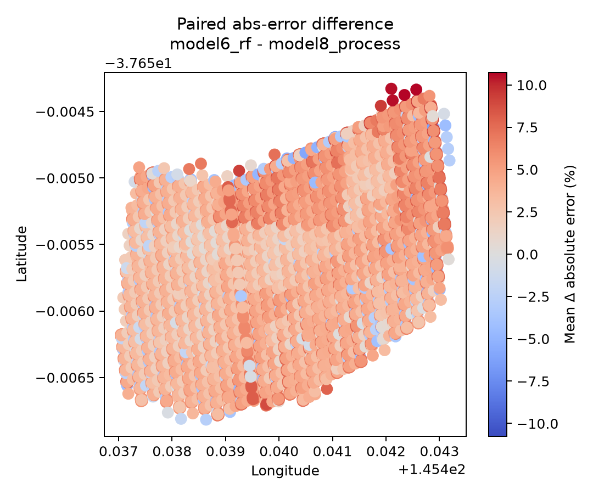
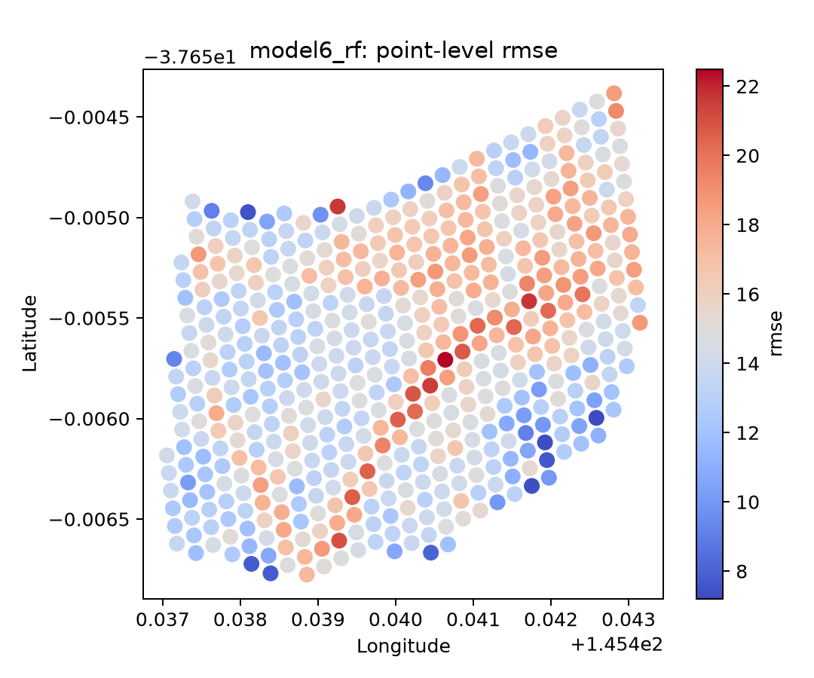
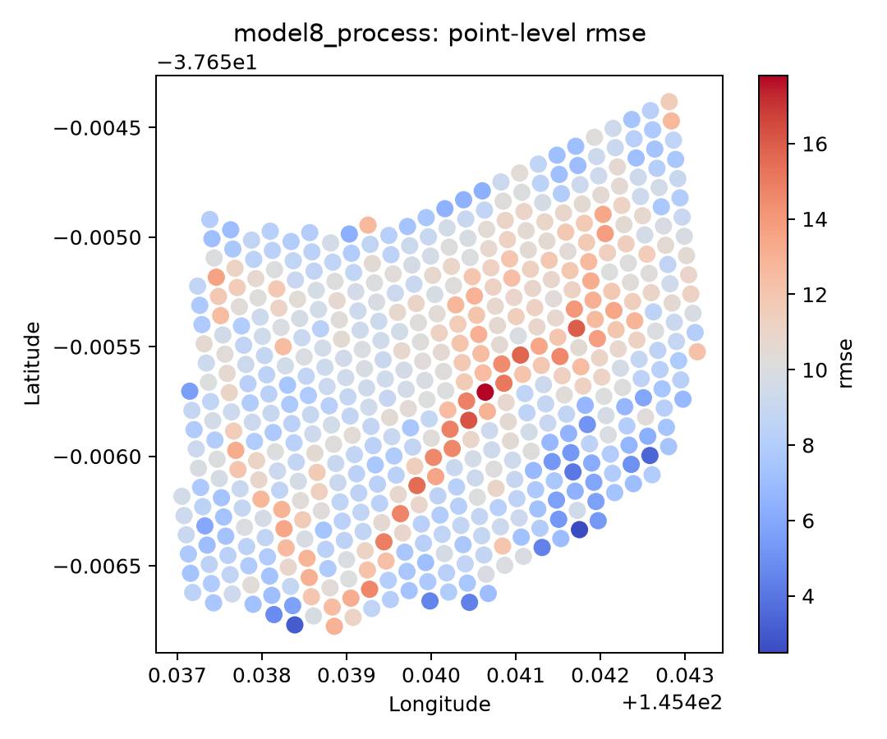
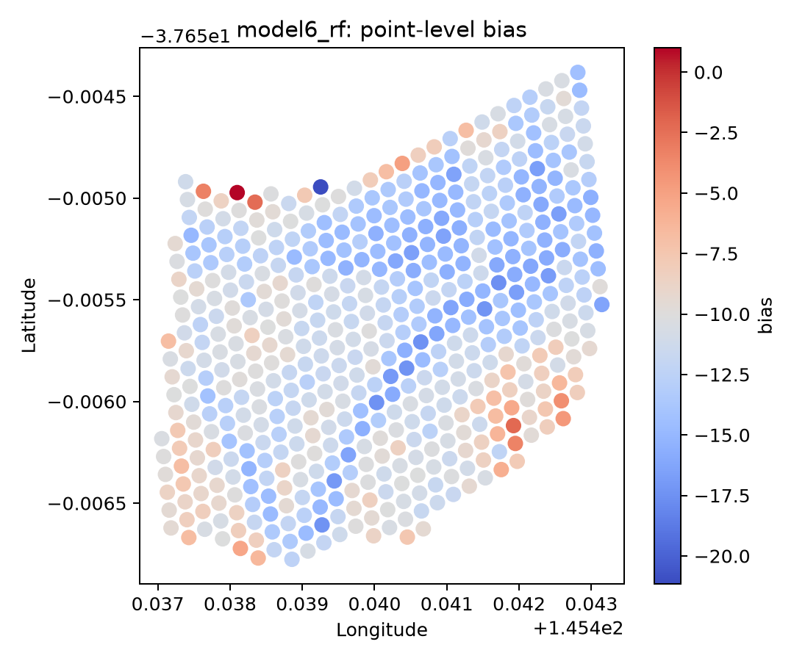
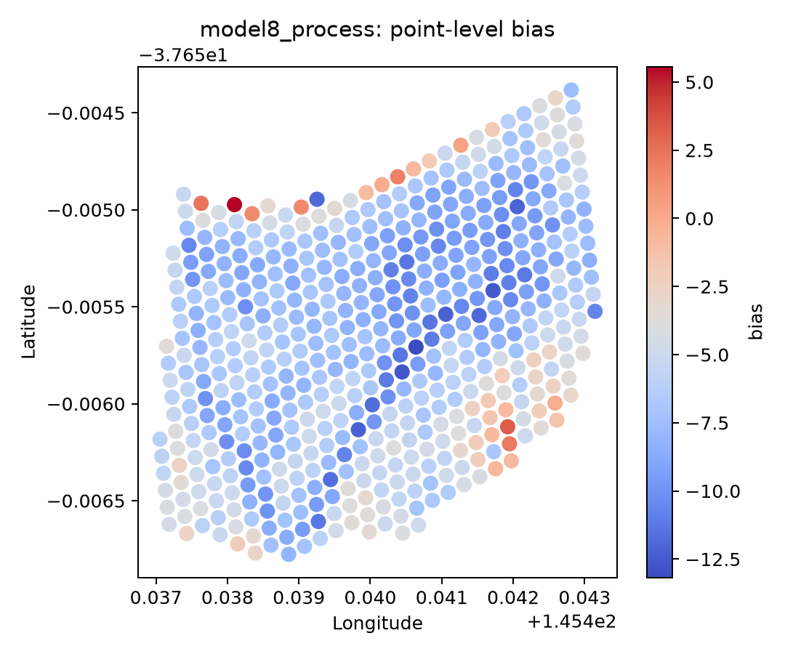

Date run: 2026-08-03  
Model branch used for model8: `DownscalingMoistureModel/process-model/model8` 

Model version 2026-08-03

Model branch used for model6: `DownscalingMoistureModel/EMT/model6` 

Model version 2026-08-03

Dense point source: Western, A. W. & Grayson, R. B. (1998). The Tarrawarra data set: Soil moisture patterns, soil characteristics, and hydrological flux measurements. Water Resources Research, 34 (10), pp.2765-2768. https://doi.org/10.1029/98WR01833.

# Independent dense-point validation report

Input prediction table:

`/Volumes/Dmitry_work/borevitz_projects/DMM_validation/outputs/tarrawarra_model6_vs_model8/model6_model8_combined_predictions_valid.csv`

Validation rows: 17290

- `model6_rf`: the random-forest/downscaling model;
- `model8_process`: the process-model branch model8 bucket/readout model.

Points: 3610

Dates: 1995-09-25 to 1996-11-29

## Overall skill

`r2` is reported as the NSE/coefficient-of-determination style score
`1 - SS_res / SS_tot`. Pearson correlation is reported separately as
`pearson_r` and `pearson_r2`.

| model_name     | n        | nse    | r2     | pearson_r | rmse   | ubrmse | bias    | mae    | pearson_r2 | median_ae | pred_vs_obs_slope | pred_vs_obs_intercept |
| -------------- | -------- | ------ | ------ | --------- | ------ | ------ | ------- | ------ | ---------- | --------- | ----------------- | --------------------- |
| model6_rf      | 8645.000 | -1.614 | -1.614 | 0.394     | 15.080 | 8.770  | -12.267 | 12.707 | 0.155      | 13.111    | 0.077             | 20.785                |
| model8_process | 8645.000 | -0.133 | -0.133 | 0.831     | 9.929  | 6.894  | -7.146  | 8.147  | 0.690      | 7.393     | 0.286             | 18.417                |

## Seasonal skill

| model_name     | season | n        | nse     | r2      | pearson_r | rmse   | ubrmse | bias    | mae    | pearson_r2 | median_ae | pred_vs_obs_slope | pred_vs_obs_intercept |
| -------------- | ------ | -------- | ------- | ------- | --------- | ------ | ------ | ------- | ------ | ---------- | --------- | ----------------- | --------------------- |
| model6_rf      | spring | 3541.000 | -1.629  | -1.629  | 0.457     | 15.542 | 8.895  | -12.745 | 12.885 | 0.209      | 11.117    | 0.088             | 20.022                |
| model6_rf      | summer | 1018.000 | 0.107   | 0.107   | 0.348     | 3.694  | 3.675  | -0.368  | 3.042  | 0.121      | 2.681     | 0.145             | 19.641                |
| model6_rf      | autumn | 3581.000 | -3.543  | -3.543  | 0.362     | 15.468 | 6.819  | -13.884 | 14.046 | 0.131      | 14.785    | 0.088             | 20.699                |
| model6_rf      | winter | 505.000  | -33.028 | -33.028 | 0.091     | 21.792 | 3.923  | -21.436 | 21.446 | 0.008      | 21.690    | 0.039             | 21.840                |
| model8_process | spring | 3541.000 | -0.251  | -0.251  | 0.896     | 10.723 | 6.905  | -8.204  | 8.595  | 0.803      | 7.255     | 0.295             | 17.141                |
| model8_process | summer | 1018.000 | 0.055   | 0.055   | 0.606     | 3.800  | 3.140  | 2.140   | 3.111  | 0.367      | 2.805     | 0.300             | 18.533                |
| model8_process | autumn | 3581.000 | -0.841  | -0.841  | 0.718     | 9.848  | 5.718  | -8.017  | 8.540  | 0.515      | 8.246     | 0.251             | 20.413                |
| model8_process | winter | 505.000  | -10.805 | -10.805 | 0.080     | 12.836 | 3.761  | -12.272 | 12.368 | 0.006      | 12.924    | 0.018             | 31.938                |

## Seasonal bias summary

`seasonal_bias_amplitude` is the difference between the most positive and most
negative seasonal mean bias for each model.

| model_name     | season | n        | bias    | rmse   | seasonal_bias_min | seasonal_bias_max | seasonal_bias_amplitude |
| -------------- | ------ | -------- | ------- | ------ | ----------------- | ----------------- | ----------------------- |
| model6_rf      | spring | 3541.000 | -12.745 | 15.542 | -21.436           | -0.368            | 21.068                  |
| model6_rf      | summer | 1018.000 | -0.368  | 3.694  | -21.436           | -0.368            | 21.068                  |
| model6_rf      | autumn | 3581.000 | -13.884 | 15.468 | -21.436           | -0.368            | 21.068                  |
| model6_rf      | winter | 505.000  | -21.436 | 21.792 | -21.436           | -0.368            | 21.068                  |
| model8_process | spring | 3541.000 | -8.204  | 10.723 | -12.272           | 2.140             | 14.413                  |
| model8_process | summer | 1018.000 | 2.140   | 3.800  | -12.272           | 2.140             | 14.413                  |
| model8_process | autumn | 3581.000 | -8.017  | 9.848  | -12.272           | 2.140             | 14.413                  |
| model8_process | winter | 505.000  | -12.272 | 12.836 | -12.272           | 2.140             | 14.413                  |

## Dry/wet regime bias

Observed soil moisture is split into quartiles. This helps show whether a model
is systematically biased in dry or wet conditions even when pooled RMSE looks
acceptable.

| model_name     | obs_moisture_quantile | n        | obs_mean | pred_mean | bias    | rmse   | mae    |
| -------------- | --------------------- | -------- | -------- | --------- | ------- | ------ | ------ |
| model6_rf      | dry_q1                | 2163.000 | 23.372   | 22.470    | -0.902  | 3.239  | 2.660  |
| model6_rf      | q2                    | 2191.000 | 32.596   | 23.343    | -9.253  | 9.791  | 9.253  |
| model6_rf      | q3                    | 2144.000 | 39.874   | 24.134    | -15.739 | 15.909 | 15.739 |
| model6_rf      | wet_q4                | 2147.000 | 47.593   | 24.268    | -23.325 | 23.548 | 23.325 |
| model8_process | dry_q1                | 2163.000 | 23.372   | 24.747    | 1.375   | 3.222  | 2.501  |
| model8_process | q2                    | 2191.000 | 32.596   | 27.883    | -4.713  | 5.419  | 4.835  |
| model8_process | q3                    | 2144.000 | 39.874   | 30.472    | -9.402  | 9.660  | 9.402  |
| model8_process | wet_q4                | 2147.000 | 47.593   | 31.631    | -15.962 | 16.229 | 15.962 |

## Paired model comparison

Negative `mean_delta_abs_error` means `model_a` had lower absolute error than
`model_b` on the same point-date observations.

| model_a   | model_b        | n_matched | mean_delta_abs_error | mean_delta_abs_error_ci95_low | mean_delta_abs_error_ci95_high | median_delta_abs_error | mean_delta_sq_error | rmse_a | rmse_b | rmse_delta_a_minus_b | bias_a  | bias_b | bias_delta_a_minus_b | fraction_model_a_better_abs_error |
| --------- | -------------- | --------- | -------------------- | ----------------------------- | ------------------------------ | ---------------------- | ------------------- | ------ | ------ | -------------------- | ------- | ------ | -------------------- | --------------------------------- |
| model6_rf | model8_process | 8645.000  | 4.560                | 4.491                         | 4.633                          | 5.156                  | 128.806             | 15.080 | 9.929  | 5.150                | -12.267 | -7.146 | -5.121               | 0.128                             |

## Paired model comparison by season

| season | model_a   | model_b        | n_matched | mean_delta_abs_error | mean_delta_abs_error_ci95_low | mean_delta_abs_error_ci95_high | median_delta_abs_error | mean_delta_sq_error | rmse_a | rmse_b | rmse_delta_a_minus_b | bias_a  | bias_b  | bias_delta_a_minus_b | fraction_model_a_better_abs_error |
| ------ | --------- | -------------- | --------- | -------------------- | ----------------------------- | ------------------------------ | ---------------------- | ------------------- | ------ | ------ | -------------------- | ------- | ------- | -------------------- | --------------------------------- |
| spring | model6_rf | model8_process | 3541.000  | 4.290                | 4.200                         | 4.385                          | 4.025                  | 126.562             | 15.542 | 10.723 | 4.819                | -12.745 | -8.204  | -4.541               | 0.073                             |
| summer | model6_rf | model8_process | 1018.000  | -0.069               | -0.227                        | 0.093                          | -0.527                 | -0.799              | 3.694  | 3.800  | -0.107               | -0.368  | 2.140   | -2.509               | 0.581                             |
| autumn | model6_rf | model8_process | 3581.000  | 5.506                | 5.431                         | 5.584                          | 5.976                  | 142.295             | 15.468 | 9.848  | 5.621                | -13.884 | -8.017  | -5.867               | 0.071                             |
| winter | model6_rf | model8_process | 505.000   | 9.078                | 8.939                         | 9.207                          | 9.139                  | 310.152             | 21.792 | 12.836 | 8.957                | -21.436 | -12.272 | -9.164               | 0.002                             |

## Terrain-stratified error

Terrain strata are diagnostic only. They are used to interpret where errors
occur; they are not assumed to be inputs used by any model.

| model_name     | terrain_var | terrain_stratum | n        | nse    | r2     | pearson_r | pearson_r2 | rmse   | ubrmse | bias    | mae    | median_ae | pred_vs_obs_slope | pred_vs_obs_intercept |
| -------------- | ----------- | --------------- | -------- | ------ | ------ | --------- | ---------- | ------ | ------ | ------- | ------ | --------- | ----------------- | --------------------- |
| model6_rf      | elevation   | high            | 2878.000 | -1.729 | -1.729 | 0.352     | 0.124      | 15.099 | 8.708  | -12.335 | 12.779 | 13.055    | 0.061             | 20.033                |
| model6_rf      | elevation   | low             | 2885.000 | -1.523 | -1.523 | 0.489     | 0.239      | 15.015 | 8.881  | -12.107 | 12.602 | 13.078    | 0.068             | 22.132                |
| model6_rf      | elevation   | mid             | 2882.000 | -1.682 | -1.682 | 0.405     | 0.164      | 15.125 | 8.718  | -12.359 | 12.740 | 13.162    | 0.069             | 21.355                |
| model8_process | elevation   | high            | 2878.000 | -0.042 | -0.042 | 0.817     | 0.668      | 9.331  | 6.817  | -6.371  | 7.641  | 6.828     | 0.281             | 18.424                |
| model8_process | elevation   | low             | 2885.000 | -0.145 | -0.145 | 0.842     | 0.708      | 10.115 | 7.002  | -7.299  | 8.282  | 7.482     | 0.282             | 19.103                |
| model8_process | elevation   | mid             | 2882.000 | -0.247 | -0.247 | 0.840     | 0.705      | 10.315 | 6.786  | -7.768  | 8.517  | 7.812     | 0.289             | 17.964                |
| model6_rf      | slope       | high            | 2864.000 | -1.999 | -1.999 | 0.355     | 0.126      | 15.221 | 8.315  | -12.749 | 13.045 | 13.681    | 0.075             | 20.435                |
| model6_rf      | slope       | low             | 2908.000 | -1.309 | -1.309 | 0.431     | 0.185      | 14.770 | 9.111  | -11.624 | 12.260 | 12.399    | 0.076             | 21.311                |
| model6_rf      | slope       | mid             | 2873.000 | -1.609 | -1.609 | 0.429     | 0.184      | 15.248 | 8.821  | -12.437 | 12.823 | 13.207    | 0.082             | 20.571                |
| model8_process | slope       | high            | 2864.000 | -0.342 | -0.342 | 0.847     | 0.718      | 10.183 | 6.354  | -7.957  | 8.545  | 8.157     | 0.302             | 17.060                |
| model8_process | slope       | low             | 2908.000 | 0.020  | 0.020  | 0.837     | 0.700      | 9.623  | 7.283  | -6.290  | 7.755  | 6.643     | 0.272             | 19.663                |
| model8_process | slope       | mid             | 2873.000 | -0.117 | -0.117 | 0.860     | 0.739      | 9.979  | 6.904  | -7.204  | 8.147  | 7.411     | 0.289             | 18.341                |
| model6_rf      | northness   | high            | 2880.000 | -1.903 | -1.903 | 0.377     | 0.142      | 15.348 | 8.476  | -12.796 | 13.162 | 13.510    | 0.080             | 20.576                |
| model6_rf      | northness   | low             | 2908.000 | -1.314 | -1.314 | 0.432     | 0.187      | 14.335 | 8.884  | -11.250 | 11.781 | 11.658    | 0.068             | 20.998                |
| model6_rf      | northness   | mid             | 2857.000 | -1.721 | -1.721 | 0.378     | 0.143      | 15.539 | 8.855  | -12.769 | 13.191 | 13.665    | 0.081             | 20.865                |
| model8_process | northness   | high            | 2880.000 | -0.302 | -0.302 | 0.829     | 0.687      | 10.277 | 6.607  | -7.871  | 8.602  | 8.078     | 0.294             | 17.731                |
| model8_process | northness   | low             | 2908.000 | 0.077  | 0.077  | 0.858     | 0.735      | 9.052  | 6.898  | -5.861  | 7.187  | 6.125     | 0.289             | 18.748                |
| model8_process | northness   | mid             | 2857.000 | -0.222 | -0.222 | 0.824     | 0.678      | 10.415 | 6.987  | -7.723  | 8.665  | 8.087     | 0.285             | 18.467                |
| model6_rf      | eastness    | high            | 2823.000 | -1.730 | -1.730 | 0.374     | 0.140      | 15.013 | 8.551  | -12.340 | 12.780 | 13.251    | 0.080             | 21.208                |
| model6_rf      | eastness    | low             | 2930.000 | -1.464 | -1.464 | 0.431     | 0.185      | 15.070 | 9.084  | -12.024 | 12.471 | 12.722    | 0.063             | 20.507                |
| model6_rf      | eastness    | mid             | 2892.000 | -1.725 | -1.725 | 0.386     | 0.149      | 15.155 | 8.652  | -12.442 | 12.874 | 13.223    | 0.074             | 21.150                |
| model8_process | eastness    | high            | 2823.000 | -0.237 | -0.237 | 0.815     | 0.664      | 10.105 | 6.703  | -7.562  | 8.443  | 7.975     | 0.292             | 18.256                |
| model8_process | eastness    | low             | 2930.000 | 0.036  | 0.036  | 0.853     | 0.728      | 9.424  | 7.087  | -6.211  | 7.495  | 6.354     | 0.282             | 18.711                |
| model8_process | eastness    | mid             | 2892.000 | -0.247 | -0.247 | 0.826     | 0.683      | 10.251 | 6.780  | -7.688  | 8.518  | 7.973     | 0.288             | 18.152                |
| model6_rf      | twi         | high            | 2842.000 | -1.606 | -1.606 | 0.440     | 0.193      | 15.792 | 9.169  | -12.857 | 13.257 | 13.571    | 0.075             | 21.338                |
| model6_rf      | twi         | low             | 2900.000 | -1.680 | -1.680 | 0.382     | 0.146      | 14.854 | 8.575  | -12.129 | 12.553 | 13.206    | 0.071             | 20.353                |
| model6_rf      | twi         | mid             | 2903.000 | -1.625 | -1.625 | 0.349     | 0.122      | 14.582 | 8.529  | -11.828 | 12.322 | 12.696    | 0.073             | 21.133                |
| model8_process | twi         | high            | 2842.000 | -0.163 | -0.163 | 0.838     | 0.702      | 10.551 | 7.335  | -7.584  | 8.599  | 7.581     | 0.271             | 19.366                |
| model8_process | twi         | low             | 2900.000 | -0.101 | -0.101 | 0.837     | 0.700      | 9.523  | 6.650  | -6.816  | 7.836  | 7.119     | 0.293             | 17.906                |
| model8_process | twi         | mid             | 2903.000 | -0.161 | -0.161 | 0.818     | 0.670      | 9.697  | 6.661  | -7.047  | 8.015  | 7.343     | 0.288             | 18.253                |

_Showing first 30 of 108 rows._

## Key figures

### Observed vs predicted by season

### Mean observed vs predicted time series

### Mean residual time series

### Seasonal bias

### Paired point-level model difference

Negative values mean model6 has lower absolute error; positive values mean model8 has lower absolute error.

### Point-level RMSE maps

### Point-level bias maps

## Interpretation guardrails

This report is an independent validation protocol. Do not mix local calibration
or spiking into the primary score. If local calibration is tested, run it as a
separate experiment with explicit calibration and validation windows.
