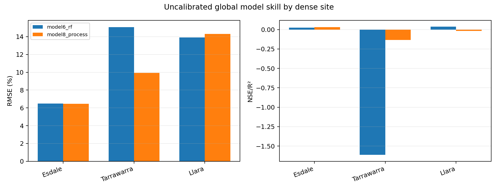
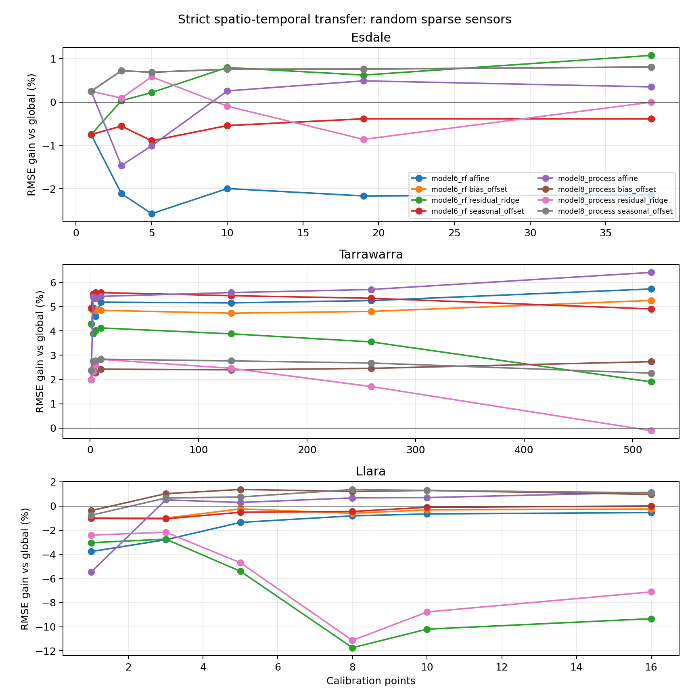
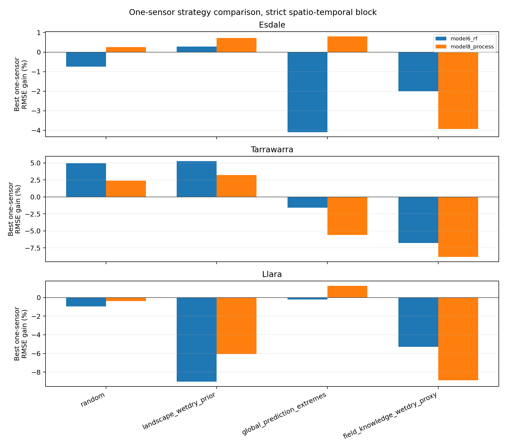
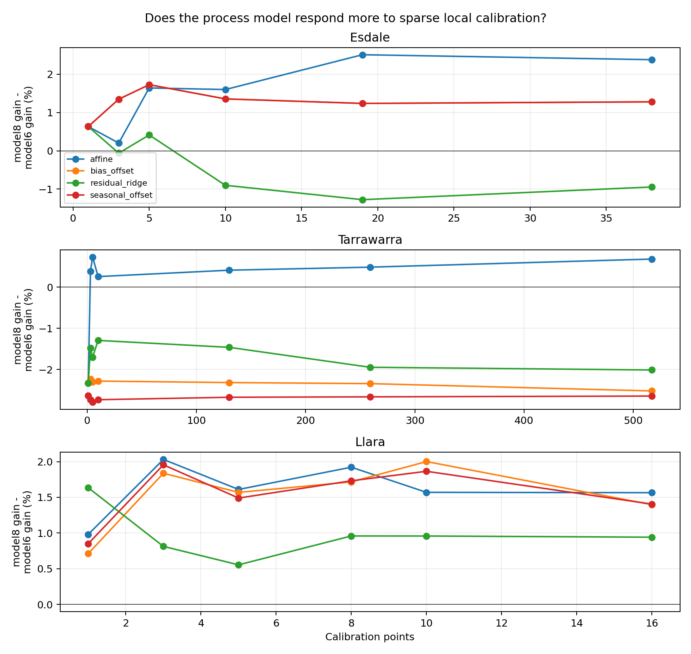

# Stage 2 local-spiking calibration: Esdale, Tarrawarra and Llara

This report replaces the Phenode-based local calibration experiment. From here
on, the original dense validation site is called **Esdale**, so each dense site
has a unique name.

The practical question is: if a landowner can afford one or a few soil-moisture
sensors, can that tiny local information budget improve property-scale
downscaling enough to matter? The experiment deliberately assumes that a new
site starts with **no measured soil moisture map**. Sensor locations are
therefore chosen using:

- random point selection;
- a terrain/model-input wet-dry landscape prior;
- global prediction extremes;
- an explicitly labelled `field_knowledge_wetdry_proxy`, which uses observed
  chronic wet/dry points as a proxy for landowner knowledge and should not be
  treated as a fully deployable selection rule.

## Blocking design

Each site is tested under three blocks:

1. `spatial_block`: fit selected calibration points across all available dense
   dates, validate unselected points.
2. `temporal_block`: fit selected calibration points in the early dense dates,
   validate those same points in later dates.
3. `spatiotemporal_block`: fit selected calibration points in early dates,
   validate different points in later dates. This is the strictest and most
   relevant property-map transfer test.

Calibration methods:

- `bias_offset`: one local residual offset;
- `seasonal_offset`: separate residual offsets by southern-hemisphere season,
  falling back to the global offset where a season is unseen in calibration;
- `affine`: local intercept and slope correction;
- `residual_ridge`: strongly regularised residual layer using only
  prediction-time model inputs and terrain/soil/weather state.

## Site inputs

| site       | path                                                                                                                                   | rows      | models                   | points   | eligible_points_train_and_future | dates   | date_min   | date_max   | train_dates | future_dates | seasons                     |
| ---------- | -------------------------------------------------------------------------------------------------------------------------------------- | --------- | ------------------------ | -------- | -------------------------------- | ------- | ---------- | ---------- | ----------- | ------------ | --------------------------- |
| Esdale     | /Volumes/Dmitry_work/borevitz_projects/DMM_validation/outputs/model6_vs_model8_dense/model6_model8_combined_predictions.csv            | 1120.000  | model6_rf,model8_process | 79.000   | 76.000                           | 9.000   | 2025-04-30 | 2025-07-17 | 3.000       | 6.000        | autumn,winter               |
| Tarrawarra | /Volumes/Dmitry_work/borevitz_projects/DMM_validation/outputs/tarrawarra_model6_vs_model8/model6_model8_combined_predictions_valid.csv | 17290.000 | model6_rf,model8_process | 3610.000 | 517.000                          | 19.000  | 1995-09-25 | 1996-11-29 | 7.000       | 12.000       | autumn,spring,summer,winter |
| Llara      | /Volumes/Dmitry_work/borevitz_projects/DMM_validation/outputs/llara_unseen_model6_vs_model8/llara_model6_model8_predictions.csv        | 58494.000 | model6_rf,model8_process | 32.000   | 32.000                           | 955.000 | 2021-10-19 | 2024-06-30 | 316.000     | 639.000      | autumn,spring,summer,winter |

Tarrawarra model6 should be read with a special caveat: the historical SMIPS inputs in the existing Tarrawarra run are zero, so model6 there is closer to a missing-coarse-anchor ablation than a normal model6 run.

## Uncalibrated global model skill

| site       | base_model     | model_track    | n         | nse    | r2     | pearson_r | pearson_r2 | rmse   | ubrmse | bias    | mae    | median_ae | pred_vs_obs_slope | pred_vs_obs_intercept |
| ---------- | -------------- | -------------- | --------- | ------ | ------ | --------- | ---------- | ------ | ------ | ------- | ------ | --------- | ----------------- | --------------------- |
| Esdale     | model6_rf      | statistical_rf | 560.000   | 0.023  | 0.023  | 0.238     | 0.057      | 6.477  | 6.453  | -0.558  | 5.209  | 4.415     | 0.096             | 14.876                |
| Esdale     | model8_process | process_bucket | 560.000   | 0.031  | 0.031  | 0.462     | 0.213      | 6.452  | 5.884  | 2.645   | 5.199  | 4.476     | 0.277             | 14.981                |
| Tarrawarra | model6_rf      | statistical_rf | 8645.000  | -1.614 | -1.614 | 0.394     | 0.155      | 15.080 | 8.770  | -12.267 | 12.707 | 13.111    | 0.077             | 20.785                |
| Tarrawarra | model8_process | process_bucket | 8645.000  | -0.133 | -0.133 | 0.831     | 0.690      | 9.929  | 6.894  | -7.146  | 8.147  | 7.393     | 0.286             | 18.417                |
| Llara      | model6_rf      | statistical_rf | 29247.000 | 0.036  | 0.036  | 0.267     | 0.071      | 13.927 | 13.744 | -2.249  | 10.872 | 9.007     | 0.098             | 25.636                |
| Llara      | model8_process | process_bucket | 29247.000 | -0.017 | -0.017 | 0.453     | 0.205      | 14.306 | 12.855 | -6.278  | 10.796 | 7.831     | 0.132             | 20.566                |

## Headline inference

- Under the strict random one-sensor test, **model8 process is usually more
  responsive than model6 RF at Esdale and Llara**, especially for simple
  bias-offset calibration. This is the cleanest evidence so far that the
  process model may provide a more stable base for tiny local information
  budgets.
- Tarrawarra is different: both models improve strongly with sparse local
  calibration, but model6 often shows larger RMSE gains because its uncalibrated
  bias is very large. However, model8 generally remains the lower-RMSE model
  after calibration. Interpret this alongside the Tarrawarra SMIPS-zero caveat.
- One random sensor is not consistently enough. It helps model8 at Esdale and
  Tarrawarra, but worsens Llara unless more points are supplied. In the random
  strict block, Llara model8 begins to improve with 2-5 calibration points,
  while model6 remains much less responsive.
- The field-knowledge/landscape-prior selections can outperform random
  placement in some cases, which supports the practical idea of putting a
  sensor in an intuitively wet/dry part of the property. But the
  `field_knowledge_wetdry_proxy` is an upper-bound proxy, not a blind deployment
  rule.
- The residual-ridge layer is useful in selected cases, but simple
  `bias_offset` is often the most robust sparse-sensor calibration layer. This
  matters for deployability: a landowner-facing calibration should probably
  start with a small, interpretable correction before adding flexible residual
  models.

## Best one-sensor strict spatio-temporal result

For each site and model, this table selects the best one-sensor calibration
method/selection strategy by median RMSE under the strict block.

| site       | base_model     | selection_strategy         | budget_label | method          | rmse_median | rmse_gain_median | nse_median | delta_nse_median | bias_median | delta_abs_bias_median | n_replicates |
| ---------- | -------------- | -------------------------- | ------------ | --------------- | ----------- | ---------------- | ---------- | ---------------- | ----------- | --------------------- | ------------ |
| Esdale     | model6_rf      | landscape_wetdry_prior     | 1            | residual_ridge  | 4.926       | 0.279            | -0.249     | 0.145            | 0.127       | -1.558                | 1.000        |
| Esdale     | model8_process | global_prediction_extremes | 1            | bias_offset     | 4.515       | 0.808            | -0.049     | 0.409            | -0.851      | -2.095                | 1.000        |
| Llara      | model6_rf      | global_prediction_extremes | 1            | affine          | 12.745      | -0.213           | 0.000      | -0.033           | -0.041      | -3.206                | 1.000        |
| Llara      | model8_process | global_prediction_extremes | 1            | affine          | 12.179      | 1.253            | 0.087      | 0.198            | -1.838      | -5.252                | 1.000        |
| Tarrawarra | model6_rf      | landscape_wetdry_prior     | 1            | seasonal_offset | 10.841      | 5.268            | -0.532     | 1.850            | -4.408      | -9.467                | 1.000        |
| Tarrawarra | model8_process | landscape_wetdry_prior     | 1            | affine          | 7.237       | 3.209            | 0.318      | 0.740            | -3.434      | -4.845                | 1.000        |

## Random sparse-sensor learning curves

This table is the most defensible deployment-oriented result because it does
not assume the landowner already knows where the model fails. Positive
`rmse_gain_median` and `delta_nse_median` indicate improvement over the
uncalibrated global model on the same held-out rows.

| site   | budget_label | calibration_points | base_model     | method          | rmse_median | rmse_gain_median | nse_median | delta_nse_median | bias_median | n_replicates |
| ------ | ------------ | ------------------ | -------------- | --------------- | ----------- | ---------------- | ---------- | ---------------- | ----------- | ------------ |
| Esdale | 1            | 1.000              | model6_rf      | affine          | 5.946       | -0.750           | -0.835     | -0.438           | -2.319      | 20.000       |
| Esdale | 1            | 1.000              | model6_rf      | bias_offset     | 5.946       | -0.750           | -0.835     | -0.438           | -2.319      | 20.000       |
| Esdale | 1            | 1.000              | model6_rf      | residual_ridge  | 5.946       | -0.750           | -0.835     | -0.438           | -2.319      | 20.000       |
| Esdale | 1            | 1.000              | model6_rf      | seasonal_offset | 5.946       | -0.750           | -0.835     | -0.438           | -2.319      | 20.000       |
| Esdale | 1            | 1.000              | model8_process | affine          | 5.048       | 0.249            | -0.303     | 0.132            | 1.693       | 20.000       |
| Esdale | 1            | 1.000              | model8_process | bias_offset     | 5.048       | 0.249            | -0.303     | 0.132            | 1.693       | 20.000       |
| Esdale | 1            | 1.000              | model8_process | residual_ridge  | 5.048       | 0.249            | -0.303     | 0.132            | 1.693       | 20.000       |
| Esdale | 1            | 1.000              | model8_process | seasonal_offset | 5.048       | 0.249            | -0.303     | 0.132            | 1.693       | 20.000       |
| Esdale | 10           | 10.000             | model6_rf      | affine          | 7.115       | -1.993           | -1.648     | -1.268           | -5.602      | 20.000       |
| Esdale | 10           | 10.000             | model6_rf      | bias_offset     | 5.897       | -0.542           | -0.733     | -0.304           | -3.054      | 20.000       |
| Esdale | 10           | 10.000             | model6_rf      | residual_ridge  | 4.452       | 0.796            | -0.015     | 0.393            | -0.310      | 20.000       |
| Esdale | 10           | 10.000             | model6_rf      | seasonal_offset | 5.897       | -0.542           | -0.733     | -0.304           | -3.054      | 20.000       |
| Esdale | 10           | 10.000             | model8_process | affine          | 5.075       | 0.257            | -0.381     | 0.140            | -0.208      | 20.000       |
| Esdale | 10           | 10.000             | model8_process | bias_offset     | 4.587       | 0.755            | -0.048     | 0.370            | 0.769       | 20.000       |
| Esdale | 10           | 10.000             | model8_process | residual_ridge  | 5.391       | -0.096           | -0.554     | -0.057           | 3.581       | 20.000       |
| Esdale | 10           | 10.000             | model8_process | seasonal_offset | 4.587       | 0.755            | -0.048     | 0.370            | 0.769       | 20.000       |
| Esdale | 25%          | 19.000             | model6_rf      | affine          | 7.181       | -2.163           | -1.695     | -1.368           | -5.712      | 20.000       |
| Esdale | 25%          | 19.000             | model6_rf      | bias_offset     | 5.542       | -0.386           | -0.587     | -0.221           | -2.600      | 20.000       |
| Esdale | 25%          | 19.000             | model6_rf      | residual_ridge  | 4.740       | 0.622            | -0.145     | 0.314            | -0.200      | 20.000       |
| Esdale | 25%          | 19.000             | model6_rf      | seasonal_offset | 5.542       | -0.386           | -0.587     | -0.221           | -2.600      | 20.000       |
| Esdale | 25%          | 19.000             | model8_process | affine          | 4.664       | 0.488            | -0.167     | 0.260            | -1.278      | 20.000       |
| Esdale | 25%          | 19.000             | model8_process | bias_offset     | 4.510       | 0.759            | -0.043     | 0.381            | 0.793       | 20.000       |
| Esdale | 25%          | 19.000             | model8_process | residual_ridge  | 6.196       | -0.860           | -0.891     | -0.485           | 4.748       | 20.000       |
| Esdale | 25%          | 19.000             | model8_process | seasonal_offset | 4.510       | 0.759            | -0.043     | 0.381            | 0.793       | 20.000       |
| Esdale | 3            | 3.000              | model6_rf      | affine          | 7.350       | -2.109           | -1.802     | -1.378           | -5.381      | 20.000       |
| Esdale | 3            | 3.000              | model6_rf      | bias_offset     | 5.688       | -0.554           | -0.693     | -0.311           | -2.994      | 20.000       |
| Esdale | 3            | 3.000              | model6_rf      | residual_ridge  | 5.214       | 0.030            | -0.387     | 0.017            | -1.230      | 20.000       |
| Esdale | 3            | 3.000              | model6_rf      | seasonal_offset | 5.688       | -0.554           | -0.693     | -0.311           | -2.994      | 20.000       |
| Esdale | 3            | 3.000              | model8_process | affine          | 6.683       | -1.462           | -1.325     | -0.912           | 1.933       | 20.000       |
| Esdale | 3            | 3.000              | model8_process | bias_offset     | 4.557       | 0.721            | -0.064     | 0.359            | 0.942       | 20.000       |
| Esdale | 3            | 3.000              | model8_process | residual_ridge  | 5.191       | 0.093            | -0.392     | 0.051            | 2.931       | 20.000       |
| Esdale | 3            | 3.000              | model8_process | seasonal_offset | 4.557       | 0.721            | -0.064     | 0.359            | 0.942       | 20.000       |
| Esdale | 5            | 5.000              | model6_rf      | affine          | 7.734       | -2.572           | -2.074     | -1.705           | -6.352      | 20.000       |
| Esdale | 5            | 5.000              | model6_rf      | bias_offset     | 6.119       | -0.892           | -0.928     | -0.517           | -3.680      | 20.000       |
| Esdale | 5            | 5.000              | model6_rf      | residual_ridge  | 4.970       | 0.219            | -0.267     | 0.114            | -1.831      | 20.000       |
| Esdale | 5            | 5.000              | model6_rf      | seasonal_offset | 6.119       | -0.892           | -0.928     | -0.517           | -3.680      | 20.000       |
| Esdale | 5            | 5.000              | model8_process | affine          | 6.288       | -1.007           | -0.982     | -0.582           | -3.625      | 20.000       |
| Esdale | 5            | 5.000              | model8_process | bias_offset     | 4.597       | 0.688            | -0.091     | 0.352            | 0.131       | 20.000       |
| Esdale | 5            | 5.000              | model8_process | residual_ridge  | 4.614       | 0.581            | -0.094     | 0.292            | 1.588       | 20.000       |
| Esdale | 5            | 5.000              | model8_process | seasonal_offset | 4.597       | 0.688            | -0.091     | 0.352            | 0.131       | 20.000       |
| Esdale | 50%          | 38.000             | model6_rf      | affine          | 7.524       | -2.141           | -1.719     | -1.338           | -5.982      | 20.000       |
| Esdale | 50%          | 38.000             | model6_rf      | bias_offset     | 5.838       | -0.388           | -0.639     | -0.211           | -2.676      | 20.000       |
| Esdale | 50%          | 38.000             | model6_rf      | residual_ridge  | 4.420       | 1.074            | 0.009      | 0.484            | -1.094      | 20.000       |
| Esdale | 50%          | 38.000             | model6_rf      | seasonal_offset | 5.838       | -0.388           | -0.639     | -0.211           | -2.676      | 20.000       |
| Esdale | 50%          | 38.000             | model8_process | affine          | 5.211       | 0.349            | -0.189     | 0.171            | -2.319      | 20.000       |
| Esdale | 50%          | 38.000             | model8_process | bias_offset     | 4.540       | 0.808            | -0.037     | 0.395            | 0.702       | 20.000       |
| Esdale | 50%          | 38.000             | model8_process | residual_ridge  | 5.423       | -0.004           | -0.510     | 0.005            | 3.856       | 20.000       |
| Esdale | 50%          | 38.000             | model8_process | seasonal_offset | 4.540       | 0.808            | -0.037     | 0.395            | 0.702       | 20.000       |
| Llara  | 1            | 1.000              | model6_rf      | affine          | 16.287      | -3.769           | -0.590     | -0.651           | -7.162      | 20.000       |
| Llara  | 1            | 1.000              | model6_rf      | bias_offset     | 13.537      | -0.967           | -0.091     | -0.150           | -3.331      | 20.000       |
| Llara  | 1            | 1.000              | model6_rf      | residual_ridge  | 15.504      | -3.039           | -0.410     | -0.498           | -8.482      | 20.000       |
| Llara  | 1            | 1.000              | model6_rf      | seasonal_offset | 13.566      | -1.029           | -0.108     | -0.162           | -2.719      | 20.000       |
| Llara  | 1            | 1.000              | model8_process | affine          | 18.922      | -5.467           | -1.160     | -1.068           | -7.821      | 20.000       |
| Llara  | 1            | 1.000              | model8_process | bias_offset     | 13.805      | -0.383           | -0.155     | -0.062           | -7.131      | 20.000       |
| Llara  | 1            | 1.000              | model8_process | residual_ridge  | 15.708      | -2.411           | -0.474     | -0.418           | -6.057      | 20.000       |
| Llara  | 1            | 1.000              | model8_process | seasonal_offset | 14.116      | -0.765           | -0.208     | -0.126           | -6.350      | 20.000       |
| Llara  | 10           | 10.000             | model6_rf      | affine          | 12.997      | -0.656           | -0.020     | -0.101           | -2.767      | 20.000       |
| Llara  | 10           | 10.000             | model6_rf      | bias_offset     | 12.853      | -0.317           | 0.014      | -0.047           | -4.570      | 20.000       |
| Llara  | 10           | 10.000             | model6_rf      | residual_ridge  | 22.400      | -10.198          | -2.036     | -2.130           | 0.879       | 20.000       |
| Llara  | 10           | 10.000             | model6_rf      | seasonal_offset | 12.589      | -0.102           | 0.044      | -0.015           | -3.907      | 20.000       |

_Showing first 60 of 152 rows._

## Process-vs-statistical calibration responsiveness

Positive `process_minus_statistical_rmse_gain_median` means model8 process
benefited more from the same sparse local calibration than model6 RF. Negative
values mean model6 RF benefited more.

| site       | budget_label | calibration_points | method          | statistical_rmse_gain_median | process_rmse_gain_median | process_minus_statistical_rmse_gain_median | fraction_process_wins | n_replicates |
| ---------- | ------------ | ------------------ | --------------- | ---------------------------- | ------------------------ | ------------------------------------------ | --------------------- | ------------ |
| Esdale     | 1            | 1.000              | affine          | -0.750                       | 0.249                    | 0.634                                      | 0.700                 | 20.000       |
| Esdale     | 1            | 1.000              | bias_offset     | -0.750                       | 0.249                    | 0.634                                      | 0.700                 | 20.000       |
| Esdale     | 1            | 1.000              | residual_ridge  | -0.750                       | 0.249                    | 0.634                                      | 0.700                 | 20.000       |
| Esdale     | 1            | 1.000              | seasonal_offset | -0.750                       | 0.249                    | 0.634                                      | 0.700                 | 20.000       |
| Esdale     | 10           | 10.000             | affine          | -1.993                       | 0.257                    | 1.600                                      | 0.750                 | 20.000       |
| Esdale     | 10           | 10.000             | bias_offset     | -0.542                       | 0.755                    | 1.356                                      | 0.900                 | 20.000       |
| Esdale     | 10           | 10.000             | residual_ridge  | 0.796                        | -0.096                   | -0.901                                     | 0.100                 | 20.000       |
| Esdale     | 10           | 10.000             | seasonal_offset | -0.542                       | 0.755                    | 1.356                                      | 0.900                 | 20.000       |
| Esdale     | 25%          | 19.000             | affine          | -2.163                       | 0.488                    | 2.510                                      | 0.950                 | 20.000       |
| Esdale     | 25%          | 19.000             | bias_offset     | -0.386                       | 0.759                    | 1.237                                      | 1.000                 | 20.000       |
| Esdale     | 25%          | 19.000             | residual_ridge  | 0.622                        | -0.860                   | -1.277                                     | 0.250                 | 20.000       |
| Esdale     | 25%          | 19.000             | seasonal_offset | -0.386                       | 0.759                    | 1.237                                      | 1.000                 | 20.000       |
| Esdale     | 3            | 3.000              | affine          | -2.109                       | -1.462                   | 0.202                                      | 0.450                 | 20.000       |
| Esdale     | 3            | 3.000              | bias_offset     | -0.554                       | 0.721                    | 1.348                                      | 0.800                 | 20.000       |
| Esdale     | 3            | 3.000              | residual_ridge  | 0.030                        | 0.093                    | -0.062                                     | 0.500                 | 20.000       |
| Esdale     | 3            | 3.000              | seasonal_offset | -0.554                       | 0.721                    | 1.348                                      | 0.800                 | 20.000       |
| Esdale     | 5            | 5.000              | affine          | -2.572                       | -1.007                   | 1.642                                      | 0.550                 | 20.000       |
| Esdale     | 5            | 5.000              | bias_offset     | -0.892                       | 0.688                    | 1.727                                      | 0.900                 | 20.000       |
| Esdale     | 5            | 5.000              | residual_ridge  | 0.219                        | 0.581                    | 0.413                                      | 0.550                 | 20.000       |
| Esdale     | 5            | 5.000              | seasonal_offset | -0.892                       | 0.688                    | 1.727                                      | 0.900                 | 20.000       |
| Esdale     | 50%          | 38.000             | affine          | -2.141                       | 0.349                    | 2.380                                      | 1.000                 | 20.000       |
| Esdale     | 50%          | 38.000             | bias_offset     | -0.388                       | 0.808                    | 1.279                                      | 1.000                 | 20.000       |
| Esdale     | 50%          | 38.000             | residual_ridge  | 1.074                        | -0.004                   | -0.946                                     | 0.150                 | 20.000       |
| Esdale     | 50%          | 38.000             | seasonal_offset | -0.388                       | 0.808                    | 1.279                                      | 1.000                 | 20.000       |
| Llara      | 1            | 1.000              | affine          | -3.769                       | -5.467                   | 0.982                                      | 0.500                 | 20.000       |
| Llara      | 1            | 1.000              | bias_offset     | -0.967                       | -0.383                   | 0.712                                      | 0.400                 | 20.000       |
| Llara      | 1            | 1.000              | residual_ridge  | -3.039                       | -2.411                   | 1.635                                      | 0.750                 | 20.000       |
| Llara      | 1            | 1.000              | seasonal_offset | -1.029                       | -0.765                   | 0.851                                      | 0.450                 | 20.000       |
| Llara      | 10           | 10.000             | affine          | -0.656                       | 0.702                    | 1.571                                      | 0.900                 | 20.000       |
| Llara      | 10           | 10.000             | bias_offset     | -0.317                       | 1.289                    | 2.001                                      | 1.000                 | 20.000       |
| Llara      | 10           | 10.000             | residual_ridge  | -10.198                      | -8.772                   | 0.958                                      | 0.550                 | 20.000       |
| Llara      | 10           | 10.000             | seasonal_offset | -0.102                       | 1.288                    | 1.865                                      | 1.000                 | 20.000       |
| Llara      | 25%          | 8.000              | affine          | -0.813                       | 0.673                    | 1.922                                      | 0.900                 | 20.000       |
| Llara      | 25%          | 8.000              | bias_offset     | -0.602                       | 1.206                    | 1.717                                      | 1.000                 | 20.000       |
| Llara      | 25%          | 8.000              | residual_ridge  | -11.735                      | -11.132                  | 0.959                                      | 0.600                 | 20.000       |
| Llara      | 25%          | 8.000              | seasonal_offset | -0.454                       | 1.365                    | 1.732                                      | 1.000                 | 20.000       |
| Llara      | 3            | 3.000              | affine          | -2.793                       | 0.510                    | 2.031                                      | 0.800                 | 20.000       |
| Llara      | 3            | 3.000              | bias_offset     | -1.002                       | 1.026                    | 1.837                                      | 0.900                 | 20.000       |
| Llara      | 3            | 3.000              | residual_ridge  | -2.744                       | -2.168                   | 0.813                                      | 0.450                 | 20.000       |
| Llara      | 3            | 3.000              | seasonal_offset | -1.059                       | 0.661                    | 1.956                                      | 0.900                 | 20.000       |
| Llara      | 5            | 5.000              | affine          | -1.355                       | 0.295                    | 1.611                                      | 0.850                 | 20.000       |
| Llara      | 5            | 5.000              | bias_offset     | -0.236                       | 1.372                    | 1.570                                      | 0.950                 | 20.000       |
| Llara      | 5            | 5.000              | residual_ridge  | -5.405                       | -4.697                   | 0.554                                      | 0.450                 | 20.000       |
| Llara      | 5            | 5.000              | seasonal_offset | -0.515                       | 0.748                    | 1.490                                      | 1.000                 | 20.000       |
| Llara      | 50%          | 16.000             | affine          | -0.542                       | 1.133                    | 1.565                                      | 0.950                 | 20.000       |
| Llara      | 50%          | 16.000             | bias_offset     | -0.245                       | 0.965                    | 1.397                                      | 1.000                 | 20.000       |
| Llara      | 50%          | 16.000             | residual_ridge  | -9.331                       | -7.114                   | 0.942                                      | 0.750                 | 20.000       |
| Llara      | 50%          | 16.000             | seasonal_offset | -0.003                       | 1.097                    | 1.406                                      | 1.000                 | 20.000       |
| Tarrawarra | 1            | 1.000              | affine          | 4.283                        | 1.999                    | -2.329                                     | 1.000                 | 20.000       |
| Tarrawarra | 1            | 1.000              | bias_offset     | 4.283                        | 1.999                    | -2.329                                     | 1.000                 | 20.000       |
| Tarrawarra | 1            | 1.000              | residual_ridge  | 4.283                        | 1.999                    | -2.329                                     | 1.000                 | 20.000       |
| Tarrawarra | 1            | 1.000              | seasonal_offset | 4.942                        | 2.382                    | -2.637                                     | 1.000                 | 20.000       |
| Tarrawarra | 10           | 10.000             | affine          | 5.189                        | 5.428                    | 0.255                                      | 1.000                 | 20.000       |
| Tarrawarra | 10           | 10.000             | bias_offset     | 4.852                        | 2.427                    | -2.283                                     | 1.000                 | 20.000       |
| Tarrawarra | 10           | 10.000             | residual_ridge  | 4.126                        | 2.831                    | -1.296                                     | 1.000                 | 20.000       |
| Tarrawarra | 10           | 10.000             | seasonal_offset | 5.584                        | 2.837                    | -2.736                                     | 1.000                 | 20.000       |
| Tarrawarra | 25%          | 130.000            | affine          | 5.159                        | 5.584                    | 0.411                                      | 1.000                 | 20.000       |
| Tarrawarra | 25%          | 130.000            | bias_offset     | 4.735                        | 2.399                    | -2.320                                     | 1.000                 | 20.000       |
| Tarrawarra | 25%          | 130.000            | residual_ridge  | 3.884                        | 2.463                    | -1.463                                     | 1.000                 | 20.000       |
| Tarrawarra | 25%          | 130.000            | seasonal_offset | 5.457                        | 2.768                    | -2.677                                     | 1.000                 | 20.000       |

_Showing first 60 of 76 rows._

## Figures

### Figure 1. Uncalibrated global model skill by dense site

Baseline RMSE and NSE/R² for model6 RF and model8 process before any local calibration.

### Figure 2. Strict spatio-temporal random sparse-sensor learning curves

Median RMSE gain from random sparse local sensors when calibration and validation are separated in space and time.

### Figure 3. One-sensor selection strategy comparison

Best one-sensor RMSE gain by site, model and sensor-placement strategy under the strict block.

### Figure 4. Process-vs-statistical calibration responsiveness

Positive values indicate model8 process gains more from the same random sparse calibration budget than model6 RF.

## Interpretation guardrails

- Local calibration is not independent validation. It is a separate
  intervention/sensor-placement experiment layered after unseen-site
  validation.
- The `spatiotemporal_block` results are the most defensible for property-scale
  transfer because calibration and validation are separated in both space and
  time.
- The field-knowledge proxy is useful for thinking with landowners, but it is
  not a strict blind selection rule because the proxy is generated from observed
  chronic wet/dry behaviour.
- A calibration layer that improves RMSE by destroying seasonal behaviour should
  not be treated as a win. Seasonal metrics are written to
  `metrics_by_design_season.csv` for that reason.
- The process-vs-statistical question should be read as **responsiveness to a
  tiny local information budget**, not as a universal ranking of model types.
