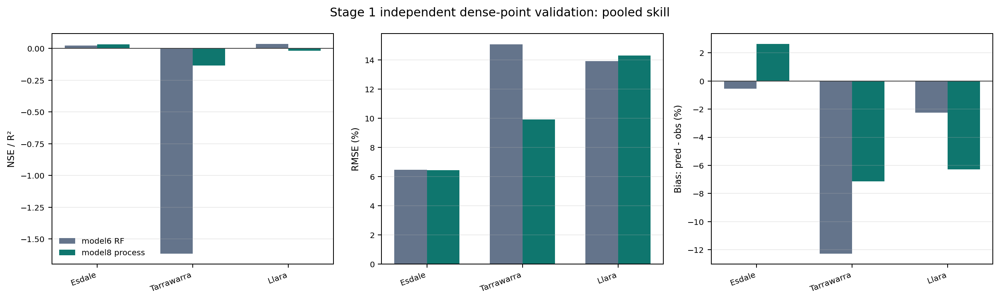
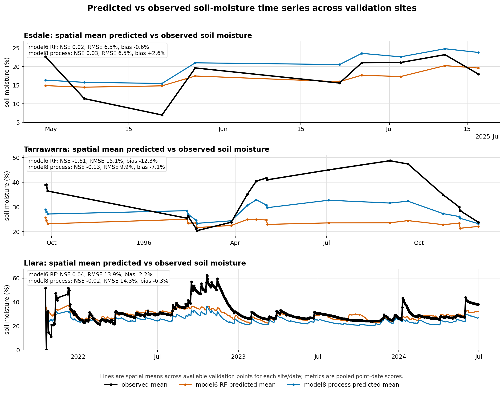
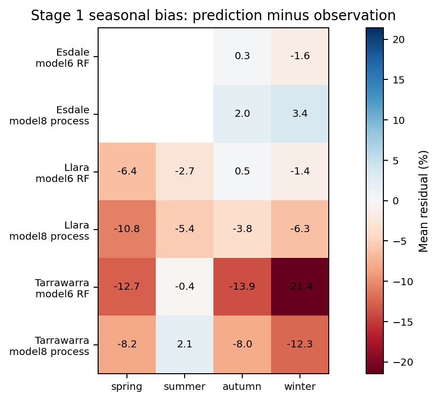
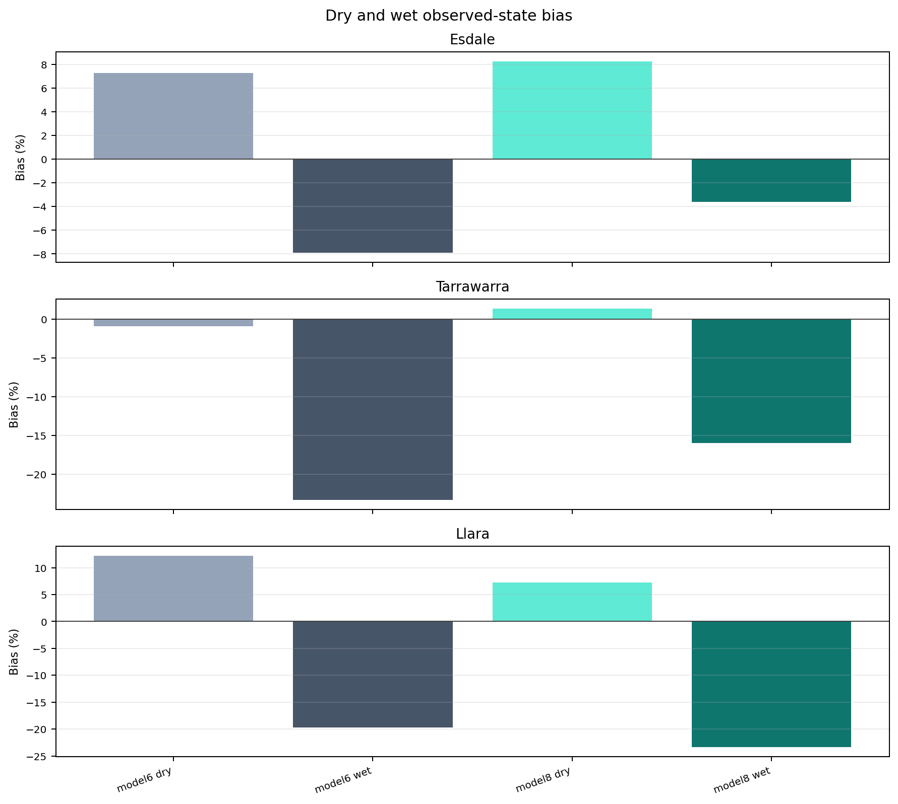
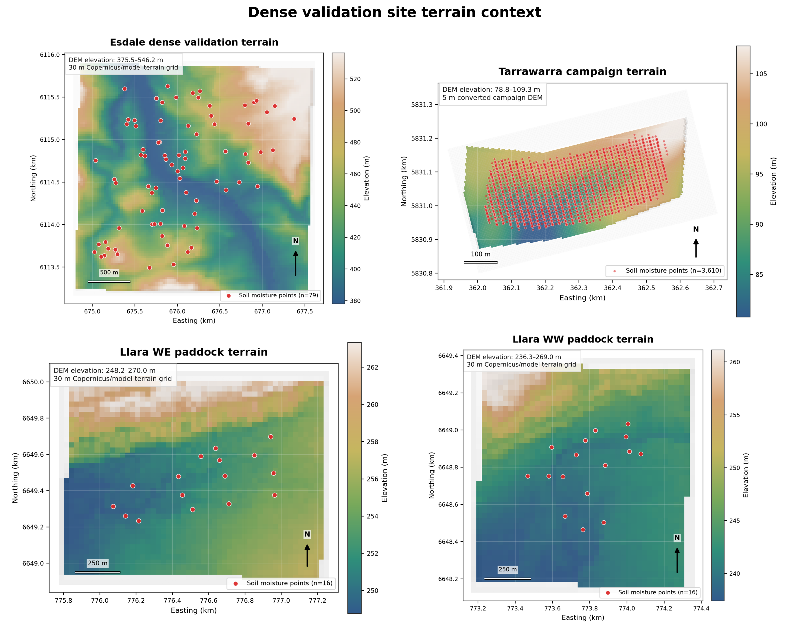
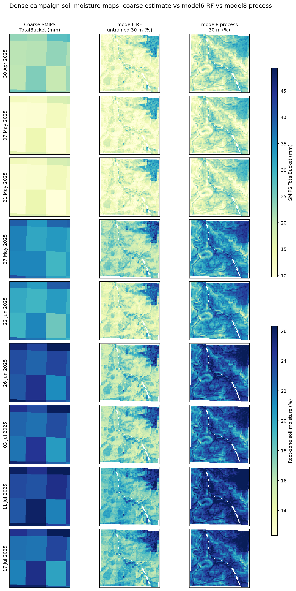
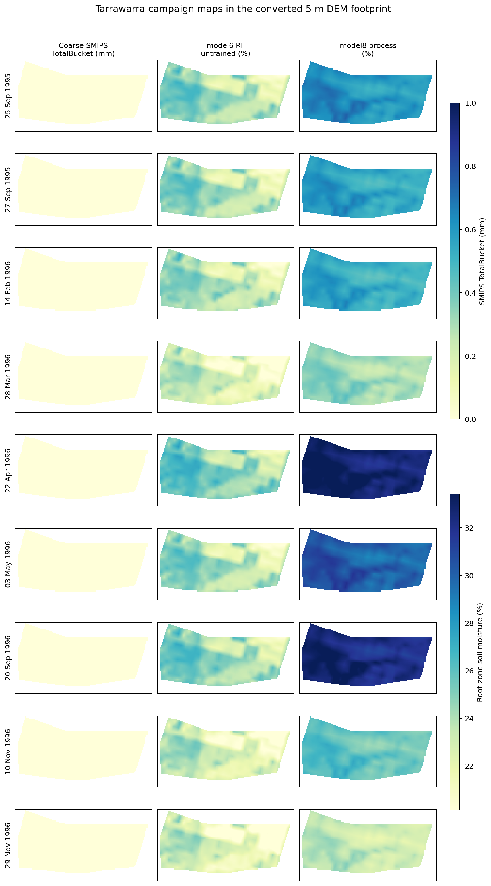
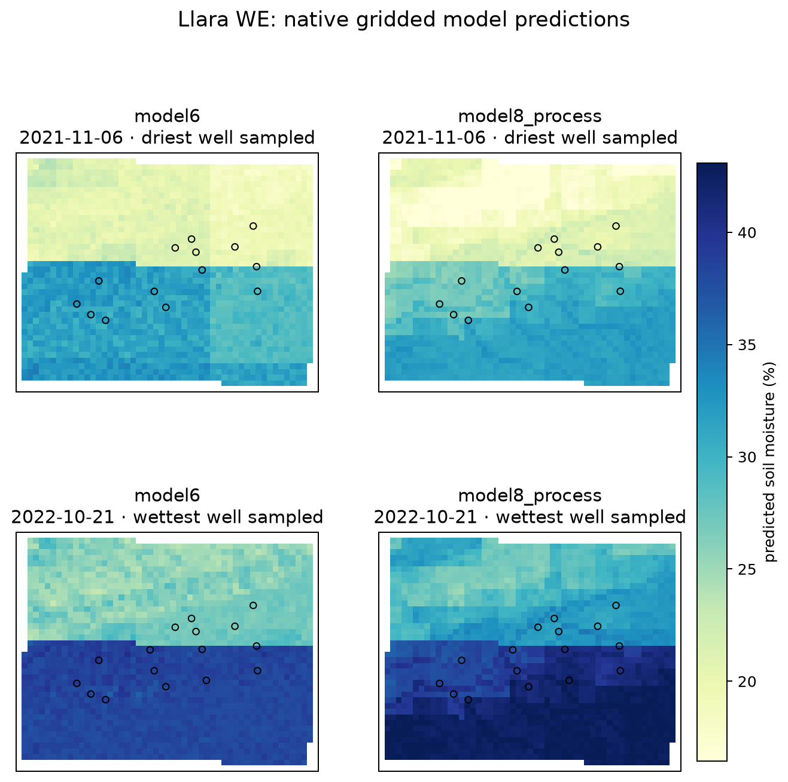
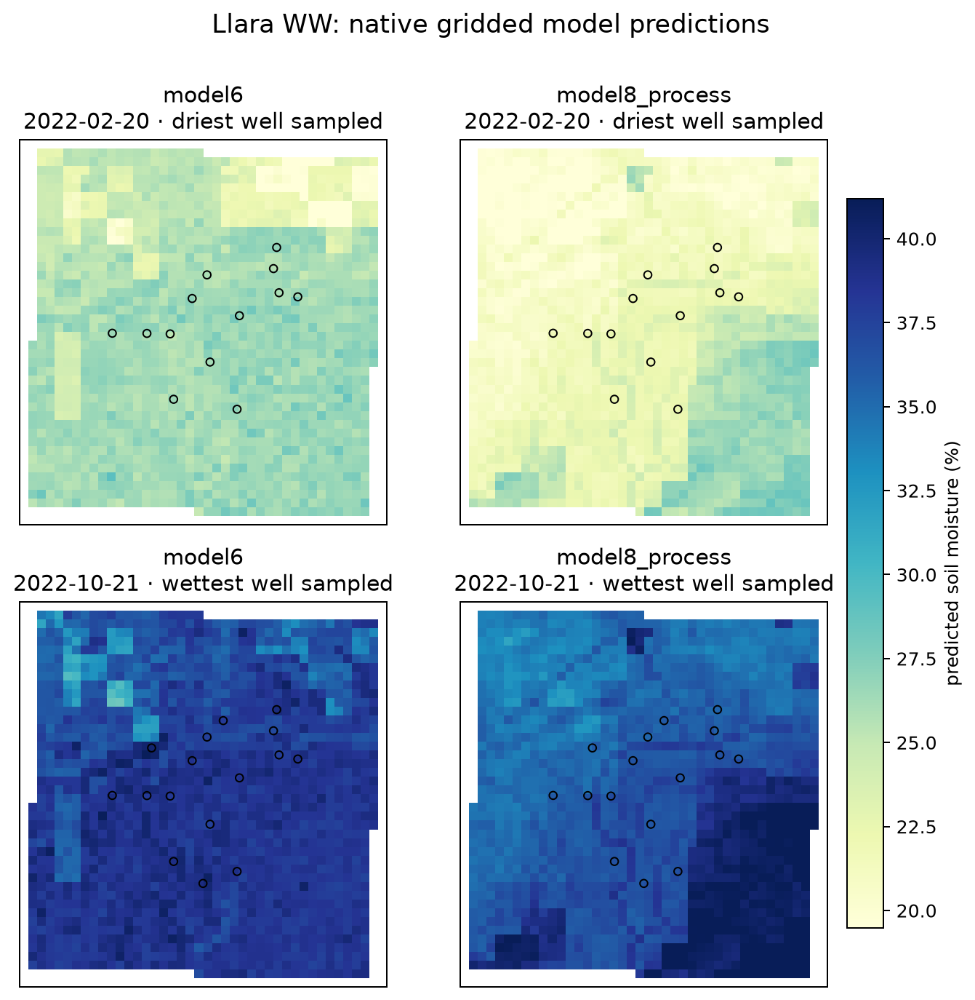

# Unified dense-point validation and local-spiking report

This report resets the earlier ad hoc three-site sparse local-calibration work
into the two-stage protocol described in
`docs/Downscaling moisture validation plan.pdf`.

The two stages are deliberately kept separate:

1. **Stage 1 — independent validation:** all dense point/date observations are
   used only as external validation. No local measurements are supplied to the
   models or calibration layers.
2. **Stage 2 — local-spiking sensitivity:** small controlled subsets of local
   points are used as calibration spikes, and validation is performed on held-out
   points/dates. The strict `spatiotemporal_block` is treated as the primary
   transfer test.

## Data inventory

| site       | source_table                                                                                                                           | rows      | models                   | points_unique | dates   | date_min   | date_max   | seasons                     | eligible_points_stage2 | smips_columns_present | note                                                                                                                                                                                                                    |
| ---------- | -------------------------------------------------------------------------------------------------------------------------------------- | --------- | ------------------------ | ------------- | ------- | ---------- | ---------- | --------------------------- | ---------------------- | --------------------- | ----------------------------------------------------------------------------------------------------------------------------------------------------------------------------------------------------------------------- |
| Esdale     | /Volumes/Dmitry_work/borevitz_projects/DMM_validation/outputs/model6_vs_model8_dense/model6_model8_combined_predictions.csv            | 1120.000  | model6_rf,model8_process | 79.000        | 9.000   | 2025-04-30 | 2025-07-17 | autumn,winter               | 76.000                 | yes                   | Autumn/winter 2025 dense campaign. Strongest spatial/terrain coverage among the modern validation points, but only nine sampling dates are present.                                                                     |
| Tarrawarra | /Volumes/Dmitry_work/borevitz_projects/DMM_validation/outputs/tarrawarra_model6_vs_model8/model6_model8_combined_predictions_valid.csv | 17290.000 | model6_rf,model8_process | 3610.000      | 19.000  | 1995-09-25 | 1996-11-29 | autumn,spring,summer,winter | 517.000                | yes                   | Very dense 1995/96 campaign. The existing model6 run has a known SMIPS-zero caveat, so model6 skill here should be read partly as a missing coarse-anchor ablation rather than a normal model6 prediction.              |
| Llara      | /Volumes/Dmitry_work/borevitz_projects/DMM_validation/outputs/llara_unseen_model6_vs_model8/llara_model6_model8_predictions.csv        | 58494.000 | model6_rf,model8_process | 32.000        | 955.000 | 2021-10-19 | 2024-06-30 | autumn,spring,summer,winter | 32.000                 | yes                   | Thirty-two profile-mean probes across two paddocks from 2021–2024. Strongest temporal/seasonal coverage. Native gridded model6/model8 GeoTIFFs are now generated for representative dry/wet dates in both Llara paddocks. |

Important caveats:

- Tarrawarra is retained because it is uniquely dense, but the existing model6
  run has a known SMIPS-zero caveat. Treat Tarrawarra model6 as partly a
  missing-coarse-anchor stress test.
- Llara now has native gridded model6/model8 GeoTIFF prediction maps for
  representative dry/wet dates in each paddock (`WE` and `WW`). These are true
  model map outputs, not interpolated point-quality surfaces. The point-quality
  surfaces remain diagnostic only.
- The PDF says Esdale has 540 points; the current model-agnostic prediction
  table contains 79 unique point IDs and 560 model6 rows across nine dates. This
  likely reflects a point-vs-observation wording mismatch and should be checked
  by a human before publication.

## Stage 1 — independent dense-point validation

### Overall model skill

| site       | base_model     | n         | nse    | r2     | pearson_r | pearson_r2 | rmse   | ubrmse | bias    | mae    | median_ae | pred_vs_obs_slope | pred_vs_obs_intercept |
| ---------- | -------------- | --------- | ------ | ------ | --------- | ---------- | ------ | ------ | ------- | ------ | --------- | ----------------- | --------------------- |
| Esdale     | model6_rf      | 560.000   | 0.023  | 0.023  | 0.238     | 0.057      | 6.477  | 6.453  | -0.558  | 5.209  | 4.415     | 0.096             | 14.876                |
| Esdale     | model8_process | 560.000   | 0.031  | 0.031  | 0.462     | 0.213      | 6.452  | 5.884  | 2.645   | 5.199  | 4.476     | 0.277             | 14.981                |
| Llara      | model6_rf      | 29247.000 | 0.036  | 0.036  | 0.267     | 0.071      | 13.927 | 13.744 | -2.249  | 10.872 | 9.007     | 0.098             | 25.636                |
| Llara      | model8_process | 29247.000 | -0.017 | -0.017 | 0.453     | 0.205      | 14.306 | 12.855 | -6.278  | 10.796 | 7.831     | 0.132             | 20.566                |
| Tarrawarra | model6_rf      | 8645.000  | -1.614 | -1.614 | 0.394     | 0.155      | 15.080 | 8.770  | -12.267 | 12.707 | 13.111    | 0.077             | 20.785                |
| Tarrawarra | model8_process | 8645.000  | -0.133 | -0.133 | 0.831     | 0.690      | 9.929  | 6.894  | -7.146  | 8.147  | 7.393     | 0.286             | 18.417                |

### Seasonal skill

| site       | base_model     | season | n        | nse     | r2      | pearson_r | pearson_r2 | rmse   | ubrmse | bias    | mae    | median_ae | pred_vs_obs_slope | pred_vs_obs_intercept |
| ---------- | -------------- | ------ | -------- | ------- | ------- | --------- | ---------- | ------ | ------ | ------- | ------ | --------- | ----------------- | --------------------- |
| Esdale     | model6_rf      | autumn | 308.000  | -0.030  | -0.030  | 0.100     | 0.010      | 7.279  | 7.273  | 0.296   | 6.009  | 5.126     | 0.029             | 14.950                |
| Esdale     | model6_rf      | winter | 252.000  | -0.292  | -0.292  | 0.111     | 0.012      | 5.336  | 5.090  | -1.601  | 4.231  | 3.642     | 0.060             | 16.698                |
| Esdale     | model8_process | autumn | 308.000  | 0.027   | 0.027   | 0.336     | 0.113      | 7.076  | 6.777  | 2.033   | 5.858  | 5.375     | 0.138             | 15.052                |
| Esdale     | model8_process | winter | 252.000  | -0.421  | -0.421  | 0.355     | 0.126      | 5.595  | 4.448  | 3.394   | 4.393  | 3.743     | 0.182             | 19.324                |
| Llara      | model6_rf      | spring | 6208.000 | 0.060   | 0.060   | 0.449     | 0.202      | 17.043 | 15.809 | -6.367  | 13.146 | 10.649    | 0.156             | 24.675                |
| Llara      | model6_rf      | summer | 7658.000 | -0.113  | -0.113  | 0.094     | 0.009      | 12.782 | 12.492 | -2.709  | 9.774  | 8.041     | 0.034             | 25.434                |
| Llara      | model6_rf      | autumn | 8617.000 | -0.074  | -0.074  | 0.093     | 0.009      | 12.132 | 12.122 | 0.483   | 9.706  | 8.295     | 0.035             | 27.364                |
| Llara      | model6_rf      | winter | 6764.000 | -0.008  | -0.008  | 0.183     | 0.034      | 14.128 | 14.055 | -1.431  | 11.513 | 10.114    | 0.066             | 27.917                |
| Llara      | model8_process | spring | 6208.000 | -0.060  | -0.060  | 0.657     | 0.432      | 18.104 | 14.520 | -10.813 | 14.012 | 11.761    | 0.210             | 18.250                |
| Llara      | model8_process | summer | 7658.000 | -0.176  | -0.176  | 0.178     | 0.032      | 13.136 | 11.978 | -5.395  | 9.782  | 7.070     | 0.049             | 22.323                |
| Llara      | model8_process | autumn | 8617.000 | -0.051  | -0.051  | 0.238     | 0.057      | 11.999 | 11.384 | -3.793  | 9.206  | 6.962     | 0.069             | 22.133                |
| Llara      | model8_process | winter | 6764.000 | -0.037  | -0.037  | 0.438     | 0.192      | 14.329 | 12.879 | -6.281  | 11.018 | 8.356     | 0.117             | 21.467                |
| Tarrawarra | model6_rf      | spring | 3541.000 | -1.629  | -1.629  | 0.457     | 0.209      | 15.542 | 8.895  | -12.745 | 12.885 | 11.117    | 0.088             | 20.022                |
| Tarrawarra | model6_rf      | summer | 1018.000 | 0.107   | 0.107   | 0.348     | 0.121      | 3.694  | 3.675  | -0.368  | 3.042  | 2.681     | 0.145             | 19.641                |
| Tarrawarra | model6_rf      | autumn | 3581.000 | -3.543  | -3.543  | 0.362     | 0.131      | 15.468 | 6.819  | -13.884 | 14.046 | 14.785    | 0.088             | 20.699                |
| Tarrawarra | model6_rf      | winter | 505.000  | -33.028 | -33.028 | 0.091     | 0.008      | 21.792 | 3.923  | -21.436 | 21.446 | 21.690    | 0.039             | 21.840                |
| Tarrawarra | model8_process | spring | 3541.000 | -0.251  | -0.251  | 0.896     | 0.803      | 10.723 | 6.905  | -8.204  | 8.595  | 7.255     | 0.295             | 17.141                |
| Tarrawarra | model8_process | summer | 1018.000 | 0.055   | 0.055   | 0.606     | 0.367      | 3.800  | 3.140  | 2.140   | 3.111  | 2.805     | 0.300             | 18.533                |
| Tarrawarra | model8_process | autumn | 3581.000 | -0.841  | -0.841  | 0.718     | 0.515      | 9.848  | 5.718  | -8.017  | 8.540  | 8.246     | 0.251             | 20.413                |
| Tarrawarra | model8_process | winter | 505.000  | -10.805 | -10.805 | 0.080     | 0.006      | 12.836 | 3.761  | -12.272 | 12.368 | 12.924    | 0.018             | 31.938                |

### Dry/wet observed-state bias

| site       | base_model     | obs_moisture_quantile | n        | obs_mean | pred_mean | bias    | rmse   | ubrmse | mae    |
| ---------- | -------------- | --------------------- | -------- | -------- | --------- | ------- | ------ | ------ | ------ |
| Esdale     | model6_rf      | dry_q1                | 140.000  | 8.014    | 15.284    | 7.270   | 8.019  | 3.383  | 7.270  |
| Esdale     | model6_rf      | q2                    | 140.000  | 15.466   | 16.566    | 1.100   | 2.941  | 2.727  | 2.286  |
| Esdale     | model6_rf      | q3                    | 140.000  | 19.899   | 17.204    | -2.694  | 3.846  | 2.744  | 3.335  |
| Esdale     | model6_rf      | wet_q4                | 140.000  | 24.889   | 16.981    | -7.907  | 8.949  | 4.190  | 7.945  |
| Esdale     | model8_process | dry_q1                | 140.000  | 8.014    | 16.290    | 8.277   | 9.030  | 3.610  | 8.281  |
| Esdale     | model8_process | q2                    | 140.000  | 15.466   | 20.239    | 4.773   | 5.802  | 3.298  | 4.929  |
| Esdale     | model8_process | q3                    | 140.000  | 19.899   | 21.053    | 1.154   | 3.604  | 3.414  | 2.987  |
| Esdale     | model8_process | wet_q4                | 140.000  | 24.889   | 21.266    | -3.622  | 6.188  | 5.017  | 4.599  |
| Llara      | model6_rf      | dry_q1                | 7312.000 | 15.259   | 27.504    | 12.245  | 13.868 | 6.510  | 12.336 |
| Llara      | model6_rf      | q2                    | 7312.000 | 24.335   | 27.935    | 3.600   | 6.352  | 5.234  | 5.380  |
| Llara      | model6_rf      | q3                    | 7311.000 | 33.320   | 28.162    | -5.159  | 7.724  | 5.749  | 6.086  |
| Llara      | model6_rf      | wet_q4                | 7312.000 | 50.734   | 31.050    | -19.684 | 21.989 | 9.799  | 19.684 |
| Llara      | model8_process | dry_q1                | 7312.000 | 15.259   | 22.474    | 7.215   | 8.559  | 4.605  | 7.304  |
| Llara      | model8_process | q2                    | 7312.000 | 24.335   | 24.454    | 0.119   | 4.166  | 4.164  | 3.338  |
| Llara      | model8_process | q3                    | 7311.000 | 33.320   | 24.248    | -9.072  | 10.343 | 4.967  | 9.168  |
| Llara      | model8_process | wet_q4                | 7312.000 | 50.734   | 27.360    | -23.374 | 24.921 | 8.643  | 23.374 |
| Tarrawarra | model6_rf      | dry_q1                | 2163.000 | 23.372   | 22.470    | -0.902  | 3.239  | 3.111  | 2.660  |
| Tarrawarra | model6_rf      | q2                    | 2191.000 | 32.596   | 23.343    | -9.253  | 9.791  | 3.200  | 9.253  |
| Tarrawarra | model6_rf      | q3                    | 2144.000 | 39.874   | 24.134    | -15.739 | 15.909 | 2.317  | 15.739 |
| Tarrawarra | model6_rf      | wet_q4                | 2147.000 | 47.593   | 24.268    | -23.325 | 23.548 | 3.229  | 23.325 |
| Tarrawarra | model8_process | dry_q1                | 2163.000 | 23.372   | 24.747    | 1.375   | 3.222  | 2.914  | 2.501  |
| Tarrawarra | model8_process | q2                    | 2191.000 | 32.596   | 27.883    | -4.713  | 5.419  | 2.675  | 4.835  |
| Tarrawarra | model8_process | q3                    | 2144.000 | 39.874   | 30.472    | -9.402  | 9.660  | 2.221  | 9.402  |
| Tarrawarra | model8_process | wet_q4                | 2147.000 | 47.593   | 31.631    | -15.962 | 16.229 | 2.927  | 15.962 |

### Most notable terrain/model-input strata

The table below ranks terrain/model-input strata by the range of bias and RMSE
across low/mid/high strata within each site/model. These are diagnostic
validation covariates rather than a claim that every variable is used by every
model internally.

| site       | base_model     | terrain_var   | n_strata | bias_min | bias_max | rmse_min | rmse_max | nse_min | nse_max | bias_range | rmse_range | nse_range | notability_score |
| ---------- | -------------- | ------------- | -------- | -------- | -------- | -------- | -------- | ------- | ------- | ---------- | ---------- | --------- | ---------------- |
| Esdale     | model6_rf      | rain_7        | 3.000    | -3.641   | 4.164    | 5.280    | 7.366    | -1.425  | -0.977  | 7.804      | 2.086      | 0.449     | 9.891            |
| Esdale     | model6_rf      | ppet_365      | 3.000    | -2.962   | 3.729    | 5.158    | 7.089    | -0.879  | -0.671  | 6.692      | 1.931      | 0.208     | 8.623            |
| Esdale     | model6_rf      | rain_365      | 3.000    | -2.950   | 3.729    | 5.167    | 7.089    | -0.876  | -0.671  | 6.679      | 1.922      | 0.205     | 8.601            |
| Esdale     | model6_rf      | rain_365_anom | 3.000    | -2.950   | 3.729    | 5.167    | 7.089    | -0.876  | -0.671  | 6.679      | 1.922      | 0.205     | 8.601            |
| Esdale     | model6_rf      | ppet_30       | 3.000    | -2.354   | 1.104    | 4.912    | 7.935    | -0.843  | -0.131  | 3.458      | 3.024      | 0.712     | 6.481            |
| Esdale     | model8_process | rain_7        | 3.000    | -0.346   | 6.016    | 4.337    | 7.340    | -1.452  | -0.334  | 6.363      | 3.003      | 1.118     | 9.365            |
| Esdale     | model8_process | ppet_365      | 3.000    | 0.736    | 5.186    | 4.465    | 7.409    | -0.890  | -0.373  | 4.450      | 2.944      | 0.517     | 7.394            |
| Esdale     | model8_process | rain_365      | 3.000    | 0.779    | 5.186    | 4.429    | 7.409    | -0.901  | -0.354  | 4.407      | 2.980      | 0.547     | 7.387            |
| Esdale     | model8_process | rain_365_anom | 3.000    | 0.779    | 5.186    | 4.429    | 7.409    | -0.901  | -0.354  | 4.407      | 2.980      | 0.547     | 7.387            |
| Esdale     | model8_process | soil_sand     | 3.000    | -0.286   | 4.969    | 5.609    | 7.350    | -0.337  | 0.299   | 5.254      | 1.741      | 0.637     | 6.995            |
| Llara      | model6_rf      | hli           | 3.000    | -7.178   | 5.567    | 11.762   | 15.291   | -0.350  | 0.075   | 12.745     | 3.530      | 0.425     | 16.275           |
| Llara      | model6_rf      | eastness      | 3.000    | -5.622   | 4.642    | 10.961   | 16.856   | -0.282  | 0.123   | 10.265     | 5.894      | 0.405     | 16.159           |
| Llara      | model6_rf      | elevation     | 3.000    | -8.256   | 1.284    | 10.714   | 16.594   | -0.065  | 0.136   | 9.540      | 5.880      | 0.201     | 15.420           |
| Llara      | model6_rf      | soil_bdw      | 3.000    | -7.303   | 5.144    | 13.007   | 15.486   | -0.152  | 0.133   | 12.447     | 2.479      | 0.284     | 14.926           |
| Llara      | model6_rf      | northness     | 3.000    | -6.552   | 3.454    | 12.490   | 15.624   | -0.299  | 0.127   | 10.006     | 3.134      | 0.425     | 13.141           |
| Llara      | model8_process | eastness      | 3.000    | -9.164   | -1.609   | 9.006    | 16.854   | -0.212  | 0.134   | 7.555      | 7.848      | 0.346     | 15.403           |
| Llara      | model8_process | hli           | 3.000    | -9.361   | -0.801   | 9.480    | 16.063   | -0.246  | 0.123   | 8.560      | 6.583      | 0.369     | 15.143           |
| Llara      | model8_process | northness     | 3.000    | -9.652   | -1.261   | 10.445   | 16.679   | -0.290  | 0.092   | 8.392      | 6.233      | 0.382     | 14.625           |
| Llara      | model8_process | soil_bdw      | 3.000    | -10.419  | -1.533   | 11.476   | 16.933   | -0.377  | 0.140   | 8.886      | 5.458      | 0.517     | 14.344           |
| Llara      | model8_process | ppet_365      | 3.000    | -9.513   | -4.294   | 11.117   | 17.929   | -0.112  | -0.033  | 5.218      | 6.813      | 0.079     | 12.031           |
| Tarrawarra | model6_rf      | vpd_30        | 3.000    | -19.406  | -2.788   | 5.701    | 20.202   | -12.141 | -0.002  | 16.618     | 14.501     | 12.139    | 31.119           |
| Tarrawarra | model6_rf      | ppet_30       | 3.000    | -17.610  | -2.884   | 5.135    | 18.987   | -15.650 | -0.454  | 14.726     | 13.852     | 15.197    | 28.577           |
| Tarrawarra | model6_rf      | ppet_365      | 3.000    | -18.993  | -8.198   | 11.671   | 20.129   | -7.546  | -0.812  | 10.795     | 8.458      | 6.734     | 19.252           |
| Tarrawarra | model6_rf      | rain_365      | 3.000    | -16.937  | -7.283   | 11.229   | 17.698   | -9.032  | -0.566  | 9.654      | 6.470      | 8.466     | 16.123           |
| Tarrawarra | model6_rf      | rain_30       | 3.000    | -17.062  | -9.444   | 13.819   | 17.556   | -15.650 | -0.660  | 7.618      | 3.737      | 14.991    | 11.354           |
| Tarrawarra | model8_process | vpd_30        | 3.000    | -12.632  | -0.047   | 3.905    | 13.497   | -4.865  | 0.530   | 12.585     | 9.592      | 5.395     | 22.177           |
| Tarrawarra | model8_process | ppet_30       | 3.000    | -11.115  | -0.451   | 3.830    | 12.598   | -5.859  | 0.191   | 10.663     | 8.768      | 6.050     | 19.431           |
| Tarrawarra | model8_process | ppet_365      | 3.000    | -11.900  | -4.123   | 7.709    | 13.283   | -2.721  | 0.209   | 7.777      | 5.574      | 2.931     | 13.351           |
| Tarrawarra | model8_process | rain_365      | 3.000    | -10.470  | -3.690   | 7.501    | 11.485   | -3.225  | 0.301   | 6.780      | 3.985      | 3.526     | 10.764           |
| Tarrawarra | model8_process | rain_30       | 3.000    | -10.384  | -4.506   | 8.931    | 11.268   | -5.859  | 0.322   | 5.878      | 2.337      | 6.181     | 8.215            |

### Paired model comparison

Negative `mean_delta_abs_error` means model6 had lower absolute error than
model8 on matched observations; positive values favour model8.

| site       | model_a   | model_b        | n_matched | mean_delta_abs_error | mean_delta_abs_error_ci95_low | mean_delta_abs_error_ci95_high | median_delta_abs_error | mean_delta_sq_error | rmse_a | rmse_b | rmse_delta_a_minus_b | bias_a  | bias_b | bias_delta_a_minus_b | fraction_model_a_better_abs_error |
| ---------- | --------- | -------------- | --------- | -------------------- | ----------------------------- | ------------------------------ | ---------------------- | ------------------- | ------ | ------ | -------------------- | ------- | ------ | -------------------- | --------------------------------- |
| Esdale     | model6_rf | model8_process | 560.000   | 0.010                | -0.412                        | 0.442                          | -0.194                 | 0.333               | 6.477  | 6.452  | 0.026                | -0.558  | 2.645  | -3.203               | 0.516                             |
| Tarrawarra | model6_rf | model8_process | 8645.000  | 4.560                | 4.494                         | 4.639                          | 5.156                  | 128.806             | 15.080 | 9.929  | 5.150                | -12.267 | -7.146 | -5.121               | 0.128                             |
| Llara      | model6_rf | model8_process | 29247.000 | 0.076                | -1.205                        | 1.582                          | -0.109                 | -10.701             | 13.927 | 14.306 | -0.379               | -2.249  | -6.278 | 4.028                | 0.509                             |

## Stage 2 — local training-data spiking

Budgets used: `1,3,5,10,25%,50%,all`.

Calibration methods:

- `bias_offset`: constant local residual offset;
- `seasonal_offset`: season-specific residual offset;
- `affine`: local intercept and slope correction;
- `residual_ridge`: regularised residual model using prediction-time model
  inputs such as weather, SMIPS/process state, terrain and soil attributes.

The target requested in the plan is average held-out NSE/R² > 0.4. The table
below reports the smallest strict-block design that reaches that target, or the
best strict-block design if the target is not reached.

| site       | base_model     | target_status                | selection_strategy         | budget_label | calibration_points | method          | nse_median | rmse_median | bias_median | rmse_gain_median | delta_nse_median | n_replicates |
| ---------- | -------------- | ---------------------------- | -------------------------- | ------------ | ------------------ | --------------- | ---------- | ----------- | ----------- | ---------------- | ---------------- | ------------ |
| Esdale     | model6_rf      | not reached; best NSE 0.160  | global_prediction_extremes | 50%          | 38.000             | residual_ridge  | 0.160      | 3.480       | -1.269      | 0.201            | 0.100            | 1.000        |
| Esdale     | model8_process | not reached; best NSE 0.237  | landscape_wetdry_prior     | 25%          | 19.000             | residual_ridge  | 0.237      | 3.746       | 0.088       | 1.539            | 0.756            | 1.000        |
| Llara      | model6_rf      | not reached; best NSE 0.205  | global_prediction_extremes | 50%          | 16.000             | seasonal_offset | 0.205      | 10.211      | -0.579      | 0.065            | 0.010            | 1.000        |
| Llara      | model8_process | not reached; best NSE 0.255  | global_prediction_extremes | 50%          | 16.000             | affine          | 0.255      | 9.885       | 0.503       | 1.605            | 0.262            | 1.000        |
| Tarrawarra | model6_rf      | not reached; best NSE -0.330 | landscape_wetdry_prior     | 3            | 3.000              | bias_offset     | -0.330     | 10.098      | -5.920      | 6.008            | 2.053            | 1.000        |
| Tarrawarra | model8_process | reached NSE ≥ 0.4            | random                     | 3            | 3.000              | affine          | 0.668      | 5.047       | 0.019       | 5.401            | 1.091            | 20.000       |

### Best strict-block local calibration design per site/model

| site       | base_model     | selection_strategy           | budget_label | calibration_points | method          | nse_median | rmse_median | ubrmse_median | bias_median | rmse_gain_median | delta_nse_median | delta_abs_bias_median | n_replicates |
| ---------- | -------------- | ---------------------------- | ------------ | ------------------ | --------------- | ---------- | ----------- | ------------- | ----------- | ---------------- | ---------------- | --------------------- | ------------ |
| Esdale     | model6_rf      | global_prediction_extremes   | 50%          | 38.000             | residual_ridge  | 0.160      | 3.480       | 3.240         | -1.269      | 0.201            | 0.100            | -0.048                | 1.000        |
| Esdale     | model8_process | field_knowledge_wetdry_proxy | 50%          | 38.000             | bias_offset     | 0.099      | 2.952       | 2.925         | 0.397       | 1.193            | 0.876            | -2.540                | 1.000        |
| Llara      | model6_rf      | field_knowledge_wetdry_proxy | 25%          | 8.000              | seasonal_offset | 0.232      | 10.084      | 10.048        | -0.852      | 0.450            | 0.070            | -2.040                | 1.000        |
| Llara      | model8_process | field_knowledge_wetdry_proxy | 50%          | 16.000             | seasonal_offset | 0.242      | 9.601       | 9.588         | -0.506      | 2.092            | 0.366            | -5.988                | 1.000        |
| Tarrawarra | model6_rf      | landscape_wetdry_prior       | 25%          | 130.000            | affine          | -0.347     | 9.951       | 7.883         | -6.073      | 6.030            | 2.127            | -7.770                | 1.000        |
| Tarrawarra | model8_process | field_knowledge_wetdry_proxy | all          | 517.000            | affine          | 0.544      | 4.401       | 4.337         | -0.751      | 6.415            | 2.297            | -8.744                | 1.000        |

### Random-placement learning curves

Random placement is the most defensible deployment-oriented strategy because it
does not assume the landowner already knows where the model fails. Landscape and
global-prediction extreme strategies are still useful as practical priors.

| site   | base_model     | budget_label | calibration_points | method          | nse_median | rmse_median | rmse_gain_median | bias_median | n_replicates |
| ------ | -------------- | ------------ | ------------------ | --------------- | ---------- | ----------- | ---------------- | ----------- | ------------ |
| Esdale | model6_rf      | 1            | 1.000              | affine          | -0.835     | 5.946       | -0.750           | -2.319      | 20.000       |
| Esdale | model6_rf      | 1            | 1.000              | bias_offset     | -0.835     | 5.946       | -0.750           | -2.319      | 20.000       |
| Esdale | model6_rf      | 1            | 1.000              | residual_ridge  | -0.835     | 5.946       | -0.750           | -2.319      | 20.000       |
| Esdale | model6_rf      | 1            | 1.000              | seasonal_offset | -0.835     | 5.946       | -0.750           | -2.319      | 20.000       |
| Esdale | model6_rf      | 3            | 3.000              | affine          | -1.802     | 7.350       | -2.109           | -5.381      | 20.000       |
| Esdale | model6_rf      | 3            | 3.000              | bias_offset     | -0.693     | 5.688       | -0.554           | -2.994      | 20.000       |
| Esdale | model6_rf      | 3            | 3.000              | residual_ridge  | -0.387     | 5.214       | 0.030            | -1.230      | 20.000       |
| Esdale | model6_rf      | 3            | 3.000              | seasonal_offset | -0.693     | 5.688       | -0.554           | -2.994      | 20.000       |
| Esdale | model6_rf      | 5            | 5.000              | affine          | -2.074     | 7.734       | -2.572           | -6.352      | 20.000       |
| Esdale | model6_rf      | 5            | 5.000              | bias_offset     | -0.928     | 6.119       | -0.892           | -3.680      | 20.000       |
| Esdale | model6_rf      | 5            | 5.000              | residual_ridge  | -0.267     | 4.970       | 0.219            | -1.831      | 20.000       |
| Esdale | model6_rf      | 5            | 5.000              | seasonal_offset | -0.928     | 6.119       | -0.892           | -3.680      | 20.000       |
| Esdale | model6_rf      | 10           | 10.000             | affine          | -1.648     | 7.115       | -1.993           | -5.602      | 20.000       |
| Esdale | model6_rf      | 10           | 10.000             | bias_offset     | -0.733     | 5.897       | -0.542           | -3.054      | 20.000       |
| Esdale | model6_rf      | 10           | 10.000             | residual_ridge  | -0.015     | 4.452       | 0.796            | -0.310      | 20.000       |
| Esdale | model6_rf      | 10           | 10.000             | seasonal_offset | -0.733     | 5.897       | -0.542           | -3.054      | 20.000       |
| Esdale | model6_rf      | 25%          | 19.000             | affine          | -1.695     | 7.181       | -2.163           | -5.712      | 20.000       |
| Esdale | model6_rf      | 25%          | 19.000             | bias_offset     | -0.587     | 5.542       | -0.386           | -2.600      | 20.000       |
| Esdale | model6_rf      | 25%          | 19.000             | residual_ridge  | -0.145     | 4.740       | 0.622            | -0.200      | 20.000       |
| Esdale | model6_rf      | 25%          | 19.000             | seasonal_offset | -0.587     | 5.542       | -0.386           | -2.600      | 20.000       |
| Esdale | model6_rf      | 50%          | 38.000             | affine          | -1.719     | 7.524       | -2.141           | -5.982      | 20.000       |
| Esdale | model6_rf      | 50%          | 38.000             | bias_offset     | -0.639     | 5.838       | -0.388           | -2.676      | 20.000       |
| Esdale | model6_rf      | 50%          | 38.000             | residual_ridge  | 0.009      | 4.420       | 1.074            | -1.094      | 20.000       |
| Esdale | model6_rf      | 50%          | 38.000             | seasonal_offset | -0.639     | 5.838       | -0.388           | -2.676      | 20.000       |
| Esdale | model8_process | 1            | 1.000              | affine          | -0.303     | 5.048       | 0.249            | 1.693       | 20.000       |
| Esdale | model8_process | 1            | 1.000              | bias_offset     | -0.303     | 5.048       | 0.249            | 1.693       | 20.000       |
| Esdale | model8_process | 1            | 1.000              | residual_ridge  | -0.303     | 5.048       | 0.249            | 1.693       | 20.000       |
| Esdale | model8_process | 1            | 1.000              | seasonal_offset | -0.303     | 5.048       | 0.249            | 1.693       | 20.000       |
| Esdale | model8_process | 3            | 3.000              | affine          | -1.325     | 6.683       | -1.462           | 1.933       | 20.000       |
| Esdale | model8_process | 3            | 3.000              | bias_offset     | -0.064     | 4.557       | 0.721            | 0.942       | 20.000       |
| Esdale | model8_process | 3            | 3.000              | residual_ridge  | -0.392     | 5.191       | 0.093            | 2.931       | 20.000       |
| Esdale | model8_process | 3            | 3.000              | seasonal_offset | -0.064     | 4.557       | 0.721            | 0.942       | 20.000       |
| Esdale | model8_process | 5            | 5.000              | affine          | -0.982     | 6.288       | -1.007           | -3.625      | 20.000       |
| Esdale | model8_process | 5            | 5.000              | bias_offset     | -0.091     | 4.597       | 0.688            | 0.131       | 20.000       |
| Esdale | model8_process | 5            | 5.000              | residual_ridge  | -0.094     | 4.614       | 0.581            | 1.588       | 20.000       |
| Esdale | model8_process | 5            | 5.000              | seasonal_offset | -0.091     | 4.597       | 0.688            | 0.131       | 20.000       |
| Esdale | model8_process | 10           | 10.000             | affine          | -0.381     | 5.075       | 0.257            | -0.208      | 20.000       |
| Esdale | model8_process | 10           | 10.000             | bias_offset     | -0.048     | 4.587       | 0.755            | 0.769       | 20.000       |
| Esdale | model8_process | 10           | 10.000             | residual_ridge  | -0.554     | 5.391       | -0.096           | 3.581       | 20.000       |
| Esdale | model8_process | 10           | 10.000             | seasonal_offset | -0.048     | 4.587       | 0.755            | 0.769       | 20.000       |
| Esdale | model8_process | 25%          | 19.000             | affine          | -0.167     | 4.664       | 0.488            | -1.278      | 20.000       |
| Esdale | model8_process | 25%          | 19.000             | bias_offset     | -0.043     | 4.510       | 0.759            | 0.793       | 20.000       |
| Esdale | model8_process | 25%          | 19.000             | residual_ridge  | -0.891     | 6.196       | -0.860           | 4.748       | 20.000       |
| Esdale | model8_process | 25%          | 19.000             | seasonal_offset | -0.043     | 4.510       | 0.759            | 0.793       | 20.000       |
| Esdale | model8_process | 50%          | 38.000             | affine          | -0.189     | 5.211       | 0.349            | -2.319      | 20.000       |
| Esdale | model8_process | 50%          | 38.000             | bias_offset     | -0.037     | 4.540       | 0.808            | 0.702       | 20.000       |
| Esdale | model8_process | 50%          | 38.000             | residual_ridge  | -0.510     | 5.423       | -0.004           | 3.856       | 20.000       |
| Esdale | model8_process | 50%          | 38.000             | seasonal_offset | -0.037     | 4.540       | 0.808            | 0.702       | 20.000       |
| Llara  | model6_rf      | 1            | 1.000              | affine          | -0.590     | 16.287      | -3.769           | -7.162      | 20.000       |
| Llara  | model6_rf      | 1            | 1.000              | bias_offset     | -0.091     | 13.537      | -0.967           | -3.331      | 20.000       |
| Llara  | model6_rf      | 1            | 1.000              | residual_ridge  | -0.410     | 15.504      | -3.039           | -8.482      | 20.000       |
| Llara  | model6_rf      | 1            | 1.000              | seasonal_offset | -0.108     | 13.566      | -1.029           | -2.719      | 20.000       |
| Llara  | model6_rf      | 3            | 3.000              | affine          | -0.419     | 15.014      | -2.793           | -2.599      | 20.000       |
| Llara  | model6_rf      | 3            | 3.000              | bias_offset     | -0.105     | 13.109      | -1.002           | -2.626      | 20.000       |
| Llara  | model6_rf      | 3            | 3.000              | residual_ridge  | -0.442     | 15.497      | -2.744           | -2.567      | 20.000       |
| Llara  | model6_rf      | 3            | 3.000              | seasonal_offset | -0.133     | 13.487      | -1.059           | -2.650      | 20.000       |
| Llara  | model6_rf      | 5            | 5.000              | affine          | -0.140     | 13.632      | -1.355           | -1.564      | 20.000       |
| Llara  | model6_rf      | 5            | 5.000              | bias_offset     | 0.042      | 12.717      | -0.236           | -0.698      | 20.000       |
| Llara  | model6_rf      | 5            | 5.000              | residual_ridge  | -0.947     | 17.808      | -5.405           | 2.151       | 20.000       |
| Llara  | model6_rf      | 5            | 5.000              | seasonal_offset | 0.015      | 12.929      | -0.515           | -0.322      | 20.000       |
| Llara  | model6_rf      | 25%          | 8.000              | affine          | -0.049     | 13.172      | -0.813           | -1.764      | 20.000       |
| Llara  | model6_rf      | 25%          | 8.000              | bias_offset     | 0.009      | 12.993      | -0.602           | -2.224      | 20.000       |
| Llara  | model6_rf      | 25%          | 8.000              | residual_ridge  | -2.637     | 23.145      | -11.735          | 2.330       | 20.000       |
| Llara  | model6_rf      | 25%          | 8.000              | seasonal_offset | 0.040      | 12.774      | -0.454           | -1.697      | 20.000       |
| Llara  | model6_rf      | 10           | 10.000             | affine          | -0.020     | 12.997      | -0.656           | -2.767      | 20.000       |
| Llara  | model6_rf      | 10           | 10.000             | bias_offset     | 0.014      | 12.853      | -0.317           | -4.570      | 20.000       |
| Llara  | model6_rf      | 10           | 10.000             | residual_ridge  | -2.036     | 22.400      | -10.198          | 0.879       | 20.000       |
| Llara  | model6_rf      | 10           | 10.000             | seasonal_offset | 0.044      | 12.589      | -0.102           | -3.907      | 20.000       |
| Llara  | model6_rf      | 50%          | 16.000             | affine          | -0.013     | 12.371      | -0.542           | 1.090       | 20.000       |
| Llara  | model6_rf      | 50%          | 16.000             | bias_offset     | 0.045      | 11.821      | -0.245           | -0.374      | 20.000       |

_Showing first 70 of 152 rows._

### Process-vs-statistical response to local spiking

Positive `process_minus_statistical_rmse_gain_median` means model8 process
benefited more from the same sparse local calibration budget than model6 RF.

| site       | budget_label | calibration_points | method          | statistical_rmse_gain_median | process_rmse_gain_median | process_minus_statistical_rmse_gain_median | fraction_process_wins | n_replicates |
| ---------- | ------------ | ------------------ | --------------- | ---------------------------- | ------------------------ | ------------------------------------------ | --------------------- | ------------ |
| Esdale     | 1            | 1.000              | affine          | -0.750                       | 0.249                    | 0.634                                      | 0.700                 | 20.000       |
| Esdale     | 1            | 1.000              | bias_offset     | -0.750                       | 0.249                    | 0.634                                      | 0.700                 | 20.000       |
| Esdale     | 1            | 1.000              | residual_ridge  | -0.750                       | 0.249                    | 0.634                                      | 0.700                 | 20.000       |
| Esdale     | 1            | 1.000              | seasonal_offset | -0.750                       | 0.249                    | 0.634                                      | 0.700                 | 20.000       |
| Esdale     | 10           | 10.000             | affine          | -1.993                       | 0.257                    | 1.600                                      | 0.750                 | 20.000       |
| Esdale     | 10           | 10.000             | bias_offset     | -0.542                       | 0.755                    | 1.356                                      | 0.900                 | 20.000       |
| Esdale     | 10           | 10.000             | residual_ridge  | 0.796                        | -0.096                   | -0.901                                     | 0.100                 | 20.000       |
| Esdale     | 10           | 10.000             | seasonal_offset | -0.542                       | 0.755                    | 1.356                                      | 0.900                 | 20.000       |
| Esdale     | 25%          | 19.000             | affine          | -2.163                       | 0.488                    | 2.510                                      | 0.950                 | 20.000       |
| Esdale     | 25%          | 19.000             | bias_offset     | -0.386                       | 0.759                    | 1.237                                      | 1.000                 | 20.000       |
| Esdale     | 25%          | 19.000             | residual_ridge  | 0.622                        | -0.860                   | -1.277                                     | 0.250                 | 20.000       |
| Esdale     | 25%          | 19.000             | seasonal_offset | -0.386                       | 0.759                    | 1.237                                      | 1.000                 | 20.000       |
| Esdale     | 3            | 3.000              | affine          | -2.109                       | -1.462                   | 0.202                                      | 0.450                 | 20.000       |
| Esdale     | 3            | 3.000              | bias_offset     | -0.554                       | 0.721                    | 1.348                                      | 0.800                 | 20.000       |
| Esdale     | 3            | 3.000              | residual_ridge  | 0.030                        | 0.093                    | -0.062                                     | 0.500                 | 20.000       |
| Esdale     | 3            | 3.000              | seasonal_offset | -0.554                       | 0.721                    | 1.348                                      | 0.800                 | 20.000       |
| Esdale     | 5            | 5.000              | affine          | -2.572                       | -1.007                   | 1.642                                      | 0.550                 | 20.000       |
| Esdale     | 5            | 5.000              | bias_offset     | -0.892                       | 0.688                    | 1.727                                      | 0.900                 | 20.000       |
| Esdale     | 5            | 5.000              | residual_ridge  | 0.219                        | 0.581                    | 0.413                                      | 0.550                 | 20.000       |
| Esdale     | 5            | 5.000              | seasonal_offset | -0.892                       | 0.688                    | 1.727                                      | 0.900                 | 20.000       |
| Esdale     | 50%          | 38.000             | affine          | -2.141                       | 0.349                    | 2.380                                      | 1.000                 | 20.000       |
| Esdale     | 50%          | 38.000             | bias_offset     | -0.388                       | 0.808                    | 1.279                                      | 1.000                 | 20.000       |
| Esdale     | 50%          | 38.000             | residual_ridge  | 1.074                        | -0.004                   | -0.946                                     | 0.150                 | 20.000       |
| Esdale     | 50%          | 38.000             | seasonal_offset | -0.388                       | 0.808                    | 1.279                                      | 1.000                 | 20.000       |
| Llara      | 1            | 1.000              | affine          | -3.769                       | -5.467                   | 0.982                                      | 0.500                 | 20.000       |
| Llara      | 1            | 1.000              | bias_offset     | -0.967                       | -0.383                   | 0.712                                      | 0.400                 | 20.000       |
| Llara      | 1            | 1.000              | residual_ridge  | -3.039                       | -2.411                   | 1.635                                      | 0.750                 | 20.000       |
| Llara      | 1            | 1.000              | seasonal_offset | -1.029                       | -0.765                   | 0.851                                      | 0.450                 | 20.000       |
| Llara      | 10           | 10.000             | affine          | -0.656                       | 0.702                    | 1.571                                      | 0.900                 | 20.000       |
| Llara      | 10           | 10.000             | bias_offset     | -0.317                       | 1.289                    | 2.001                                      | 1.000                 | 20.000       |
| Llara      | 10           | 10.000             | residual_ridge  | -10.198                      | -8.772                   | 0.958                                      | 0.550                 | 20.000       |
| Llara      | 10           | 10.000             | seasonal_offset | -0.102                       | 1.288                    | 1.865                                      | 1.000                 | 20.000       |
| Llara      | 25%          | 8.000              | affine          | -0.813                       | 0.673                    | 1.922                                      | 0.900                 | 20.000       |
| Llara      | 25%          | 8.000              | bias_offset     | -0.602                       | 1.206                    | 1.717                                      | 1.000                 | 20.000       |
| Llara      | 25%          | 8.000              | residual_ridge  | -11.735                      | -11.132                  | 0.959                                      | 0.600                 | 20.000       |
| Llara      | 25%          | 8.000              | seasonal_offset | -0.454                       | 1.365                    | 1.732                                      | 1.000                 | 20.000       |
| Llara      | 3            | 3.000              | affine          | -2.793                       | 0.510                    | 2.031                                      | 0.800                 | 20.000       |
| Llara      | 3            | 3.000              | bias_offset     | -1.002                       | 1.026                    | 1.837                                      | 0.900                 | 20.000       |
| Llara      | 3            | 3.000              | residual_ridge  | -2.744                       | -2.168                   | 0.813                                      | 0.450                 | 20.000       |
| Llara      | 3            | 3.000              | seasonal_offset | -1.059                       | 0.661                    | 1.956                                      | 0.900                 | 20.000       |
| Llara      | 5            | 5.000              | affine          | -1.355                       | 0.295                    | 1.611                                      | 0.850                 | 20.000       |
| Llara      | 5            | 5.000              | bias_offset     | -0.236                       | 1.372                    | 1.570                                      | 0.950                 | 20.000       |
| Llara      | 5            | 5.000              | residual_ridge  | -5.405                       | -4.697                   | 0.554                                      | 0.450                 | 20.000       |
| Llara      | 5            | 5.000              | seasonal_offset | -0.515                       | 0.748                    | 1.490                                      | 1.000                 | 20.000       |
| Llara      | 50%          | 16.000             | affine          | -0.542                       | 1.133                    | 1.565                                      | 0.950                 | 20.000       |
| Llara      | 50%          | 16.000             | bias_offset     | -0.245                       | 0.965                    | 1.397                                      | 1.000                 | 20.000       |
| Llara      | 50%          | 16.000             | residual_ridge  | -9.331                       | -7.114                   | 0.942                                      | 0.750                 | 20.000       |
| Llara      | 50%          | 16.000             | seasonal_offset | -0.003                       | 1.097                    | 1.406                                      | 1.000                 | 20.000       |
| Tarrawarra | 1            | 1.000              | affine          | 4.283                        | 1.999                    | -2.329                                     | 1.000                 | 20.000       |
| Tarrawarra | 1            | 1.000              | bias_offset     | 4.283                        | 1.999                    | -2.329                                     | 1.000                 | 20.000       |
| Tarrawarra | 1            | 1.000              | residual_ridge  | 4.283                        | 1.999                    | -2.329                                     | 1.000                 | 20.000       |
| Tarrawarra | 1            | 1.000              | seasonal_offset | 4.942                        | 2.382                    | -2.637                                     | 1.000                 | 20.000       |
| Tarrawarra | 10           | 10.000             | affine          | 5.189                        | 5.428                    | 0.255                                      | 1.000                 | 20.000       |
| Tarrawarra | 10           | 10.000             | bias_offset     | 4.852                        | 2.427                    | -2.283                                     | 1.000                 | 20.000       |
| Tarrawarra | 10           | 10.000             | residual_ridge  | 4.126                        | 2.831                    | -1.296                                     | 1.000                 | 20.000       |
| Tarrawarra | 10           | 10.000             | seasonal_offset | 5.584                        | 2.837                    | -2.736                                     | 1.000                 | 20.000       |
| Tarrawarra | 25%          | 130.000            | affine          | 5.159                        | 5.584                    | 0.411                                      | 1.000                 | 20.000       |
| Tarrawarra | 25%          | 130.000            | bias_offset     | 4.735                        | 2.399                    | -2.320                                     | 1.000                 | 20.000       |
| Tarrawarra | 25%          | 130.000            | residual_ridge  | 3.884                        | 2.463                    | -1.463                                     | 1.000                 | 20.000       |
| Tarrawarra | 25%          | 130.000            | seasonal_offset | 5.457                        | 2.768                    | -2.677                                     | 1.000                 | 20.000       |
| Tarrawarra | 3            | 3.000              | affine          | 4.960                        | 5.401                    | 0.387                                      | 1.000                 | 20.000       |
| Tarrawarra | 3            | 3.000              | bias_offset     | 4.846                        | 2.401                    | -2.232                                     | 1.000                 | 20.000       |
| Tarrawarra | 3            | 3.000              | residual_ridge  | 3.893                        | 2.333                    | -1.476                                     | 1.000                 | 20.000       |
| Tarrawarra | 3            | 3.000              | seasonal_offset | 5.531                        | 2.765                    | -2.734                                     | 1.000                 | 20.000       |
| Tarrawarra | 5            | 5.000              | affine          | 4.608                        | 5.338                    | 0.729                                      | 1.000                 | 20.000       |
| Tarrawarra | 5            | 5.000              | bias_offset     | 4.851                        | 2.279                    | -2.308                                     | 1.000                 | 20.000       |
| Tarrawarra | 5            | 5.000              | residual_ridge  | 4.027                        | 2.605                    | -1.702                                     | 1.000                 | 20.000       |
| Tarrawarra | 5            | 5.000              | seasonal_offset | 5.586                        | 2.769                    | -2.793                                     | 1.000                 | 20.000       |
| Tarrawarra | 50%          | 259.000            | affine          | 5.255                        | 5.712                    | 0.485                                      | 1.000                 | 20.000       |
| Tarrawarra | 50%          | 259.000            | bias_offset     | 4.808                        | 2.460                    | -2.345                                     | 1.000                 | 20.000       |

_Showing first 70 of 76 rows._

## Figures

### Stage 1 overall model skill by site

Independent pooled skill for each model/site, before any local calibration.

### Predicted vs observed time series by site

Spatial-mean observed soil moisture and spatial-mean model6/model8 predictions
for Esdale, Tarrawarra and Llara. The companion table is
`reports/unified_dense_validation/tables/predicted_vs_observed_timeseries_three_sites.csv`.

### Seasonal bias by site and model

Mean residual by season; positive values mean overprediction.

### Dry/wet observed-state bias

Bias in driest and wettest observed moisture quartiles.

### Dense-site DEM context maps

True DEM-backed terrain maps with soil-moisture point overlays. Esdale, Llara
WE and Llara WW use the 30 m Copernicus/model terrain grid; Tarrawarra uses the
converted 5 m campaign DEM. Individual presentation maps are also available for
[Esdale](figures/stage1/dem_point_overlays/esdale_dem_points_overlay.png),
[Tarrawarra](figures/stage1/dem_point_overlays/tarrawarra_dem_points_overlay.png),
[Llara WE](figures/stage1/dem_point_overlays/llara_we_dem_points_overlay.png),
and [Llara WW](figures/stage1/dem_point_overlays/llara_ww_dem_points_overlay.png).

### Esdale raster-native dry/wet prediction gallery

Actual cached coarse/model6/model8 gridded products for Esdale dates.

### Tarrawarra raster-native prediction gallery

Actual cached gridded model products plotted in the Tarrawarra 5 m DEM footprint.

### Llara raster-native prediction galleries

Actual native model6/model8 gridded products for the two Llara paddocks, plotted
separately for the driest and wettest well-sampled representative dates. The
rasters and model-terrain-grid DEMs are stored under
`outputs/unified_dense_validation/native_prediction_rasters/llara/`.

### Stage 2 global baseline skill

Uncalibrated baseline for the same held-out design used by local spiking.

### Stage 2 random sparse-sensor learning curves

Median RMSE gain under the strict spatial+temporal block.

### Stage 2 one-sensor placement comparison

One-sensor strategy comparison under the strict block.

### Process-vs-statistical local calibration responsiveness

Positive values indicate model8 gained more from the same sparse local information budget.

## Gallery generation warnings

_None._

## Output index

- Stage 1 tables: `outputs/unified_dense_validation/stage1_independent_validation/`
- Stage 2 tables: `outputs/unified_dense_validation/stage2_local_spiking/`
- Report figures: `reports/unified_dense_validation/figures/`
- Stage 2 standalone report: `reports/unified_dense_validation/stage2_local_spiking_report.md`

## Interpretation guardrails

- Stage 1 is the independent validation score. Stage 2 is an intervention
  experiment and should not be mixed into the primary model-transfer score.
- Only spatial+temporal blocking should be treated as strong evidence of local
  calibration transfer.
- Field-knowledge-like placement strategies are useful for exploring landowner
  deployment, but anything using observed chronic wet/dry behaviour is an upper
  bound rather than a blind operational rule.
- Interpolated prediction-quality surfaces are diagnostic maps of point metrics.
  They are not substitutes for full gridded model prediction rasters.
